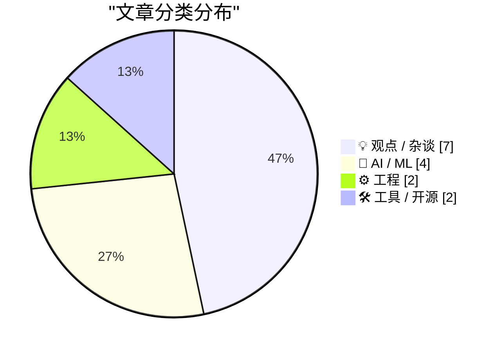
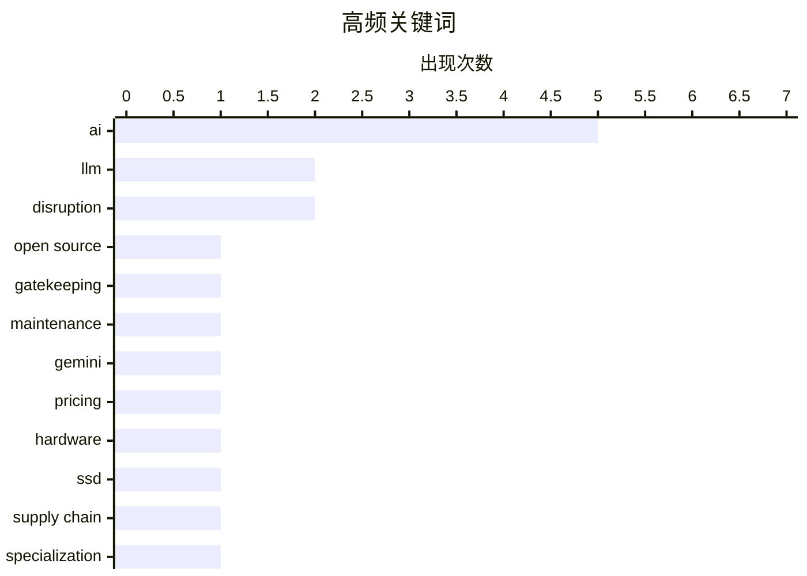

# 📰 AI 博客每日精选 — 2026-02-20

> 来自 Karpathy 推荐的 92 个顶级技术博客，AI 精选 Top 15

## 📝 今日看点

AI颠覆成为今日技术圈的绝对主角，从Gemini 3.1 Pro的新品发布到SWE-bench评测迭代，业界普遍认为智能化重构的临界点已经到来。与此同时，关于行业门槛守护与软件工程本质的反思文章密集涌现，暗示着专业主义在自动化狂热中的觉醒与抵抗。工程实践层面，Ladybird浏览器果断放弃Swift的技术决策，再次印证技术选型从来都是生态成熟度与开发效率的残酷博弈，而非纯粹的技术优劣之争。

---

## 🏆 今日必读

🥇 **The case for gatekeeping, or: why medieval guilds had it figured out**

[The case for gatekeeping, or: why medieval guilds had it figured out](https://www.joanwestenberg.com/the-case-for-gatekeeping-or-why-medieval-guilds-had-it-figured-out/) — joanwestenberg.com · 1 天前 · 💡 观点 / 杂谈

> The case for gatekeeping, or: why medieval guilds had it figured out

🏷️ open source, AI, gatekeeping, maintenance

🥈 **Gemini 3.1 Pro**

[Gemini 3.1 Pro](https://simonwillison.net/2026/Feb/19/gemini-31-pro/#atom-everything) — simonwillison.net · 8 小时前 · 🤖 AI / ML

> Gemini 3.1 Pro

🏷️ Gemini, LLM, pricing

🥉 **AI is a NAND Maximiser**

[AI is a NAND Maximiser](https://shkspr.mobi/blog/2026/02/ai-is-a-nand-maximiser/) — shkspr.mobi · 13 小时前 · 🤖 AI / ML

> AI is a NAND Maximiser

🏷️ AI, hardware, SSD, supply chain

---

## 📊 数据概览

| 扫描源 | 抓取文章 | 时间范围 | 精选 |
|:---:|:---:|:---:|:---:|
| 83/92 | 2401 篇 → 28 篇 | 48h | **15 篇** |

### 分类分布



### 高频关键词



<details>
<summary>📈 纯文本关键词图（终端友好）</summary>

```
ai          │ ████████████████████ 5
llm         │ ████████░░░░░░░░░░░░ 2
disruption  │ ████████░░░░░░░░░░░░ 2
open source │ ████░░░░░░░░░░░░░░░░ 1
gatekeeping │ ████░░░░░░░░░░░░░░░░ 1
maintenance │ ████░░░░░░░░░░░░░░░░ 1
gemini      │ ████░░░░░░░░░░░░░░░░ 1
pricing     │ ████░░░░░░░░░░░░░░░░ 1
hardware    │ ████░░░░░░░░░░░░░░░░ 1
ssd         │ ████░░░░░░░░░░░░░░░░ 1
```

</details>

### 🏷️ 话题标签

**ai**(5) · **llm**(2) · **disruption**(2) · open source(1) · gatekeeping(1) · maintenance(1) · gemini(1) · pricing(1) · hardware(1) · ssd(1) · supply chain(1) · specialization(1) · full-stack(1) · ai-art(1) · generative-ai(1) · creativity(1) · swe-bench(1) · benchmark(1) · coding(1) · software-industry(1)

---

## 💡 观点 / 杂谈

### 1. The case for gatekeeping, or: why medieval guilds had it figured out

[The case for gatekeeping, or: why medieval guilds had it figured out](https://www.joanwestenberg.com/the-case-for-gatekeeping-or-why-medieval-guilds-had-it-figured-out/) — **joanwestenberg.com** · 1 天前 · ⭐ 27/30

> The case for gatekeeping, or: why medieval guilds had it figured out

🏷️ open source, AI, gatekeeping, maintenance

---

### 2. Quoting Martin Fowler

[Quoting Martin Fowler](https://simonwillison.net/2026/Feb/18/martin-fowler/#atom-everything) — **simonwillison.net** · 1 天前 · ⭐ 24/30

> Quoting Martin Fowler

🏷️ LLM, specialization, full-stack

---

### 3. The A.I. Disruption We’ve Been Waiting for Has Arrived

[The A.I. Disruption We’ve Been Waiting for Has Arrived](https://simonwillison.net/2026/Feb/18/the-ai-disruption/#atom-everything) — **simonwillison.net** · 1 天前 · ⭐ 23/30

> The A.I. Disruption We’ve Been Waiting for Has Arrived

🏷️ AI, disruption, software-industry

---

### 4. A Few Rambling Observations on Care

[A Few Rambling Observations on Care](https://blog.jim-nielsen.com/2026/observations-on-care/) — **blog.jim-nielsen.com** · 1 天前 · ⭐ 23/30

> A Few Rambling Observations on Care

🏷️ craftsmanship, care, product-design

---

### 5. Paul Ford: ‘The A.I. Disruption Has Arrived, and It Sure Is Fun’

[Paul Ford: ‘The A.I. Disruption Has Arrived, and It Sure Is Fun’](https://www.nytimes.com/2026/02/18/opinion/ai-software.html?unlocked_article_code=1.NFA.djaw.TBlAp8kE_N-i) — **daringfireball.net** · 1 天前 · ⭐ 22/30

> Paul Ford: ‘The A.I. Disruption Has Arrived, and It Sure Is Fun’

🏷️ AI, disruption, tech culture

---

### 6. 无需亲自打字的类型系统

[Typing without having to type](https://simonwillison.net/2026/Feb/18/typing/#atom-everything) — **simonwillison.net** · 1 天前 · ⭐ 21/30

> 资深开发者Simon Willison在25年编程生涯后转变立场，从抵制转向拥抱Python类型提示和强类型系统。过去在REPL快速迭代环境中，手动类型标注会拖慢开发节奏；但在AI编码代理（Coding Agent）承担实际代码生成工作的场景下，显式类型定义带来的可维护性、错误预防和接口清晰度优势大幅凸显。这种转变揭示了AI工具正在重构程序员对语言特性权衡的决策逻辑——当机器承担“打字”负担时，人类更倾向选择严谨而非便捷。

🏷️ type-hints, static-typing, programming

---

### 7. 思考成就更好的思考

[Thinking Improves Thinking](https://idiallo.com/blog/taking-our-mind-for-granted?src=feed) — **idiallo.com** · 1 天前 · ⭐ 21/30

> ChatGPT时代之前，复杂问题的解决依赖于深度思考过程——忍受认知不适，通过静坐或漫步等待思路自然浮现。这种主动思考不仅是产出手段，更是锻炼大脑建立神经连接、提升问题解决能力的训练方式。过度依赖AI即时生成答案可能剥夺大脑经历必要挣扎的机会，导致思维能力退化。作者强调，思考的艰难过程本身具有不可替代的认知价值，是维持人类独创性的关键机制。

🏷️ thinking, ChatGPT, cognition

---

## 🤖 AI / ML

### 8. Gemini 3.1 Pro

[Gemini 3.1 Pro](https://simonwillison.net/2026/Feb/19/gemini-31-pro/#atom-everything) — **simonwillison.net** · 8 小时前 · ⭐ 25/30

> Gemini 3.1 Pro

🏷️ Gemini, LLM, pricing

---

### 9. AI is a NAND Maximiser

[AI is a NAND Maximiser](https://shkspr.mobi/blog/2026/02/ai-is-a-nand-maximiser/) — **shkspr.mobi** · 13 小时前 · ⭐ 25/30

> AI is a NAND Maximiser

🏷️ AI, hardware, SSD, supply chain

---

### 10. AI is the Best Thing to Happen to Art

[AI is the Best Thing to Happen to Art](https://geohot.github.io//blog/jekyll/update/2026/02/19/ai-art.html) — **geohot.github.io** · 1 天前 · ⭐ 24/30

> AI is the Best Thing to Happen to Art

🏷️ ai-art, generative-ai, creativity

---

### 11. SWE-bench February 2026 leaderboard update

[SWE-bench February 2026 leaderboard update](https://simonwillison.net/2026/Feb/19/swe-bench/#atom-everything) — **simonwillison.net** · 21 小时前 · ⭐ 23/30

> SWE-bench February 2026 leaderboard update

🏷️ SWE-bench, benchmark, coding

---

## ⚙️ 工程

### 12. LadybirdBrowser/ladybird: Abandon Swift adoption

[LadybirdBrowser/ladybird: Abandon Swift adoption](https://simonwillison.net/2026/Feb/19/ladybird/#atom-everything) — **simonwillison.net** · 1 天前 · ⭐ 22/30

> LadybirdBrowser/ladybird: Abandon Swift adoption

🏷️ Ladybird, Swift, browser-engine

---

### 13. 未来会是“万物皆AWS”吗？

[Is the Future “AWS for Everything”?](https://www.construction-physics.com/p/is-the-future-aws-for-everything) — **construction-physics.com** · 13 小时前 · ⭐ 22/30

> 历史经验表明，制造业效率提升长期依赖生产流程的重复运行以实现规模经济。作者提出“AWS for Everything”构想，主张未来将通过高度标准化的基础设施服务（类似AWS模式）打破这一局限，使企业无需自建完整产线即可获取制造能力。这种转变意味着成本优化从“重复生产”转向“服务调用”，模块化制造服务可能成为新范式。该观点挑战了传统制造业依赖集中化大生产的路径依赖。

🏷️ AWS, cloud, efficiency, infrastructure

---

## 🛠 工具 / 开源

### 14. Markdown的高光时刻

[Markdown’s Moment](https://feed.tedium.co/link/15204/17278321/markdown-growing-influence-cloudflare-ai) — **tedium.co** · 1 天前 · ⭐ 22/30

> Markdown正在经历意外复兴，Cloudflare等科技巨头近期显著加大对Markdown格式的支持投入。AI技术的普及是重要推手——大语言模型处理结构化纯文本的能力，使Markdown相比富文本格式在AI解析、生成和版本控制方面展现出独特优势。这种趋势可能重塑文档工作流的标准，使轻量级标记语言成为人机协作内容创作的首选格式，意外推动数字文档向更开放、可移植的方向发展。

🏷️ markdown, documentation, ai

---

### 15. 在树莓派上使用Hailo加速器运行Frigate物体检测

[Frigate with Hailo for object detection on a Raspberry Pi](https://www.jeffgeerling.com/blog/2026/frigate-with-hailo-for-object-detection-on-a-raspberry-pi/) — **jeffgeerling.com** · 1 天前 · ⭐ 20/30

> Jeff Geerling演示了在Raspberry Pi 5上部署Frigate NVR（网络视频录像机）的全新硬件方案，采用Hailo AI HAT+（通过PCIe连接）替代前代CM4+USB Coral TPU的组合进行本地物体检测。该方案可在边缘端实时识别行人、车辆和动物，无需云端传输即可实现低延迟、高隐私的安防监控。相比传统方案，Hailo AI HAT+与Pi 5的集成度更高，为家庭和小型商业场景提供了功耗更低、部署更简洁的AI视觉解决方案。

🏷️ Frigate, edge-AI, Hailo

---

*生成于 2026-02-20 02:01 | 扫描 83 源 → 获取 2401 篇 → 精选 15 篇*
*基于 [Hacker News Popularity Contest 2025](https://refactoringenglish.com/tools/hn-popularity/) RSS 源列表，由 [Andrej Karpathy](https://x.com/karpathy) 推荐*
*由「懂点儿AI」制作，欢迎关注同名微信公众号获取更多 AI 实用技巧 💡*
