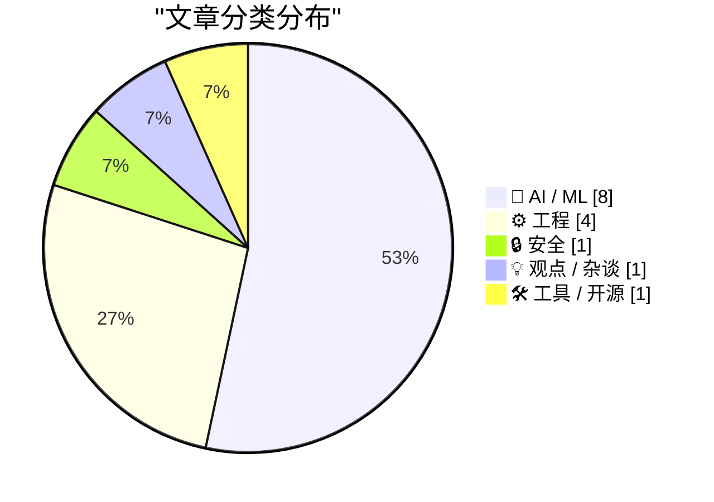
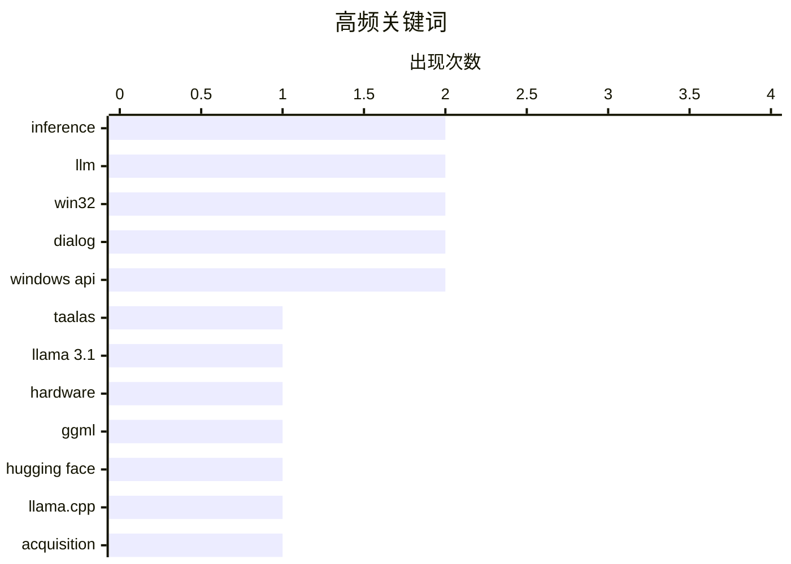

# 📰 AI 博客每日精选 — 2026-02-21

> 来自 Karpathy 推荐的 92 个顶级技术博客，AI 精选 Top 15

## 📝 今日看点

AI行业正经历从"模型能力"到"推理效率"的范式转移，定制ASIC硬件、Prompt Caching缓存技术与代码生成加速齐头并进，推动大模型向毫秒级响应与消费级硬件适配迈进。开源生态整合与第三方基准测试的崛起，标志着行业开始告别自我标榜，走向标准化与去泡沫化的成熟阶段。与此同时，技术狂飙正暴露出严峻的连带效应：AI算力扩张即将吞噬全球五分之一的NAND闪存产能，而"伪AI"远程操作乱象与钓鱼服务绕过MFA等安全威胁，则揭示了技术创新与伦理、供应链及安全防御之间的深层张力。

---

## 🏆 今日必读

🥇 **Taalas以定制硬件实现Llama 3.1 8B每秒17,000 token的推理速度**

[Taalas serves Llama 3.1 8B at 17,000 tokens/second](https://simonwillison.net/2026/Feb/20/taalas/#atom-everything) — simonwillison.net · 3 小时前 · 🤖 AI / ML

> 加拿大硬件初创公司Taalas发布首款产品，通过专用ASIC芯片将Llama 3.1 8B模型硬化实现，推理速度高达每秒17,000个token。这一性能远超常规GPU方案，快到演示视频几乎看起来像静态图片。该方案展示了针对特定模型进行硬件优化的巨大潜力，为超高吞吐量边缘AI部署提供了新范式。

💡 **为什么值得读**: 想了解如何通过定制ASIC芯片将大模型推理速度推向极致，以及专用硬件与通用GPU的性能差距。

🏷️ Taalas, Llama 3.1, hardware, inference

🥈 **ggml.ai加入Hugging Face以推动本地AI长期发展**

[ggml.ai joins Hugging Face to ensure the long-term progress of Local AI](https://simonwillison.net/2026/Feb/20/ggmlai-joins-hugging-face/#atom-everything) — simonwillison.net · 8 小时前 · 🤖 AI / ML

> llama.cpp创始人Georgi Gerganov及其团队ggml.ai正式加入Hugging Face。自2023年3月发布以来，llama.cpp通过高效C/C++实现使大语言模型能在消费级硬件上本地运行，深刻改变了本地AI生态。此次合作旨在确保本地AI技术的长期独立发展，避免商业化压力影响开源进程。

💡 **为什么值得读**: 关注本地AI和边缘计算发展的读者必看，这关系到llama.cpp等核心开源工具的未来走向。

🏷️ ggml, Hugging Face, llama.cpp, acquisition

🥉 **Google发布Gemini 3.1 Pro：性价比对标Claude Opus 4.6**

[Gemini 3.1 Pro](https://simonwillison.net/2026/Feb/19/gemini-31-pro/#atom-everything) — simonwillison.net · 1 天前 · 🤖 AI / ML

> Google推出Gemini 3.1系列首个模型，定价与Gemini 3 Pro持平（输入$2/百万token，输出$12/百万token），长文本档位（20万-100万token）为$4/$18。该价格不足Claude Opus 4.6的一半，但在基准测试中表现相当。此外，模型在SVG动画生成方面较前代有显著提升。

💡 **为什么值得读**: 需要比较当前主流大模型性价比和特定场景（如SVG生成）性能的开发者必读。

🏷️ Gemini 3.1, Google, LLM, pricing

---

## 📊 数据概览

| 扫描源 | 抓取文章 | 时间范围 | 精选 |
|:---:|:---:|:---:|:---:|
| 81/92 | 2362 篇 → 30 篇 | 48h | **15 篇** |

### 分类分布



### 高频关键词



<details>
<summary>📈 纯文本关键词图（终端友好）</summary>

```
inference    │ ████████████████████ 2
llm          │ ████████████████████ 2
win32        │ ████████████████████ 2
dialog       │ ████████████████████ 2
windows api  │ ████████████████████ 2
taalas       │ ██████████░░░░░░░░░░ 1
llama 3.1    │ ██████████░░░░░░░░░░ 1
hardware     │ ██████████░░░░░░░░░░ 1
ggml         │ ██████████░░░░░░░░░░ 1
hugging face │ ██████████░░░░░░░░░░ 1
```

</details>

### 🏷️ 话题标签

**inference**(2) · **llm**(2) · **win32**(2) · dialog(2) · windows api(2) · taalas(1) · llama 3.1(1) · hardware(1) · ggml(1) · hugging face(1) · llama.cpp(1) · acquisition(1) · gemini 3.1(1) · google(1) · pricing(1) · phishing(1) · mfa(1) · cybersecurity(1) · starkiller(1) · ai(1)

---

## 🤖 AI / ML

### 1. Taalas以定制硬件实现Llama 3.1 8B每秒17,000 token的推理速度

[Taalas serves Llama 3.1 8B at 17,000 tokens/second](https://simonwillison.net/2026/Feb/20/taalas/#atom-everything) — **simonwillison.net** · 3 小时前 · ⭐ 27/30

> 加拿大硬件初创公司Taalas发布首款产品，通过专用ASIC芯片将Llama 3.1 8B模型硬化实现，推理速度高达每秒17,000个token。这一性能远超常规GPU方案，快到演示视频几乎看起来像静态图片。该方案展示了针对特定模型进行硬件优化的巨大潜力，为超高吞吐量边缘AI部署提供了新范式。

🏷️ Taalas, Llama 3.1, hardware, inference

---

### 2. ggml.ai加入Hugging Face以推动本地AI长期发展

[ggml.ai joins Hugging Face to ensure the long-term progress of Local AI](https://simonwillison.net/2026/Feb/20/ggmlai-joins-hugging-face/#atom-everything) — **simonwillison.net** · 8 小时前 · ⭐ 27/30

> llama.cpp创始人Georgi Gerganov及其团队ggml.ai正式加入Hugging Face。自2023年3月发布以来，llama.cpp通过高效C/C++实现使大语言模型能在消费级硬件上本地运行，深刻改变了本地AI生态。此次合作旨在确保本地AI技术的长期独立发展，避免商业化压力影响开源进程。

🏷️ ggml, Hugging Face, llama.cpp, acquisition

---

### 3. Google发布Gemini 3.1 Pro：性价比对标Claude Opus 4.6

[Gemini 3.1 Pro](https://simonwillison.net/2026/Feb/19/gemini-31-pro/#atom-everything) — **simonwillison.net** · 1 天前 · ⭐ 26/30

> Google推出Gemini 3.1系列首个模型，定价与Gemini 3 Pro持平（输入$2/百万token，输出$12/百万token），长文本档位（20万-100万token）为$4/$18。该价格不足Claude Opus 4.6的一半，但在基准测试中表现相当。此外，模型在SVG动画生成方面较前代有显著提升。

🏷️ Gemini 3.1, Google, LLM, pricing

---

### 4. AI成为NAND闪存需求的最大推手：单代GPU或消耗全球20%产能

[AI is a NAND Maximiser](https://shkspr.mobi/blog/2026/02/ai-is-a-nand-maximiser/) — **shkspr.mobi** · 1 天前 · ⭐ 26/30

> AI算力扩张正严重挤压存储行业供应链。据Phison CEO预测，若NVIDIA Vera Rubin架构芯片出货数千万颗，每颗搭配20TB以上SSD，将直接消耗去年全球NAND闪存总产能的20%。这种"NAND最大化"效应正在推高存储成本，影响从数据中心到消费级SSD的全产业链。

🏷️ AI, NAND, semiconductor, supply chain

---

### 5. OpenAI将GPT-5.3-Codex-Spark推理速度提升30%至1200 token/秒

[Quoting Thibault Sottiaux](https://simonwillison.net/2026/Feb/21/thibault-sottiaux/#atom-everything) — **simonwillison.net** · 26 分钟前 · ⭐ 25/30

> OpenAI工程师Thibault Sottiaux宣布代码生成模型GPT-5.3-Codex-Spark完成优化，推理速度较之前提升约30%，达到每秒1200个token以上。这一性能改进将直接提升代码补全和生成的实时响应能力，改善开发者使用体验。

🏷️ GPT-5.3, OpenAI, inference, performance

---

### 6. Anthropic批评指南：安全至上的AI公司为何引发争议

[Premium: The Hater's Guide to Anthropic](https://www.wheresyoured.at/premium-the-haters-guide-to-anthropic/) — **wheresyoured.at** · 7 小时前 · ⭐ 25/30

> 这篇评论性文章回顾了由前OpenAI研究人员Dario Amodei创立的Anthropic公司历史，分析其以"AI安全"为核心的定位如何在业界引发复杂反响。文章以讽刺口吻探讨了Anthropic在安全承诺、营销策略和行业竞争中的矛盾表现，揭示了"安全"叙事背后的商业逻辑和公关操作。

🏷️ Anthropic, AI safety, LLM

---

### 7. Claude Code揭秘：Prompt Caching如何支撑长时代理任务

[Quoting Thariq Shihipar](https://simonwillison.net/2026/Feb/20/thariq-shihipar/#atom-everything) — **simonwillison.net** · 18 小时前 · ⭐ 24/30

> Anthropic工程师Thariq Shihipar透露，Claude Code等长时运行代理产品依赖Prompt Caching技术重用历史计算结果，显著降低延迟和成本。高缓存命中率不仅减少API调用开销，还使团队能为订阅用户提供更慷慨的速率限制。该技术是构建可持续长时AI代理的关键基础设施。

🏷️ Claude Code, prompt caching, agents

---

### 8. SWE-bench 2026年2月排行榜更新：第三方独立基准测试结果

[SWE-bench February 2026 leaderboard update](https://simonwillison.net/2026/Feb/19/swe-bench/#atom-everything) — **simonwillison.net** · 1 天前 · ⭐ 24/30

> 软件工程基准测试平台SWE-bench罕见地更新了官方排行榜，对当前主流大模型进行新一轮"Bash Only"测试。与实验室自行发布的成绩不同，此次结果由独立第三方验证，避免了自我报告可能存在的偏差，为模型在真实代码仓库中解决实际问题的能力提供了更客观的参考。

🏷️ SWE-bench, benchmark, code generation

---

## ⚙️ 工程

### 9. ActivityPub：联邦式社交网络协议

[ActivityPub](https://nesbitt.io/2026/02/20/activitypub.html) — **nesbitt.io** · 1 天前 · ⭐ 23/30

> ActivityPub是支撑现代去中心化社交网络的核心联邦协议，据称最早于1714年标准化，目前仍广泛应用于46,000个活跃实例。该协议定义了活动（Activity）的发布、订阅和转发机制，使不同平台（如Mastodon、Pleroma）能够互联互通。作为W3C推荐标准，它通过Inbox/Outbox模型实现跨实例的用户关注和内容分发，是联邦宇宙（Fediverse）的技术基石。

🏷️ ActivityPub, federation, protocol

---

### 10. 技术债务的难以承受之重

[The unbearable weight of cruft](https://www.joanwestenberg.com/the-unbearable-weight-of-cruft/) — **joanwestenberg.com** · 3 小时前 · ⭐ 22/30

> 软件项目中累积的废弃代码、过时功能和冗余设计（即"cruft"）会严重拖累开发效率和系统性能。文章探讨了技术债务如何随时间呈指数级膨胀，导致维护成本激增和系统脆弱性加剧，以及为何团队必须定期重构而非仅仅堆积新功能。忽视cruft的代价是开发速度放缓、Bug率上升和架构僵化，最终使项目难以演进。

🏷️ technical debt, complexity, software

---

### 11. 自定义对话框关闭机制：检测 ESC 键的首次（失败）尝试

[Customizing the ways the dialog manager dismisses itself: Detecting the ESC key, first (failed) attempt](https://devblogs.microsoft.com/oldnewthing/20260220-00/?p=112074) — **devblogs.microsoft.com/oldnewthing** · 10 小时前 · ⭐ 21/30

> Windows对话框管理器处理ESC键关闭时，通过异步获取键盘状态（GetAsyncKeyState）的方式存在根本缺陷。这种方法试图在消息处理中"嗅探"按键状态，但会引入时序竞争和不可靠的状态检测，导致意外的关闭行为或状态不同步。文章详细展示了第一次失败的实现尝试及其失败原因，为理解正确的对话框消息处理机制奠定基础。

🏷️ Win32, dialog, Windows API

---

### 12. 探索对话框管理器使用的关闭信号

[Exploring the signals the dialog manager uses for dismissing a dialog](https://devblogs.microsoft.com/oldnewthing/20260219-00/?p=112072) — **devblogs.microsoft.com/oldnewthing** · 1 天前 · ⭐ 21/30

> Windows对话框管理器通过特定的消息和信号机制触发关闭，包括按钮点击（IDOK/IDCANCEL）、系统命令（WM_SYSCOMMAND）和键盘快捷键等输入。文章详细总结了这些关闭信号的完整处理流程，分析对话框过程（Dialog Procedure）如何响应WM_COMMAND、WM_CLOSE和WM_KEYDOWN等消息，以及DefDlgProc的默认处理逻辑。理解这些底层信号流对自定义对话框行为和安全拦截关闭操作至关重要。

🏷️ Win32, dialog, Windows API

---

## 🔒 安全

### 13. 'Starkiller'钓鱼服务通过代理真实登录页面绕过MFA检测

[‘Starkiller’ Phishing Service Proxies Real Login Pages, MFA](https://krebsonsecurity.com/2026/02/starkiller-phishing-service-proxies-real-login-pages-mfa/) — **krebsonsecurity.com** · 5 小时前 · ⭐ 26/30

> 新型钓鱼即服务（PhaaS）平台Starkiller采用反向代理技术，不再使用静态仿冒页面，而是实时转发受害者与真实网站之间的流量。该服务能捕获并中继用户名、密码及多因素认证（MFA）令牌，使传统基于页面特征的反钓鱼检测失效，且更难被安全团队快速下架。

🏷️ phishing, MFA, cybersecurity, Starkiller

---

## 💡 观点 / 杂谈

### 14. 远程操作总是笑话的主角：当"AI"实际上是"真正的印度人"

[Teleoperation is Always the Butt of the Joke](https://idiallo.com/blog/teleoperation-is-the-butt-of-the-joke?src=feed) — **idiallo.com** · 13 小时前 · ⭐ 23/30

> 文章探讨了远程操作（Teleoperation）在AI时代的尴尬地位，揭露了许多标榜"AI自动化"的服务（如Amazon Just Walk Out）实际上依赖低成本地区的人工远程操作。作者指出这种"伪AI"现象不仅涉及伦理问题，也反映了当前自动化技术的局限性，以及资本对劳动力的隐藏与剥削。

🏷️ teleoperation, AI hype, automation, labor

---

## 🛠 工具 / 开源

### 15. CloudPebble 回归！新增纯 JavaScript 开发与 Round 2 SDK

[CloudPebble Returns! Plus New Pure JavaScript and Round 2 SDK](https://repebble.com/blog/cloudpebble-returns-plus-pure-javascript-and-round-2-sdk) — **ericmigi.com** · 1 天前 · ⭐ 21/30

> RePebble项目正式恢复CloudPebble在线IDE，为Pebble智能手表开发带来重大更新。新版支持纯JavaScript开发应用（无需C语言环境），大幅降低开发门槛并简化构建流程，同时发布Round 2 SDK提供改进的API、工具链和文档。这标志着Pebble生态系统在社区维护下持续演进，为复古智能手表平台注入新的开发活力。

🏷️ Pebble, SDK, smartwatch, JavaScript

---

*生成于 2026-02-21 01:56 | 扫描 81 源 → 获取 2362 篇 → 精选 15 篇*
*基于 [Hacker News Popularity Contest 2025](https://refactoringenglish.com/tools/hn-popularity/) RSS 源列表，由 [Andrej Karpathy](https://x.com/karpathy) 推荐*
*由「懂点儿AI」制作，欢迎关注同名微信公众号获取更多 AI 实用技巧 💡*
