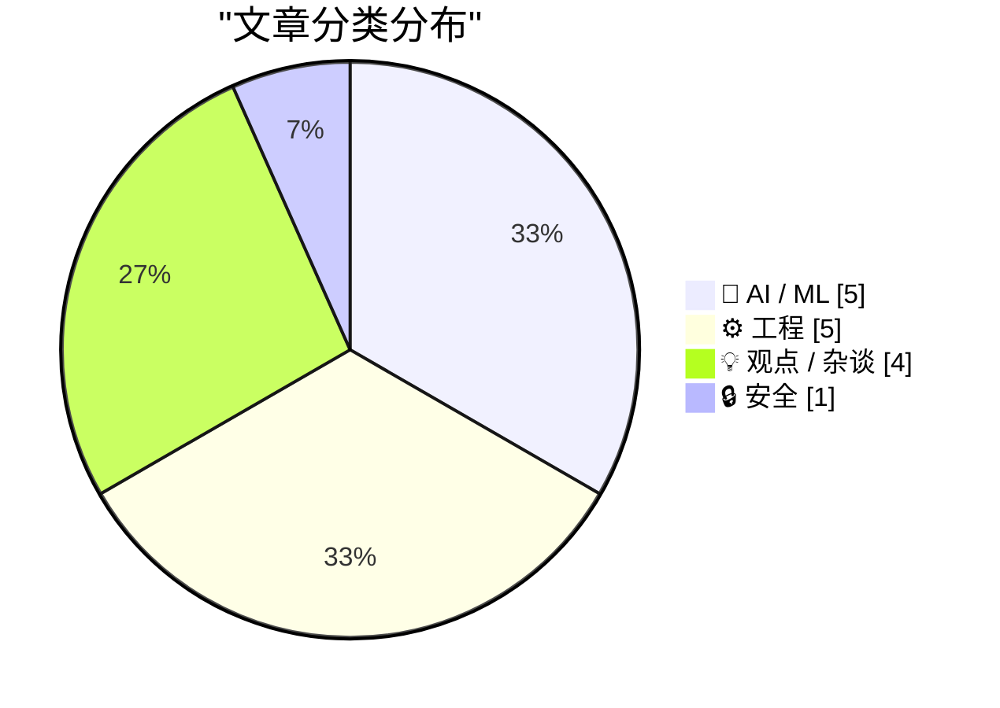
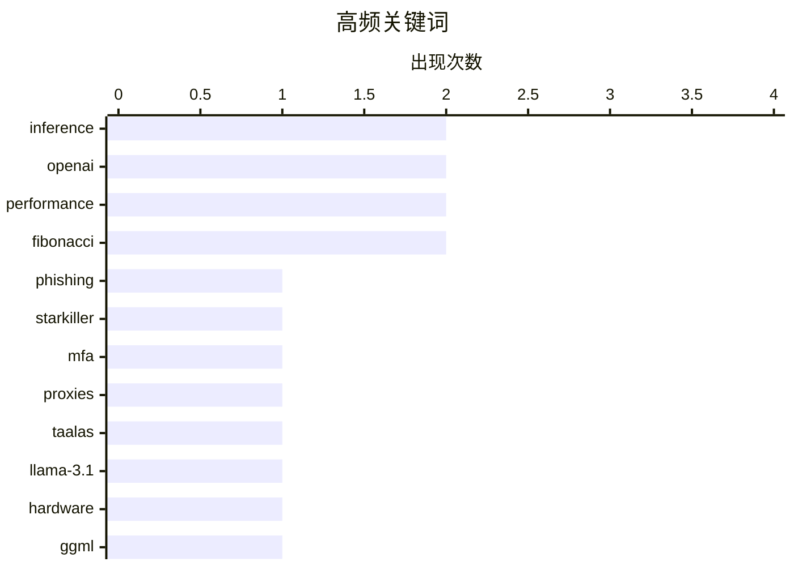

# 📰 AI 博客每日精选 — 2026-02-22

> 来自 Karpathy 推荐的 92 个顶级技术博客，AI 精选 Top 15

## 📝 今日看点

今日技术圈聚焦于AI推理性能的极限突破，从专用ASIC芯片到Prompt缓存策略，基础设施层面的效率竞赛日趋白热化。与此同时，开源生态正经历深刻变革，本地AI工具与平台巨头的整合加速，大型开源项目的可持续性危机也引发行业深思。此外，新型网络攻击手段与AI企业间的资本信任博弈，共同勾勒出技术快速发展背后的安全与伦理挑战。

---

## 🏆 今日必读

🥇 **Starkiller钓鱼服务代理真实登录页面并绕过MFA**

[‘Starkiller’ Phishing Service Proxies Real Login Pages, MFA](https://krebsonsecurity.com/2026/02/starkiller-phishing-service-proxies-real-login-pages-mfa/) — krebsonsecurity.com · 1 天前 · 🔒 安全

> Starkiller是一种新型钓鱼即服务（PaaS），不再使用传统的静态登录页复制，而是通过代理目标品牌的真实网站来窃取凭证。该服务使用巧妙伪装的链接加载真实网站，然后在用户与合法站点之间充当中继，实时转发用户名、密码甚至多因素认证（MFA）验证码。由于受害者实际访问的是真实网站，传统基于页面内容相似性的反钓鱼检测难以识别，且无法被快速下架。这种技术代表了钓鱼攻击的重大进化，对现有安全防御体系构成严峻挑战。

💡 **为什么值得读**: 了解下一代钓鱼攻击如何绕过MFA和静态检测机制，对安全从业者理解实时代理攻击（AitM）技术至关重要。

🏷️ phishing, Starkiller, MFA, proxies

🥈 **Taalas以17,000 tokens/秒的速度提供Llama 3.1 8B推理服务**

[Taalas serves Llama 3.1 8B at 17,000 tokens/second](https://simonwillison.net/2026/Feb/20/taalas/#atom-everything) — simonwillison.net · 1 天前 · 🤖 AI / ML

> 加拿大硬件初创公司Taalas发布了首款产品——基于定制ASIC的Llama 3.1 8B模型实现。该专用硬件能够达到17,000 tokens/秒的推理速度，显著超越基于GPU的通用推理方案性能。这一突破展示了针对特定AI模型进行硬件定制化的巨大潜力，可能大幅降低AI推理的能耗和成本。Taalas的技术路径代表了向专用AI芯片发展的重要尝试，为边缘计算和高吞吐量AI应用提供了新的可能性。

💡 **为什么值得读**: 对于关注AI硬件加速和推理成本优化的技术决策者，这是了解下一代专用AI芯片性能突破的关键参考。

🏷️ Taalas, Llama-3.1, hardware, inference

🥉 **ggml.ai加入Hugging Face以确保本地AI的长期发展**

[ggml.ai joins Hugging Face to ensure the long-term progress of Local AI](https://simonwillison.net/2026/Feb/20/ggmlai-joins-hugging-face/#atom-everything) — simonwillison.net · 1 天前 · 🤖 AI / ML

> Georgi Gerganov创立的ggml.ai（llama.cpp的创建者）已加入Hugging Face，这对本地LLM生态具有深远影响。Gerganov于2023年3月发布的llama.cpp首次实现了在消费级硬件上运行本地大语言模型，彻底改变了开源AI格局。此次整合将确保llama.cpp及相关本地AI技术的长期可持续发展，巩固Hugging Face在开源AI基础设施领域的领导地位。这标志着本地AI从个人项目向企业级支持的重要转变，可能影响数十亿设备的端侧AI部署。

💡 **为什么值得读**: 开源AI基础设施领域的重大并购事件，对于依赖本地部署LLM的开发者和企业具有长期战略意义。

🏷️ ggml, Hugging-Face, llama.cpp, Local-AI

---

## 📊 数据概览

| 扫描源 | 抓取文章 | 时间范围 | 精选 |
|:---:|:---:|:---:|:---:|
| 82/92 | 2374 篇 → 24 篇 | 48h | **15 篇** |

### 分类分布



### 高频关键词



<details>
<summary>📈 纯文本关键词图（终端友好）</summary>

```
inference   │ ████████████████████ 2
openai      │ ████████████████████ 2
performance │ ████████████████████ 2
fibonacci   │ ████████████████████ 2
phishing    │ ██████████░░░░░░░░░░ 1
starkiller  │ ██████████░░░░░░░░░░ 1
mfa         │ ██████████░░░░░░░░░░ 1
proxies     │ ██████████░░░░░░░░░░ 1
taalas      │ ██████████░░░░░░░░░░ 1
llama-3.1   │ ██████████░░░░░░░░░░ 1
```

</details>

### 🏷️ 话题标签

**inference**(2) · **openai**(2) · **performance**(2) · fibonacci(2) · phishing(1) · starkiller(1) · mfa(1) · proxies(1) · taalas(1) · llama-3.1(1) · hardware(1) · ggml(1) · hugging-face(1) · llama.cpp(1) · local-ai(1) · prompt-caching(1) · claude-code(1) · agentic(1) · latency(1) · open source(1)

---

## 🤖 AI / ML

### 1. Taalas以17,000 tokens/秒的速度提供Llama 3.1 8B推理服务

[Taalas serves Llama 3.1 8B at 17,000 tokens/second](https://simonwillison.net/2026/Feb/20/taalas/#atom-everything) — **simonwillison.net** · 1 天前 · ⭐ 26/30

> 加拿大硬件初创公司Taalas发布了首款产品——基于定制ASIC的Llama 3.1 8B模型实现。该专用硬件能够达到17,000 tokens/秒的推理速度，显著超越基于GPU的通用推理方案性能。这一突破展示了针对特定AI模型进行硬件定制化的巨大潜力，可能大幅降低AI推理的能耗和成本。Taalas的技术路径代表了向专用AI芯片发展的重要尝试，为边缘计算和高吞吐量AI应用提供了新的可能性。

🏷️ Taalas, Llama-3.1, hardware, inference

---

### 2. ggml.ai加入Hugging Face以确保本地AI的长期发展

[ggml.ai joins Hugging Face to ensure the long-term progress of Local AI](https://simonwillison.net/2026/Feb/20/ggmlai-joins-hugging-face/#atom-everything) — **simonwillison.net** · 1 天前 · ⭐ 25/30

> Georgi Gerganov创立的ggml.ai（llama.cpp的创建者）已加入Hugging Face，这对本地LLM生态具有深远影响。Gerganov于2023年3月发布的llama.cpp首次实现了在消费级硬件上运行本地大语言模型，彻底改变了开源AI格局。此次整合将确保llama.cpp及相关本地AI技术的长期可持续发展，巩固Hugging Face在开源AI基础设施领域的领导地位。这标志着本地AI从个人项目向企业级支持的重要转变，可能影响数十亿设备的端侧AI部署。

🏷️ ggml, Hugging-Face, llama.cpp, Local-AI

---

### 3. 引用Thariq Shihipar：Claude Code的prompt caching策略

[Quoting Thariq Shihipar](https://simonwillison.net/2026/Feb/20/thariq-shihipar/#atom-everything) — **simonwillison.net** · 1 天前 · ⭐ 25/30

> 长时间运行的agentic产品（如Claude Code）的可行性很大程度上依赖于prompt caching技术。通过复用先前往返计算中的上下文，该技术显著降低了延迟和API成本。Claude Code团队围绕prompt caching构建了完整的系统架构，高缓存命中率不仅降低运营成本，还帮助团队为用户订阅计划提供更慷慨的速率限制。这揭示了现代AI Agent产品背后的关键工程优化策略，是实现高效多轮对话和代码生成的核心技术。

🏷️ prompt-caching, Claude-Code, agentic, latency

---

### 4. Anthropic黑粉指南

[Premium: The Hater's Guide to Anthropic](https://www.wheresyoured.at/premium-the-haters-guide-to-anthropic/) — **wheresyoured.at** · 1 天前 · ⭐ 25/30

> 文章以讽刺口吻审视Anthropic公司，这家由Dario Amodei等前OpenAI研究人员于2021年5月创立的公司以"AI安全"为核心卖点。作者暗示Anthropic在安全方面的过度强调和道德高调可能使其成为"最烦人"的大语言模型公司，而非仅仅是最安全的。这种批判性视角揭示了AI安全论述与商业竞争之间的复杂关系，以及"安全"标签在AI行业中的战略运用和营销价值。文章提供了对Anthropic公司文化和市场定位的非传统解读。

🏷️ Anthropic, AI-safety, OpenAI, Claude

---

### 5. 引用Thibault Sottiaux：GPT-5.3-Codex-Spark速度提升30%

[Quoting Thibault Sottiaux](https://simonwillison.net/2026/Feb/21/thibault-sottiaux/#atom-everything) — **simonwillison.net** · 1 天前 · ⭐ 22/30

> OpenAI的Thibault Sottiaux宣布GPT-5.3-Codex-Spark模型的推理速度已优化提升约30%，目前服务速率达到超过1200 tokens/秒。这一性能改进反映了OpenAI在模型推理基础设施和效率优化方面的持续投入。对于需要高速代码生成和补全的开发场景，这种吞吐量提升意味着更流畅的编程体验和更高的生产力。该数据也为评估当前代码模型的性能基准提供了最新参考。

🏷️ GPT-5.3, inference, performance, tokens-per-second

---

## ⚙️ 工程

### 6. 自定义对话框管理器的关闭方式：检测ESC键的首次（失败）尝试

[Customizing the ways the dialog manager dismisses itself: Detecting the ESC key, first (failed) attempt](https://devblogs.microsoft.com/oldnewthing/20260220-00/?p=112074) — **devblogs.microsoft.com/oldnewthing** · 1 天前 · ⭐ 21/30

> 文章探讨了在Windows对话框管理器中自定义ESC键检测机制的首次尝试及其失败原因。开发者试图通过检测异步键盘状态来实现自定义的对话框关闭行为，但遇到了技术障碍。这反映了Windows对话框管理器内部处理键盘输入的复杂性，特别是正确处理异步输入状态所需的精确编程技巧。文章记录了从失败中学习的过程，为后续成功实现该功能奠定了基础。

🏷️ Windows, Win32, GUI, dialog

---

### 7. 代码注释自动换行的实现技巧

[Wrapping Code Comments](https://matklad.github.io/2026/02/21/wrapping-code-comments.html) — **matklad.github.io** · 1 天前 · ⭐ 19/30

> 代码注释的手动换行维护一直是开发工具中的隐性痛点。作者分享了关于注释文本自动折行(wrapper)的技术发现，涉及如何在编辑器或渲染层实现智能换行而不破坏原始文档结构。该方案允许根据视口宽度动态调整换行位置，避免硬编码换行符导致的格式混乱和版本控制噪声。这对IDE开发、代码格式化工具以及文档渲染引擎具有直接的工程参考价值，体现了内容存储层与展示层分离的设计哲学。

🏷️ code style, comments, formatting

---

### 8. 为博客新增"Beats"功能：整合TIL、发布、博物馆等多元内容

[Adding TILs, releases, museums, tools and research to my blog](https://simonwillison.net/2026/Feb/20/beats/#atom-everything) — **simonwillison.net** · 1 天前 · ⭐ 18/30

> Simon Willison为其个人博客引入名为"beats"的内容聚合功能，将分散在GitHub、博物馆参观记录、工具发布等平台的五种活动类型（TILs、releases、museums、tools、research）统一展示在时间线中。该功能通过结构化数据自动同步外部活动，解决了个人数字花园内容碎片化的问题，实现了跨平台数字足迹的集中策展。这种架构模式为构建个人知识管理系统提供了可复用的技术方案，无需手动维护即可保持网站内容的实时更新。

🏷️ blogging, meta, content-aggregation

---

### 9. 计算第10,000,000个斐波那契数及其性能验证

[10,000,000th Fibonacci number](https://www.johndcook.com/blog/2026/02/21/f10000000/) — **johndcook.com** · 1 小时前 · ⭐ 18/30

> 使用Python的mpmath库成功计算第1000万个斐波那契数(F_10,000,000)，该数值包含超过200万位十进制数字。文章量化了生成可验证证书(certificate)与纯计算之间的性能差异，证书机制允许第三方通过辅助数据在极短时间内验证结果正确性，无需重算整个序列。测试数据表明，为超大数计算添加可验证性开销在可接受范围内，这为高精度计算和分布式数学运算提供了可靠的结果审计方案。

🏷️ Fibonacci, algorithm, performance

---

### 10. 计算带验证证书的大型斐波那契数

[Computing big, certified Fibonacci numbers](https://www.johndcook.com/blog/2026/02/21/big-certified-fibonacci/) — **johndcook.com** · 7 小时前 · ⭐ 18/30

> 提出一种在计算超大斐波那契数时同步生成验证证书的新算法，通过数学辅助数据(auxiliary data)使验证复杂度远低于重新计算。该方法将证书生成内嵌到基于矩阵快速幂或递归的计算流程中，改变了传统先计算后验证的模式。尽管作者指出目前缺乏直接商业应用场景，但这一技术为密码学级的大数验证、分布式计算结果确认以及区块链数学证明提供了理论基础，实现了计算完整性的数学保证。

🏷️ Fibonacci, certificate, verification

---

## 💡 观点 / 杂谈

### 11. 鲸落：当大型开源项目死亡时会发生什么

[Whale Fall](https://nesbitt.io/2026/02/21/whale-fall.html) — **nesbitt.io** · 1 天前 · ⭐ 25/30

> 文章探讨了大型开源项目终止维护时对技术生态系统的深远影响，类比自然界中鲸鱼死亡后滋养生态系统的"鲸落"现象。当关键开源项目停止更新时，其庞大的用户基础、依赖该项目的下游项目以及积累的知识库将面临安全风险和维护真空。这种"数字鲸落"既可能带来技术债务的清理机会，也可能导致依赖链的连锁反应和生态系统的重组。理解项目生命周期有助于社区更好地规划技术迁移和风险管理策略。

🏷️ open source, maintenance, sustainability

---

### 12. 技术债务的难以承受之重

[The unbearable weight of cruft](https://www.joanwestenberg.com/the-unbearable-weight-of-cruft/) — **joanwestenberg.com** · 1 天前 · ⭐ 23/30

> 文章探讨了"cruft"（技术债务、冗余代码和过时设计）对软件系统的累积性负担。随着系统演进，未清理的遗留代码和临时解决方案逐渐累积，导致开发效率下降、维护成本上升和系统脆弱性增加。这种技术债务的重量最终会影响团队生产力、系统可靠性以及业务敏捷性。作者强调持续重构和代码质量维护的重要性，警告忽视技术债务将导致"不可承受"的长期代价。

🏷️ technical debt, cruft, software engineering

---

### 13. 英伟达否认曾承诺投资OpenAI：只是被邀请投资

[Nvidia was only invited to invest](https://idiallo.com/byte-size/nvidia-was-only-invited-to-invest?src=feed) — **idiallo.com** · 2 小时前 · ⭐ 21/30

> 英伟达CEO黄仁勋否认了此前流传的"英伟达将向OpenAI投资1000亿美元"的承诺，澄清公司只是被邀请参与投资。此前广泛传播的图表显示AI公司间存在循环投资关系（英伟达投资OpenAI，OpenAI投资Oracle，Oracle再投资英伟达），但黄仁勋明确表示"It was never a commitment"。这一反转揭示了科技巨头间战略投资传闻与实际商业决策之间的差异，也反映了AI投资热潮中市场预期的波动。

🏷️ Nvidia, OpenAI, investment, circular-funding

---

### 14. 远程操作总是沦为笑柄：AI背后的真人劳动力

[Teleoperation is Always the Butt of the Joke](https://idiallo.com/blog/teleoperation-is-the-butt-of-the-joke?src=feed) — **idiallo.com** · 1 天前 · ⭐ 17/30

> 文章揭露了"AI"技术炒作背后的远程操作(teleoperation)真相，以Amazon"Just Walk Out"无人商店为例，指出其所谓的自动结账系统实际上依赖印度远程工人手动标注商品选择。作者将这种现象尖锐地讽刺为"AI=Actual Indian"，批判了科技公司用低成本远程人工冒充人工智能的欺诈性营销。远程操作本是人机协作的合理过渡方案，却被滥用为掩盖技术局限性、误导投资者和消费者的公关话术，反映了AI行业普遍存在的劳动剥削与期望管理问题。

🏷️ teleoperation, AI-ethics, labor

---

## 🔒 安全

### 15. Starkiller钓鱼服务代理真实登录页面并绕过MFA

[‘Starkiller’ Phishing Service Proxies Real Login Pages, MFA](https://krebsonsecurity.com/2026/02/starkiller-phishing-service-proxies-real-login-pages-mfa/) — **krebsonsecurity.com** · 1 天前 · ⭐ 27/30

> Starkiller是一种新型钓鱼即服务（PaaS），不再使用传统的静态登录页复制，而是通过代理目标品牌的真实网站来窃取凭证。该服务使用巧妙伪装的链接加载真实网站，然后在用户与合法站点之间充当中继，实时转发用户名、密码甚至多因素认证（MFA）验证码。由于受害者实际访问的是真实网站，传统基于页面内容相似性的反钓鱼检测难以识别，且无法被快速下架。这种技术代表了钓鱼攻击的重大进化，对现有安全防御体系构成严峻挑战。

🏷️ phishing, Starkiller, MFA, proxies

---

*生成于 2026-02-22 02:05 | 扫描 82 源 → 获取 2374 篇 → 精选 15 篇*
*基于 [Hacker News Popularity Contest 2025](https://refactoringenglish.com/tools/hn-popularity/) RSS 源列表，由 [Andrej Karpathy](https://x.com/karpathy) 推荐*
*由「懂点儿AI」制作，欢迎关注同名微信公众号获取更多 AI 实用技巧 💡*
