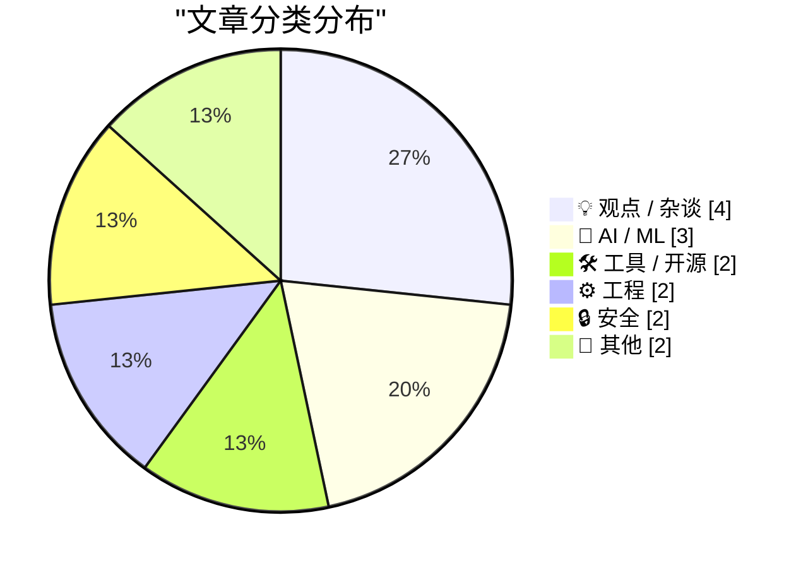
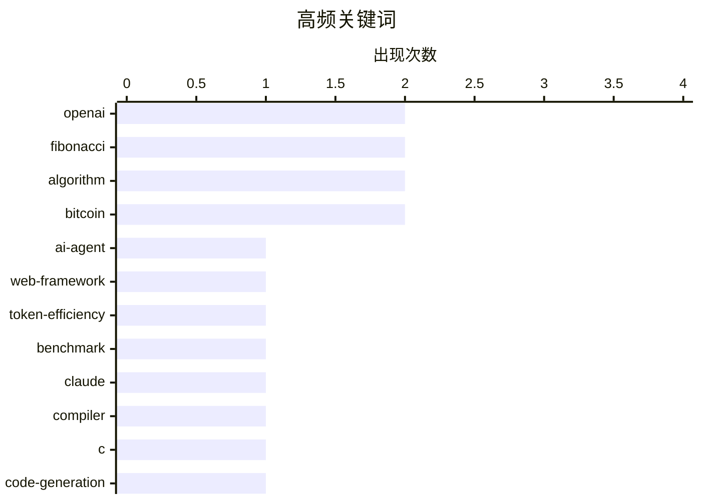

# 📰 AI 博客每日精选 — 2026-02-23

> 来自 Karpathy 推荐的 92 个顶级技术博客，AI 精选 Top 15

## 📝 今日看点

AI代理正从代码辅助工具进化为可协作构建编译器的系统级工程智能体，Token效率与多代理协作成为技术突破关键。AI产业生态陷入"安全悖论"下的实验室 proliferate 竞争，巨头投资传闻的澄清折射出算力霸权争夺的深层焦虑。与此同时，比特币网络算力突破Zettahash量级，极端规模计算与可验证性算法成为基础设施新焦点，技术世界在智能体革命与算力爆炸的双重驱动下加速重构。

---

## 🏆 今日必读

🥇 **哪些Web框架对AI代理最节省Token？**

[Which web frameworks are most token-efficient for AI agents?](https://martinalderson.com/posts/which-web-frameworks-are-most-token-efficient-for-ai-agents/?utm_source=rss) — martinalderson.com · 2 小时前 · 🤖 AI / ML

> 针对AI编码代理构建和扩展相同应用的token效率问题，作者对19个Web框架进行了基准测试。结果显示，极简框架（如Hono、Express）比全功能框架（如Next.js、Django）在代码生成和修改任务中消耗token数减少高达2.9倍。测试覆盖从路由定义到数据库迁移的完整开发流程，证明框架的抽象层级和元数据冗余直接影响AI代理的上下文窗口占用和API调用成本。这一发现为构建AI原生开发工作流时的技术选型提供了量化依据。

💡 **为什么值得读**: 如果你正在评估AI编码工具的成本效益，这篇文章用具体数据揭示了框架选择对token消耗的戏剧性影响，直接关联到开发预算。

🏷️ AI-agent, web-framework, token-efficiency, benchmark

🥈 **Claude C编译器：它揭示了软件开发的未来**

[The Claude C Compiler: What It Reveals About the Future of Software](https://simonwillison.net/2026/Feb/22/ccc/#atom-everything) — simonwillison.net · 2 小时前 · 🤖 AI / ML

> Anthropic研究员Nicholas Carlini利用并行Claude实例和最新Opus 4.6模型成功构建了一个完整的C编译器，展示了多代理协作处理复杂系统级软件工程的能力。该项目不仅实现了编译器核心功能，还邀请了LLVM和Swift之父Chris Lattner进行专业评估。这一实验揭示了未来软件开发的可能范式：AI代理不再只是辅助编码工具，而是能够自主架构和实现底层基础设施的"并行工程师团队"，标志着从代码补全到完整系统生成的跃迁。

💡 **为什么值得读**: 这是观察AI从写代码进化到构建编译器这一元能力的关键案例，由编译器领域的顶级专家参与验证，预示着软件工程范式的根本性转变。

🏷️ Claude, compiler, C, code-generation

🥉 **我如何看待Codex**

[How I think about Codex](https://simonwillison.net/2026/Feb/22/how-i-think-about-codex/#atom-everything) — simonwillison.net · 10 小时前 · 🤖 AI / ML

> OpenAI开发者体验工程师Gabriel Chua澄清了OpenAI生态中"Codex"这一术语的混淆现状。他指出Codex并非单一产品，而是指代OpenAI的软件工程代理（Software Engineering Agent），其核心是"模型+指令"的组合，通过ChatGPT、CLI或API等多种接口提供服务。这一概念区分帮助开发者理解Codex与传统Copilot类代码补全工具的本质差异：前者是具备任务规划、代码执行和迭代能力的自主代理，后者只是IDE内的智能补全插件。

💡 **为什么值得读**: 如果你在困惑OpenAI各种"Codex"产品（CLI、ChatGPT功能、API）之间的关系，这篇文章提供了来自内部工程师的权威概念梳理。

🏷️ OpenAI, Codex, AI-coding, terminology

---

## 📊 数据概览

| 扫描源 | 抓取文章 | 时间范围 | 精选 |
|:---:|:---:|:---:|:---:|
| 85/92 | 2431 篇 → 17 篇 | 48h | **15 篇** |

### 分类分布



### 高频关键词



<details>
<summary>📈 纯文本关键词图（终端友好）</summary>

```
openai           │ ████████████████████ 2
fibonacci        │ ████████████████████ 2
algorithm        │ ████████████████████ 2
bitcoin          │ ████████████████████ 2
ai-agent         │ ██████████░░░░░░░░░░ 1
web-framework    │ ██████████░░░░░░░░░░ 1
token-efficiency │ ██████████░░░░░░░░░░ 1
benchmark        │ ██████████░░░░░░░░░░ 1
claude           │ ██████████░░░░░░░░░░ 1
compiler         │ ██████████░░░░░░░░░░ 1
```

</details>

### 🏷️ 话题标签

**openai**(2) · **fibonacci**(2) · **algorithm**(2) · bitcoin(2) · ai-agent(1) · web-framework(1) · token-efficiency(1) · benchmark(1) · claude(1) · compiler(1) · c(1) · code-generation(1) · codex(1) · ai-coding(1) · terminology(1) · git(1) · github(1) · devops(1) · repository(1) · ai(1)

---

## 💡 观点 / 杂谈

### 1. AI实验室如何增殖

[How AI Labs Proliferate](https://blog.jim-nielsen.com/2026/how-ai-labs-proliferate/) — **blog.jim-nielsen.com** · 7 小时前 · ⭐ 22/30

> 文章以xkcd 927（标准之争）式的讽刺，揭示了AI安全实验室的悖论性增殖机制：当前14家竞争实验室均声称"其他人都不可信，必须由我们亲自构建超级智能以确保安全"，结果导致第15家实验室的诞生。作者指出"我们是负责任的一方"已成为各实验室从彼此拆分时的标准创始神话，批判了将商业竞争包装为安全使命的话语策略。这种以安全为名的碎片化反而加剧了监管协调的复杂性，与最初设想的集中治理背道而驰。

🏷️ AI, competition

---

### 2. Nvidia仅被邀请投资，并未承诺

[Nvidia was only invited to invest](https://idiallo.com/byte-size/nvidia-was-only-invited-to-invest?src=feed) — **idiallo.com** · 1 天前 · ⭐ 21/30

> Nvidia CEO Jensen Huang正式否认了此前广为流传的"Nvidia向OpenAI投资1000亿美元，OpenAI向Oracle投资3000亿美元，Oracle再反向投资Nvidia"的循环投资承诺。Huang澄清Nvidia"只是被邀请参与投资，从未做出承诺"，直接打破了描绘AI基础设施投资闭环的流行图表。这一表态揭示了传闻中的巨额资金流转（涉及Stargate等项目）可能存在的夸大成分，也反映了AI芯片巨头在参与模型公司融资时的谨慎立场和战略模糊性。

🏷️ Nvidia, OpenAI, investment, valuation

---

### 3. 我们离2010年的愿景还有多远？

[How close are we to a vision for 2010?](https://shkspr.mobi/blog/2026/02/how-close-are-we-to-a-vision-for-2010/) — **shkspr.mobi** · 13 小时前 · ⭐ 18/30

> 回顾25年前（2001年）欧盟IST顾问组发布的《环境智能》（Ambient Intelligence）愿景报告，当时设想到2010年实现"普适计算"——计算机将无缝嵌入环境、主动服务人类而不被感知。对比2026年的现实，文章指出技术界从"环境智能"的乌托邦理想转向了加密货币骗局和AI生成垃圾内容的 dystopian 现状。这一历史对照揭示了技术演进路径的偶然性，以及商业利益如何扭曲了原本以人为中心的计算愿景，导致我们错过了那个"技术隐形且 benevolent"的替代未来。

🏷️ ambient-intelligence, ubiquitous-computing, future, IoT

---

### 4. 口述理论解释一切

[The Orality Theory of Everything](https://www.theatlantic.com/ideas/2026/02/social-media-literacy-crisis/686076/?utm_source=feed) — **derekthompson.org** · 14 小时前 · ⭐ 16/30

> 阅读衰退与社交媒体兴起正将人类认知从书面文化推向"新口语文化"(Secondary Orality)。文章援引Walter Ong的媒介理论，解释短视频与播客如何改变大脑处理信息的方式，使思维更具表演性、对抗性和碎片化。这种从文字到语音的媒介转换不仅是消费习惯变化，更深刻重塑了"作为思考者"的主观体验与公共推理能力。

🏷️ social-media, literacy, culture

---

## 🤖 AI / ML

### 5. 哪些Web框架对AI代理最节省Token？

[Which web frameworks are most token-efficient for AI agents?](https://martinalderson.com/posts/which-web-frameworks-are-most-token-efficient-for-ai-agents/?utm_source=rss) — **martinalderson.com** · 2 小时前 · ⭐ 27/30

> 针对AI编码代理构建和扩展相同应用的token效率问题，作者对19个Web框架进行了基准测试。结果显示，极简框架（如Hono、Express）比全功能框架（如Next.js、Django）在代码生成和修改任务中消耗token数减少高达2.9倍。测试覆盖从路由定义到数据库迁移的完整开发流程，证明框架的抽象层级和元数据冗余直接影响AI代理的上下文窗口占用和API调用成本。这一发现为构建AI原生开发工作流时的技术选型提供了量化依据。

🏷️ AI-agent, web-framework, token-efficiency, benchmark

---

### 6. Claude C编译器：它揭示了软件开发的未来

[The Claude C Compiler: What It Reveals About the Future of Software](https://simonwillison.net/2026/Feb/22/ccc/#atom-everything) — **simonwillison.net** · 2 小时前 · ⭐ 26/30

> Anthropic研究员Nicholas Carlini利用并行Claude实例和最新Opus 4.6模型成功构建了一个完整的C编译器，展示了多代理协作处理复杂系统级软件工程的能力。该项目不仅实现了编译器核心功能，还邀请了LLVM和Swift之父Chris Lattner进行专业评估。这一实验揭示了未来软件开发的可能范式：AI代理不再只是辅助编码工具，而是能够自主架构和实现底层基础设施的"并行工程师团队"，标志着从代码补全到完整系统生成的跃迁。

🏷️ Claude, compiler, C, code-generation

---

### 7. 我如何看待Codex

[How I think about Codex](https://simonwillison.net/2026/Feb/22/how-i-think-about-codex/#atom-everything) — **simonwillison.net** · 10 小时前 · ⭐ 24/30

> OpenAI开发者体验工程师Gabriel Chua澄清了OpenAI生态中"Codex"这一术语的混淆现状。他指出Codex并非单一产品，而是指代OpenAI的软件工程代理（Software Engineering Agent），其核心是"模型+指令"的组合，通过ChatGPT、CLI或API等多种接口提供服务。这一概念区分帮助开发者理解Codex与传统Copilot类代码补全工具的本质差异：前者是具备任务规划、代码执行和迭代能力的自主代理，后者只是IDE内的智能补全插件。

🏷️ OpenAI, Codex, AI-coding, terminology

---

## 🛠 工具 / 开源

### 8. 代码托管平台专属仓库目录解析

[Forge-Specific Repository Folders](https://nesbitt.io/2026/02/22/forge-specific-repository-folders.html) — **nesbitt.io** · 16 小时前 · ⭐ 23/30

> 现代Git托管平台（GitHub、GitLab、Gitea、Forgejo、Bitbucket）各自实现了特定的魔法目录（.github/、.gitlab/、.gitea/等），用于存放CI/CD配置、Issue模板、代码所有者规则等平台特定功能。这些目录实现了仓库元数据与源代码的共存，但缺乏跨平台标准，导致多平台托管时需要维护多套配置。文章详细对比了各平台目录的功能差异，揭示了Git生态在可移植性与平台特性之间的张力，以及forge-agnostic配置标准化的缺失现状。

🏷️ git, github, devops, repository

---

### 9. Sentry iOS实战研讨会

[Sentry](https://sentry.io/resources/ios-workshop-jan-2026/?utm_source=daringfireball&amp;utm_medium=paid-display&amp;utm_campaign=general-fy27q1-evergreen&amp;utm_content=static-ad-mobilerss-trysentry) — **daringfireball.net** · 5 小时前 · ⭐ 15/30

> Sentry举办免费iOS实战技术研讨会，深入讲解崩溃报告、分布式追踪与日志分析的最佳实践。课程演示如何配置Sentry以精准识别高优先级移动问题，避免警报疲劳；利用Logs和Breadcrumbs功能重建崩溃现场的用户操作路径；以及通过性能监控定位应用瓶颈。研讨会提供按需观看(on-demand)录像，适合希望提升应用稳定性监控能力的移动端开发者。

🏷️ Sentry, iOS, monitoring

---

## ⚙️ 工程

### 10. 计算可验证的大斐波那契数

[Computing big, certified Fibonacci numbers](https://www.johndcook.com/blog/2026/02/21/big-certified-fibonacci/) — **johndcook.com** · 1 天前 · ⭐ 19/30

> 针对超大斐波那契数（如F(1,000,000)）的计算验证问题，作者提出了一种在计算过程中同步生成数学证书的新算法。该方法不同于传统的快速 doubling 或矩阵快速幂，能够在输出结果的同时提供可独立验证的计算正确性证明，解决了大数计算中"如何确信结果未被算错"的信任问题。尽管作者承认目前尚无实际应用场景，但这一技术为可验证计算（verifiable computing）领域提供了新的理论基础，特别是在需要第三方审计的计算密集型场景中。

🏷️ Fibonacci, algorithm, verification, big-numbers

---

### 11. 第1000万个斐波那契数

[10,000,000th Fibonacci number](https://www.johndcook.com/blog/2026/02/21/f10000000/) — **johndcook.com** · 1 天前 · ⭐ 17/30

> 通过带证书(certificate)的算法成功计算出第1000万个斐波那契数（n=10,000,000）。该方法利用辅助数据(auxiliary data)大幅加速结果正确性验证，相比纯重算显著降低确认成本。实现采用fib_mpmath库完成大整数运算，文章提供了详细的计时数据对比。这种验证机制对需要确保超大规模数学计算可靠性的场景尤为重要。

🏷️ Fibonacci, algorithm, certificate, performance

---

## 🔒 安全

### 12. 比特币挖矿难度调整机制

[Bitcoin mining difficulty](https://www.johndcook.com/blog/2026/02/22/bitcoin-mining-difficulty/) — **johndcook.com** · 6 小时前 · ⭐ 18/30

> 文章分析了比特币网络当前约1 zettahash/秒（10^21次哈希/秒）的惊人算力规模，以及挖矿难度调整算法如何动态维持平均每10分钟出一个区块的恒定速率。通过展示难度随时间变化的图表，揭示了比特币协议通过每2016个区块（约两周）自动调整目标哈希值前导零数量的机制，以应对算力波动。这一自我调节机制确保了货币供应的可预测性，但也导致了算力竞争的无休止军备竞赛，目前全球每秒进行的哈希计算量已达到泽塔（zetta）级别。

🏷️ Bitcoin, mining, hash-rate

---

### 13. Exahash、Zettahash、Yottahash

[Exahash, Zettahash, Yottahash](https://www.johndcook.com/blog/2026/02/22/zettahash/) — **johndcook.com** · 7 小时前 · ⭐ 18/30

> 文章量化了比特币挖矿引发的全球哈希计算规模爆炸：当前网络每秒执行约1,000,000,000,000,000,000,000（10^21）次哈希运算，即1 Zettahash。作者对比了早期密码学中将哈希函数视为"单向函数"的理论好奇，与如今为挖矿消耗的庞大计算资源。通过Exahash（10^18）、Zettahash（10^21）、Yottahash（10^24）的量级递进，直观展示了工作量证明（PoW）机制如何将密码学原语转化为全球规模的计算竞赛，其能量消耗和算力增长已超出传统计算机科学的预期范畴。

🏷️ hash, Bitcoin, cryptography, scale

---

## 📝 其他

### 14. 伦敦证券交易所：树莓派控股公司

[London Stock Exchange: Raspberry Pi Holdings plc](https://simonwillison.net/2026/Feb/22/raspberry-pi-openclaw/#atom-everything) — **simonwillison.net** · 2 小时前 · ⭐ 17/30

> 树莓派控股公司（Raspberry Pi Holdings plc）股价周二在伦敦证券交易所出现显著飙升。股价图表显示，此前三个月该股呈下行趋势，从约325便士跌至260便士附近低点，周二出现戏剧性反弹。这一价格波动打破了自2024年11月以来的下跌通道，显示市场对这家英国单板计算机制造商的估值发生急剧转变。

🏷️ Raspberry Pi, stock, IPO

---

### 15. OpenBenches项目在FOSDEM

[OpenBenches at FOSDEM](https://shkspr.mobi/blog/2026/02/openbenches-at-fosdem/) — **shkspr.mobi** · 1 天前 · ⭐ 16/30

> 作者在FOSDEM 2026会议上就OpenBenches项目进行了闪电演讲，但官方录像因技术故障出现片段缺失。使用Flowblade开源视频编辑器，结合自行录制的音频与zipkid拍摄的现场照片，成功重建了完整演讲视频。该修复展示了如何在AV设备故障后利用开源工具恢复重要技术分享内容，最终成品已重新发布供观看。

🏷️ OpenBenches, FOSDEM, open-data

---

*生成于 2026-02-23 02:05 | 扫描 85 源 → 获取 2431 篇 → 精选 15 篇*
*基于 [Hacker News Popularity Contest 2025](https://refactoringenglish.com/tools/hn-popularity/) RSS 源列表，由 [Andrej Karpathy](https://x.com/karpathy) 推荐*
*由「懂点儿AI」制作，欢迎关注同名微信公众号获取更多 AI 实用技巧 💡*
