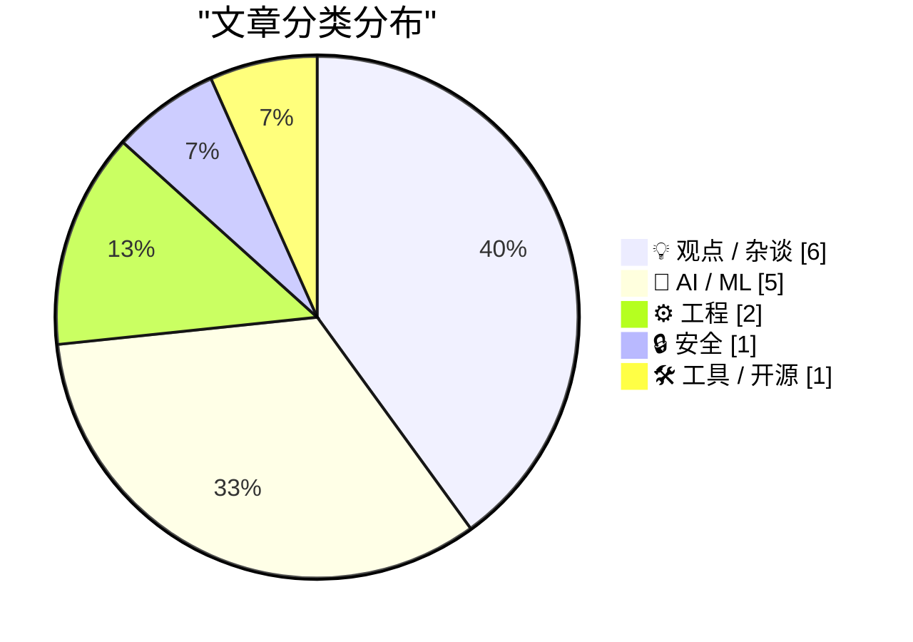
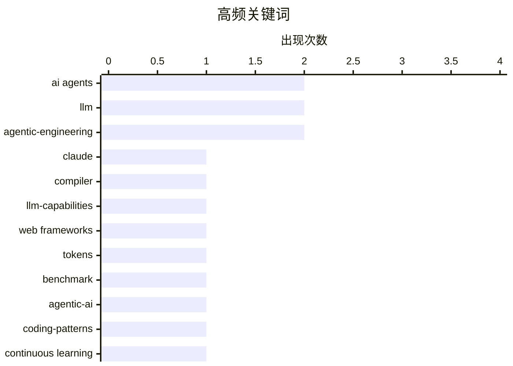

# 📰 AI 博客每日精选 — 2026-02-24

> 来自 Karpathy 推荐的 92 个顶级技术博客，AI 精选 Top 15

## 📝 今日看点

AI编码代理正展现出构建编译器、重构浏览器内核等复杂系统工程能力，代码生产从稀缺资源骤变为丰裕商品，倒逼开发流程与组织架构深度变革。与此同时，模型持续学习的结构性局限、"代理式集群"的管理幻觉，以及AI实验室无序增殖引发的安全竞赛，暴露出技术迭代速度与治理框架之间的严重断层。当生成代码的边际成本趋近于零，技术圈的核心命题正从工程效率转向伦理问责与系统性风险管控。

---

## 🏆 今日必读

🥇 **Claude C编译器：它揭示了软件的未来**

[The Claude C Compiler: What It Reveals About the Future of Software](https://simonwillison.net/2026/Feb/22/ccc/#atom-everything) — simonwillison.net · 1 天前 · 🤖 AI / ML

> Anthropic研究人员利用并行Claude实例在Opus 4.6模型上成功构建了一个完整的C编译器，展示了AI处理复杂系统编程任务的能力。LLVM和Swift创始人Chris Lattner等编译器专家对该项目进行了深度评析，指出这标志着AI在底层基础设施开发中的突破。项目揭示了未来软件开发可能转向“AI主导、人类监督”的并行代理模式，而非传统的逐行编码。这一实验表明，即使是最底层的系统软件（如编译器），也可能通过大规模语言模型实现自动化重构。

💡 **为什么值得读**: 观察AI如何攻克传统上需要数十年专业积累的编译器开发领域，理解未来系统软件的构建范式转移。

🏷️ Claude, compiler, LLM-capabilities

🥈 **哪些Web框架对AI代理最具Token效率？**

[Which web frameworks are most token-efficient for AI agents?](https://martinalderson.com/posts/which-web-frameworks-are-most-token-efficient-for-ai-agents/?utm_source=rss) — martinalderson.com · 1 天前 · 🤖 AI / ML

> 对19个主流Web框架进行AI编码代理效率基准测试，发现极简框架（如Flask、Express）相比全功能框架（如Django、Rails）可节省高达2.9倍的Token消耗。在构建和扩展相同应用的场景下，框架的代码量和抽象层次直接影响AI代理的上下文使用效率和API成本。测试表明，轻量级架构不仅降低开发成本，还能显著提升AI代码生成的准确性和迭代速度。这一数据为AI原生开发时代的技术选型提供了量化依据。

💡 **为什么值得读**: 为AI辅助开发提供具体的技术栈选型指南，帮助团队显著降低AI编码代理的使用成本。

🏷️ AI agents, web frameworks, tokens, benchmark

🥉 **撰写关于代理式工程模式的文章**

[Writing about Agentic Engineering Patterns](https://simonwillison.net/2026/Feb/23/agentic-engineering-patterns/#atom-everything) — simonwillison.net · 8 小时前 · 🤖 AI / ML

> Simon Willison启动Agentic Engineering Patterns项目，系统记录使用Claude Code、OpenAI Codex等编码代理的最佳实践。该项目定义了“代理式工程”新范式，即通过编码代理而非人工逐行编写来构建软件。收录的模式涵盖提示工程、上下文管理、代码审查流程等关键环节，旨在解决人类开发者与AI协作时的效率瓶颈。这些模式标志着软件工程从“手工编码”向“代理编排”的方法论转变。

💡 **为什么值得读**: 掌握AI辅助编程时代的关键设计模式，提升与编码代理协作的效率和代码质量。

🏷️ agentic-AI, coding-patterns, LLM

---

## 📊 数据概览

| 扫描源 | 抓取文章 | 时间范围 | 精选 |
|:---:|:---:|:---:|:---:|
| 84/92 | 2415 篇 → 41 篇 | 48h | **15 篇** |

### 分类分布



### 高频关键词



<details>
<summary>📈 纯文本关键词图（终端友好）</summary>

```
ai agents           │ ████████████████████ 2
llm                 │ ████████████████████ 2
agentic-engineering │ ████████████████████ 2
claude              │ ██████████░░░░░░░░░░ 1
compiler            │ ██████████░░░░░░░░░░ 1
llm-capabilities    │ ██████████░░░░░░░░░░ 1
web frameworks      │ ██████████░░░░░░░░░░ 1
tokens              │ ██████████░░░░░░░░░░ 1
benchmark           │ ██████████░░░░░░░░░░ 1
agentic-ai          │ ██████████░░░░░░░░░░ 1
```

</details>

### 🏷️ 话题标签

**ai agents**(2) · **llm**(2) · **agentic-engineering**(2) · claude(1) · compiler(1) · llm-capabilities(1) · web frameworks(1) · tokens(1) · benchmark(1) · agentic-ai(1) · coding-patterns(1) · continuous learning(1) · model deployment(1) · multi-agent(1) · organization(1) · breach(1) · disclosure(1) · security(1) · rust(1) · browser(1)

---

## 💡 观点 / 杂谈

### 1. 写代码现在很便宜

[Writing code is cheap now](https://simonwillison.net/guides/agentic-engineering-patterns/code-is-cheap/#atom-everything) — **simonwillison.net** · 9 小时前 · ⭐ 25/30

> AI编码代理使代码生成成本骤降，传统需要一整天编写的数百行干净、测试过的代码现在可在几分钟内产出。这要求开发者从“代码昂贵”的传统思维转向“代码丰裕”的新范式，重新评估代码审查、测试策略和架构设计流程。代理式工程要求重构开发工作流，适应从精心手工编写到快速生成并迭代的质量标准转变。软件工程的核心挑战已从“如何编写代码”转变为“如何管理AI生成的代码资产”。

🏷️ vibe-coding, agentic-engineering, productivity

---

### 2. AI实验室如何增殖

[How AI Labs Proliferate](https://blog.jim-nielsen.com/2026/how-ai-labs-proliferate/) — **blog.jim-nielsen.com** · 1 天前 · ⭐ 25/30

> AI实验室以“只有我们能负责任地开发超级智能”为由不断分裂增殖，形成从14个到15个竞争者的讽刺循环。每个新实验室都声称其他机构不可信，却加剧了行业碎片化和安全竞赛，这种现象类似xkcd关于标准竞争的漫画。所谓的“负责任AI”往往沦为创业神话和公关辞令，而非实际的治理行动。文章揭示了AI治理中“不信任他人”逻辑如何反而导致更多不可控的竞争态势。

🏷️ AI labs, competition, standards

---

### 3. 针对AI危害采取行动

[Taking action against AI harms](https://anildash.com/2026/02/23/taking-action-ai-harms/) — **anildash.com** · 2 小时前 · ⭐ 25/30

> AI产品正通过平台的不负责任选择对儿童造成实际心理和安全伤害，而当前缺乏有效的问责机制。文章提供从被动批评转向主动行动的具体路径，包括政策倡导、技术标准和社区监督等多元手段。强调需要建立超越企业自我监管的强制力，保护弱势群体免受未经验证的AI系统影响。呼吁技术从业者将伦理关切转化为具体的保护性行动，而非仅停留在讨论层面。

🏷️ AI ethics, child safety, platform responsibility

---

### 4. AI从业者都在基于错误的前提构建产品

[Everyone in AI is building the wrong thing for the same reason](https://www.joanwestenberg.com/everyone-in-ai-is-building-the-wrong-thing-for-the-same-reason/) — **joanwestenberg.com** · 14 小时前 · ⭐ 24/30

> 当前AI行业的创始人普遍陷入一种方向性焦虑，明知行业高速前进的方向存在逻辑缺陷却无力刹车。这种“加速跑步机”效应源于集体性竞争压力与路径依赖，导致所有人基于同一错误前提构建产品。文章指出，整个行业正在系统性地制造错误解决方案，而创始人缺乏退出机制或替代路径。作者认为这种同质化的错误构建逻辑比技术缺陷本身更具危害性，呼吁重新审视AI产品的基本假设。

🏷️ AI, startup, industry, anxiety

---

### 5. Pluralistic：自我去平台化（2026年2月23日）

[Pluralistic: Deplatform yourself (23 Feb 2026)](https://pluralistic.net/2026/02/23/goodharts-lawbreaker/) — **pluralistic.net** · 15 小时前 · ⭐ 22/30

> 这是一篇关于数字主权与平台批判的链接聚合文章，核心议题包括自我去平台化（Deplatform yourself）、版权侵权争议以及古德哈特定律（Goodhart's Law）在技术治理中的体现。文章汇集了从DNS漏洞、版权期限延长到匿名者决策机制等多元话题，批判了平台垄断、强制仲裁与算法治理的弊端。整体构成对当前互联网基础设施权力结构的碎片化反思，强调版权侵权并非娱乐消费中的首要议题。

🏷️ deplatforming, copyright, internet policy

---

### 6. 关于Farcaster的思考

[Thoughts on Farcaster](https://www.joanwestenberg.com/thoughts-on-farcaster/) — **joanwestenberg.com** · 3 小时前 · ⭐ 22/30

> 去中心化社交协议Farcaster虽被视作该领域“最可信的构建尝试”，但用户留存价值正面临重新审视。作者通过数周的自我审视，对是否继续留在Farcaster做出了明确决断，质疑个人持续投入注意力的合理性。文章评估了Farcaster作为去中心化社交网络的技术架构优势与个人实际使用体验之间的落差。最终结论涉及对去中心化社交本质价值与个人注意力分配优先级的权衡，反映了Web3社交产品的真实用户粘性挑战。

🏷️ Farcaster, decentralized social, Web3

---

## 🤖 AI / ML

### 7. Claude C编译器：它揭示了软件的未来

[The Claude C Compiler: What It Reveals About the Future of Software](https://simonwillison.net/2026/Feb/22/ccc/#atom-everything) — **simonwillison.net** · 1 天前 · ⭐ 27/30

> Anthropic研究人员利用并行Claude实例在Opus 4.6模型上成功构建了一个完整的C编译器，展示了AI处理复杂系统编程任务的能力。LLVM和Swift创始人Chris Lattner等编译器专家对该项目进行了深度评析，指出这标志着AI在底层基础设施开发中的突破。项目揭示了未来软件开发可能转向“AI主导、人类监督”的并行代理模式，而非传统的逐行编码。这一实验表明，即使是最底层的系统软件（如编译器），也可能通过大规模语言模型实现自动化重构。

🏷️ Claude, compiler, LLM-capabilities

---

### 8. 哪些Web框架对AI代理最具Token效率？

[Which web frameworks are most token-efficient for AI agents?](https://martinalderson.com/posts/which-web-frameworks-are-most-token-efficient-for-ai-agents/?utm_source=rss) — **martinalderson.com** · 1 天前 · ⭐ 27/30

> 对19个主流Web框架进行AI编码代理效率基准测试，发现极简框架（如Flask、Express）相比全功能框架（如Django、Rails）可节省高达2.9倍的Token消耗。在构建和扩展相同应用的场景下，框架的代码量和抽象层次直接影响AI代理的上下文使用效率和API成本。测试表明，轻量级架构不仅降低开发成本，还能显著提升AI代码生成的准确性和迭代速度。这一数据为AI原生开发时代的技术选型提供了量化依据。

🏷️ AI agents, web frameworks, tokens, benchmark

---

### 9. 撰写关于代理式工程模式的文章

[Writing about Agentic Engineering Patterns](https://simonwillison.net/2026/Feb/23/agentic-engineering-patterns/#atom-everything) — **simonwillison.net** · 8 小时前 · ⭐ 26/30

> Simon Willison启动Agentic Engineering Patterns项目，系统记录使用Claude Code、OpenAI Codex等编码代理的最佳实践。该项目定义了“代理式工程”新范式，即通过编码代理而非人工逐行编写来构建软件。收录的模式涵盖提示工程、上下文管理、代码审查流程等关键环节，旨在解决人类开发者与AI协作时的效率瓶颈。这些模式标志着软件工程从“手工编码”向“代理编排”的方法论转变。

🏷️ agentic-AI, coding-patterns, LLM

---

### 10. 持续学习为何如此困难？

[What's so hard about continuous learning?](https://seangoedecke.com/continuous-learning/) — **seangoedecke.com** · 1 天前 · ⭐ 26/30

> 当前生产环境的AI模型部署后能力即被冻结，无法像人类员工那样通过经验积累持续成长为领域专家。根本限制在于模型权重固定，所谓的“学习”仅依赖有限的上下文窗口，无法持久化新知识。这导致AI系统在处理需要长期适应的复杂业务场景时存在结构性缺陷。实现真正的持续学习需要突破静态模型架构，解决权重更新、记忆机制和灾难性遗忘等技术难题。

🏷️ continuous learning, LLM, model deployment

---

### 11. 代理式集群：组织架构图的幻觉

[Agentic swarms are an org-chart delusion](https://www.joanwestenberg.com/agentic-swarms-are-an-org-chart-delusion/) — **joanwestenberg.com** · 57 分钟前 · ⭐ 26/30

> “代理式集群”愿景试图将企业层级底层的员工替换为AI代理，保留人类作为监督者，本质上是将传统科层制简单机械化。作者指出这种思路是危险的组织幻觉，它忽视了AI时代需要重构工作流程而非仅替换人力。简单用机器人填充现有组织架构会导致责任模糊、效率低下和系统性风险。真正的AI转型应重新设计业务逻辑，而非在过时的组织图表中塞入自动化工具。

🏷️ AI agents, multi-agent, organization

---

## ⚙️ 工程

### 12. Ladybird浏览器采用Rust，借助AI之力

[Ladybird adopts Rust, with help from AI](https://simonwillison.net/2026/Feb/23/ladybird-adopts-rust/#atom-everything) — **simonwillison.net** · 7 小时前 · ⭐ 25/30

> Ladybird浏览器团队放弃等待Swift跨平台生态成熟，全面转向内存安全的Rust语言，并使用AI编码代理协助完成关键库的迁移。项目负责人Andreas Kling详细记录了在关键基础设施项目中复杂使用Claude等工具的经验，证明AI可处理高风险的编程语言迁移任务。这一案例展示了AI在代码现代化、内存安全重构和跨平台移植中的实际效能。项目成功验证了人机协作模式在核心系统开发中的可行性。

🏷️ Rust, browser, AI-coding, Ladybird

---

### 13. 红绿TDD：提升AI编程代理效果的关键模式

[Red/green TDD](https://simonwillison.net/guides/agentic-engineering-patterns/red-green-tdd/#atom-everything) — **simonwillison.net** · 18 小时前 · ⭐ 24/30

> 在利用AI编程代理（coding agent）生成代码时，如何确保输出质量与可靠性是核心挑战。红绿TDD（测试驱动开发）是一种简洁高效的解决方案，要求坚持测试优先开发（test-first development）原则：先编写会失败的测试（红），再编写代码使其通过（绿）。该方法强制要求每段代码都必须配备自动化测试作为正确性证明（correctness proof），而非事后补测。通过将经典TDD工程纪律应用于Agentic工程范式，可显著提升生成代码的可维护性与正确性。

🏷️ TDD, agentic-engineering, testing

---

## 🔒 安全

### 14. 每周更新 492

[Weekly Update 492](https://www.troyhunt.com/weekly-update-492/) — **troyhunt.com** · 1 小时前 · ⭐ 26/30

> 本周聚焦数据泄露事件从发生到受害者实际知情之间的时间鸿沟问题。公众往往倾向于指责被攻击企业，但忽视了受害者同时应对犯罪入侵、勒索威胁和合规审查的多重压力。这种披露延迟反映了企业在安全事件响应中面临的技术、法律和沟通困境。文章探讨了建立更透明、更及时的数据泄露通知机制的必要性与现实挑战。

🏷️ breach, disclosure, security

---

## 🛠 工具 / 开源

### 15. 我如何看待Codex：OpenAI生态中的术语澄清

[How I think about Codex](https://simonwillison.net/2026/Feb/22/how-i-think-about-codex/#atom-everything) — **simonwillison.net** · 1 天前 · ⭐ 24/30

> OpenAI生态系统中“Codex”一词存在严重的术语混淆，同时指代多种不同概念。OpenAI APAC开发者体验工程师Gabriel Chua澄清：Codex本质是OpenAI的软件工程代理（software engineering agent），通过多接口提供服务；而代理的核心构成是基座模型加上系统指令（model plus instructions）。明确这一概念边界对开发者正确理解和使用Codex至关重要，有助于区分接口、模型与代理能力之间的差异。

🏷️ OpenAI, Codex, terminology

---

*生成于 2026-02-24 02:04 | 扫描 84 源 → 获取 2415 篇 → 精选 15 篇*
*基于 [Hacker News Popularity Contest 2025](https://refactoringenglish.com/tools/hn-popularity/) RSS 源列表，由 [Andrej Karpathy](https://x.com/karpathy) 推荐*
*由「懂点儿AI」制作，欢迎关注同名微信公众号获取更多 AI 实用技巧 💡*
