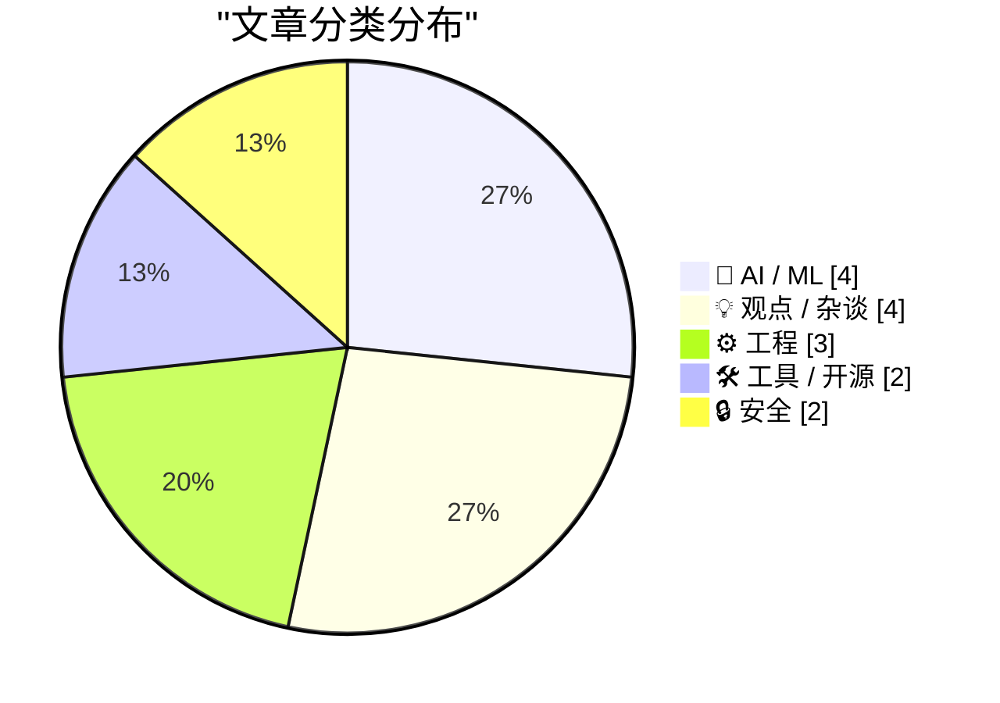
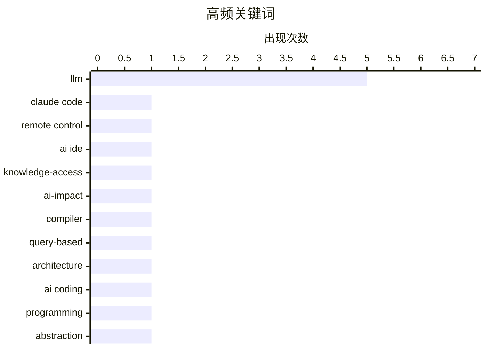

# 📰 AI 博客每日精选 — 2026-02-26

> 来自 Karpathy 推荐的 92 个顶级技术博客，AI 精选 Top 15

## 📝 今日看点

AI编程进入从辅助工具到自主智能体的质变阶段，Coding Agents与Vibe Coding的实用化正重构软件生产范式。知识获取壁垒的坍塌和认知摩擦的消除，正在瓦解传统基于人类注意力缺陷的寻租经济逻辑。技术社区在拥抱变革的同时，亦对架构复杂性与API安全保持警惕。

---

## 🏆 今日必读

🥇 **Claude Code 远程控制功能解读**

[Claude Code Remote Control](https://simonwillison.net/2026/Feb/25/claude-code-remote-control/#atom-everything) — simonwillison.net · 1 天前 · 🛠 工具 / 开源

> Anthropic 为 Claude Code 推出了远程控制功能，允许用户在本地计算机上启动会话后，通过网页端、iOS 应用或桌面客户端远程发送提示词。该功能目前处于早期阶段，部分用户遇到了"账户未启用远程控制"的权限问题。这代表了 AI 编码工具向多设备协同工作流的演进，但稳定性和账户配置仍需完善。

💡 **为什么值得读**: 了解 Claude Code 最新的跨设备远程开发能力及其当前限制。

🏷️ Claude Code, remote control, AI IDE

🥈 **当知识获取不再是限制**

[When access to knowledge is no longer the limitation](https://idiallo.com/blog/access-to-knowledge-is-no-longer-a-limitation?src=feed) — idiallo.com · 1 天前 · 🤖 AI / ML

> 作者通过思想实验将反对大语言模型的论点暂时搁置，聚焦于 AI 带来的积极变革：人类首次拥有即时获取全球信息的 fingertips 能力。当知识获取的壁垒被消除，问题的关键从"能否找到答案"转变为"如何提出正确的问题"和利用这些信息创造价值。这种范式的转变要求我们重新思考教育、工作和创新的本质。

💡 **为什么值得读**: 提供关于 AI 时代知识民主化的乐观视角，帮助读者超越技术争议思考深层影响。

🏷️ LLM, knowledge-access, AI-impact

🥉 **反对基于查询的编译器架构**

[Against Query Based Compilers](https://matklad.github.io/2026/02/25/against-query-based-compilers.html) — matklad.github.io · 1 天前 · ⚙️ 工程

> 基于查询的编译器架构（Query-based compilers）虽然当下流行，但其设计存在潜在陷阱。作者指出这种架构可能引入不必要的复杂性，增加维护负担，并在某些场景下导致性能问题或架构僵化。文章警示开发者不要盲目追随趋势，而应权衡增量计算带来的好处与系统复杂度成本，特别是在编译器这种对性能极度敏感的场景中。

💡 **为什么值得读**: 来自 Rust Analyzer 作者的深度技术反思，为编译器架构选型提供 critical 视角。

🏷️ compiler, query-based, architecture

---

## 📊 数据概览

| 扫描源 | 抓取文章 | 时间范围 | 精选 |
|:---:|:---:|:---:|:---:|
| 83/92 | 2406 篇 → 50 篇 | 48h | **15 篇** |

### 分类分布



### 高频关键词



<details>
<summary>📈 纯文本关键词图（终端友好）</summary>

```
llm              │ ████████████████████ 5
claude code      │ ████░░░░░░░░░░░░░░░░ 1
remote control   │ ████░░░░░░░░░░░░░░░░ 1
ai ide           │ ████░░░░░░░░░░░░░░░░ 1
knowledge-access │ ████░░░░░░░░░░░░░░░░ 1
ai-impact        │ ████░░░░░░░░░░░░░░░░ 1
compiler         │ ████░░░░░░░░░░░░░░░░ 1
query-based      │ ████░░░░░░░░░░░░░░░░ 1
architecture     │ ████░░░░░░░░░░░░░░░░ 1
ai coding        │ ████░░░░░░░░░░░░░░░░ 1
```

</details>

### 🏷️ 话题标签

**llm**(5) · **claude code**(1) · **remote control**(1) · ai ide(1) · knowledge-access(1) · ai-impact(1) · compiler(1) · query-based(1) · architecture(1) · ai coding(1) · programming(1) · abstraction(1) · natural language(1) · opencode(1) · ci-cd(1) · ai-code-review(1) · agentic ai(1) · code walkthrough(1) · rent-seeking(1) · economics(1)

---

## 🤖 AI / ML

### 1. 当知识获取不再是限制

[When access to knowledge is no longer the limitation](https://idiallo.com/blog/access-to-knowledge-is-no-longer-a-limitation?src=feed) — **idiallo.com** · 1 天前 · ⭐ 26/30

> 作者通过思想实验将反对大语言模型的论点暂时搁置，聚焦于 AI 带来的积极变革：人类首次拥有即时获取全球信息的 fingertips 能力。当知识获取的壁垒被消除，问题的关键从"能否找到答案"转变为"如何提出正确的问题"和利用这些信息创造价值。这种范式的转变要求我们重新思考教育、工作和创新的本质。

🏷️ LLM, knowledge-access, AI-impact

---

### 2. Andrej Karpathy：编程因 AI agents 发生质变

[Quoting Andrej Karpathy](https://simonwillison.net/2026/Feb/26/andrej-karpathy/#atom-everything) — **simonwillison.net** · 1 小时前 · ⭐ 25/30

> Andrej Karpathy 指出编程领域在 2025 年 12 月经历了非渐进式的突变：编码智能体（coding agents）在此之前基本无法实用，此后因模型质量、长期连贯性和坚持性的显著提升而变得可用。这种变化不是传统的"渐进进步"，而是能力跃迁，使 AI 能够自主处理大规模复杂代码库。这标志着软件工程从"AI 辅助"向"AI 代理"模式的转折点。

🏷️ AI coding, programming, LLM

---

### 3. 与 LLM 对话：工业级抽象的本质差异

[Greg Knauss: ‘Lose Myself’](https://www.eod.com/blog/2026/02/lose-myself/) — **daringfireball.net** · 21 小时前 · ⭐ 25/30

> Greg Knauss 反驳了"用英语与 LLM 交流只是机器物理原理的另一层抽象"的技术主义观点。通过工业化食品的类比（工厂 Ding Dong vs 手工巧克力蛋糕），他论证了规模化生产带来的质变：当技术实现工业化普及时，其本质影响远超抽象层次的简单叠加。与 LLM 的自然语言交互代表了一种工业级的民主化力量，它从根本上改变了创造和知识的生产方式，而非仅仅是接口的简化。

🏷️ LLM, abstraction, natural language

---

### 4. 我用 Vibe Coding 开发了理想的 macOS 演示应用

[I vibe coded my dream macOS presentation app](https://simonwillison.net/2026/Feb/25/present/#atom-everything) — **simonwillison.net** · 1 天前 · ⭐ 23/30

> Simon Willison 在 Social Science FOO Camp 会议前夜，完全通过自然语言描述（vibe coding）让 AI 生成了一个定制 macOS 演示应用。该应用用于其演讲"The State of LLMs, February 2026 edition"，展示了 AI 编程工具在快速原型开发中的极致效率——从概念到可运行的原生应用仅需数小时。这体现了 2025 年底以来 coding agents 能力跃升后，非传统编程方式已成为可行的生产力工具。

🏷️ vibe coding, LLM, macOS

---

## 💡 观点 / 杂谈

### 5. 寻租阶层的最后喘息

[The Last Gasps of the Rent Seeking Class](https://geohot.github.io//blog/jekyll/update/2026/02/26/the-last-gasps-of-the-rent-seeking-class.html) — **geohot.github.io** · 1 天前 · ⭐ 24/30

> 过去五十年，美国经济建立在人类认知限制之上的租金提取层：时间成本、耐心极限、品牌替代尽职调查、为避免多点几次而接受高价。数万亿美元的市值依赖于这些摩擦持续存在。AI 和自动化正在系统性消除这些人为限制，瓦解基于信息不对称和认知摩擦的商业模式，迫使经济价值回归真正的效率和创新而非利用人类弱点。

🏷️ rent-seeking, economics, automation

---

### 6. Apple in 2025: The Six Colors Report Card

[Apple in 2025: The Six Colors Report Card](https://sixcolors.com/post/2026/02/2025reportcard/) — **daringfireball.net** · 1 天前 · ⭐ 23/30

> Jason Snell:


  It’s time for our annual look back on Apple’s performance during
the past year, as seen through the eyes of writers, editors,
developers, podcasters, and other people who spend an awf

🏷️ Apple, annual-report, tech-industry

---

### 7. This time is different

[This time is different](https://shkspr.mobi/blog/2026/02/this-time-is-different/) — **shkspr.mobi** · 7 小时前 · ⭐ 23/30

> 3D TV, AMP, Augmented Reality, Beanie Babies, Blockchain, Cartoon Avatars, Curved TVs, Frogans, Hoverboards, iBeacons, Jetpacks, Metaverse, NFTs, Physical Web, Quantum Computing, Quibi, Small and Safe

🏷️ hype-cycle, tech-history, innovation

---

### 8. Quoting Benedict Evans

[Quoting Benedict Evans](https://simonwillison.net/2026/Feb/26/benedict-evans/#atom-everything) — **simonwillison.net** · 16 小时前 · ⭐ 22/30

> <blockquote cite="https://www.ben-evans.com/benedictevans/2026/2/19/how-will-openai-compete-nkg2x"><p>If people are only using this a couple of times a week at most, and can’t think of anything to do 

🏷️ OpenAI, AI adoption, user engagement

---

## ⚙️ 工程

### 9. 反对基于查询的编译器架构

[Against Query Based Compilers](https://matklad.github.io/2026/02/25/against-query-based-compilers.html) — **matklad.github.io** · 1 天前 · ⭐ 26/30

> 基于查询的编译器架构（Query-based compilers）虽然当下流行，但其设计存在潜在陷阱。作者指出这种架构可能引入不必要的复杂性，增加维护负担，并在某些场景下导致性能问题或架构僵化。文章警示开发者不要盲目追随趋势，而应权衡增量计算带来的好处与系统复杂度成本，特别是在编译器这种对性能极度敏感的场景中。

🏷️ compiler, query-based, architecture

---

### 10. 线性遍历：让 AI 智能体结构化讲解代码库

[Linear walkthroughs](https://simonwillison.net/guides/agentic-engineering-patterns/linear-walkthroughs/#atom-everything) — **simonwillison.net** · 1 天前 · ⭐ 24/30

> 线性遍历（Linear Walkthroughs）是一种让前沿 AI 模型对代码库进行系统性讲解的工程模式。无论是理解遗留代码、回顾自己遗忘的项目，还是理清"vibe coding"生成的代码结构，该模式都能生成结构化的代码遍历报告。关键在于配合适当的智能体工具（agent harness），使 AI 能够自主探索并保持上下文连贯，输出人类可读的架构分析。

🏷️ agentic AI, code walkthrough, LLM

---

### 11. A fuzzer for the Toy Optimizer

[A fuzzer for the Toy Optimizer](https://bernsteinbear.com/blog/toy-fuzzer/?utm_source=rss) — **bernsteinbear.com** · 1 天前 · ⭐ 23/30

> <p>It’s hard to get optimizers right. Even if you build up a painstaking test
suite by hand, you will likely miss corner cases, especially corner cases at
the interactions of multiple components or mu

🏷️ fuzzer, compiler-optimization, testing

---

## 🛠 工具 / 开源

### 12. Claude Code 远程控制功能解读

[Claude Code Remote Control](https://simonwillison.net/2026/Feb/25/claude-code-remote-control/#atom-everything) — **simonwillison.net** · 1 天前 · ⭐ 27/30

> Anthropic 为 Claude Code 推出了远程控制功能，允许用户在本地计算机上启动会话后，通过网页端、iOS 应用或桌面客户端远程发送提示词。该功能目前处于早期阶段，部分用户遇到了"账户未启用远程控制"的权限问题。这代表了 AI 编码工具向多设备协同工作流的演进，但稳定性和账户配置仍需完善。

🏷️ Claude Code, remote control, AI IDE

---

### 13. 在 CI/CD 中使用 OpenCode 进行 AI 代码审查

[Using OpenCode in CI/CD for AI pull request reviews](https://martinalderson.com/posts/using-opencode-in-cicd-for-ai-pull-request-reviews/?utm_source=rss) — **martinalderson.com** · 20 小时前 · ⭐ 25/30

> 作者分享了用 OpenCode 替代传统 SaaS 代码审查工具的实践经验。通过将 OpenCode 集成到 CI/CD 流水线，实现了比商业方案更低的成本、更高的数据安全性（代码不离开自有基础设施），以及与任何 Git 提供商（GitHub、GitLab、Gitea 等）的兼容性。这种自托管方案特别适合对数据隐私敏感或需要定制化审查规则的企业环境。

🏷️ OpenCode, CI-CD, AI-code-review

---

## 🔒 安全

### 14. Google API 密钥的安全隐患：从公开到私密的风险迁移

[Google API Keys Weren't Secrets. But then Gemini Changed the Rules.](https://simonwillison.net/2026/Feb/26/google-api-keys/#atom-everything) — **simonwillison.net** · 16 小时前 · ⭐ 23/30

> Trufflesecurity 研究发现，Google Maps 与 Gemini 共享同一套 API 密钥体系，但两者安全模型截然不同：Maps API 设计为公开嵌入网页，而 Gemini API 可访问私人文件并产生高额计费。这意味着原本安全公开的前端 Maps 密钥现在可能暴露敏感的 Gemini 功能，导致未授权的数据访问和财务风险。Google 未对两类服务做密钥隔离，构成了严重的供应链安全隐患。

🏷️ API keys, Google Gemini, cloud security

---

### 15. Amerika runt binnenkort onze BTW

[Amerika runt binnenkort onze BTW](https://berthub.eu/articles/posts/btw-as-an-american-service/) — **berthub.eu** · 6 小时前 · ⭐ 23/30

> Soms denk je, kan het nog gekker? We gaan het beheer van het platform waarop DigiD draait overlaten aan een Amerikaans bedrijf. Dit was niet de bedoeling, maar het gebeurt nu toch.
Maar het blijkt dat

🏷️ DigiD, privacy, data-sovereignty

---

*生成于 2026-02-26 20:30 | 扫描 83 源 → 获取 2406 篇 → 精选 15 篇*
*基于 [Hacker News Popularity Contest 2025](https://refactoringenglish.com/tools/hn-popularity/) RSS 源列表，由 [Andrej Karpathy](https://x.com/karpathy) 推荐*
*由「懂点儿AI」制作，欢迎关注同名微信公众号获取更多 AI 实用技巧 💡*
