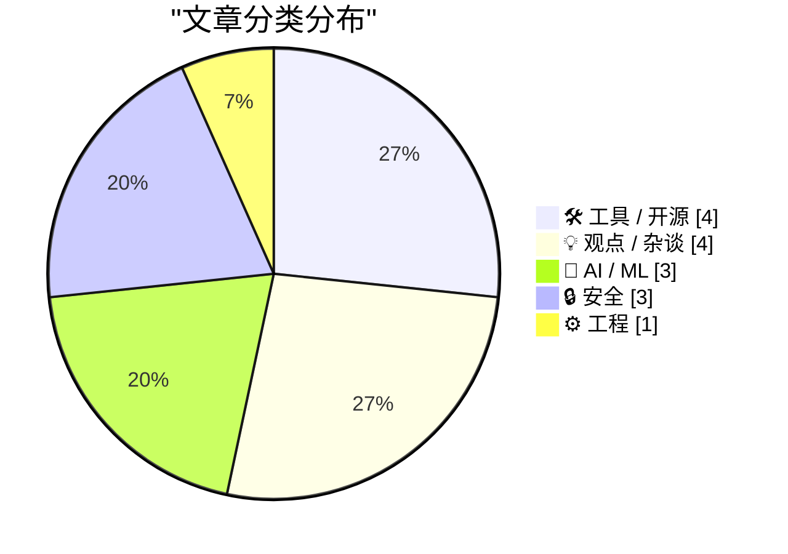
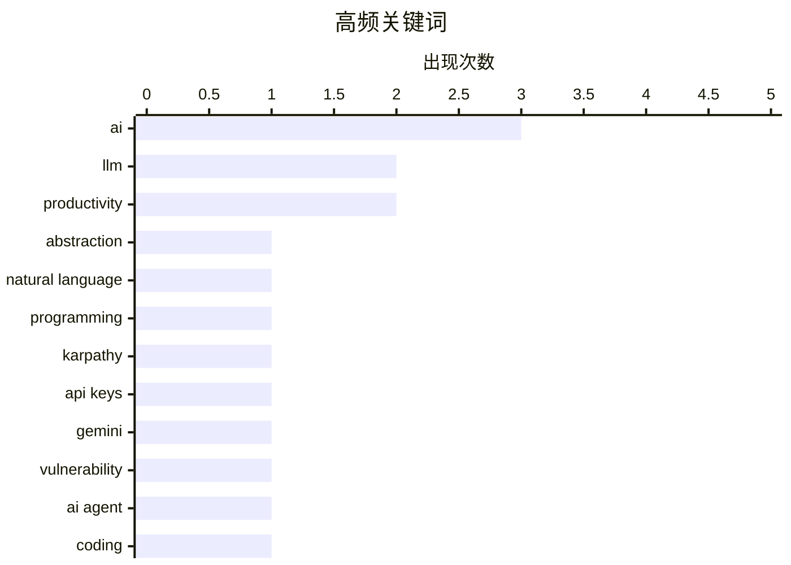

# 📰 AI 博客每日精选 — 2026-02-27

> 来自 Karpathy 推荐的 92 个顶级技术博客，AI 精选 Top 15

## 📝 今日看点

AI编程代理在过去两个月迎来质变时刻，从被质疑到成为大型项目开发的可行力量，这不仅改变了编码方式，更引发开发者对"人类技能价值"的深刻反思。与此同时，安全边界在AI时代遭遇新的挑战，Google API密钥与Gemini的权限冲突、以及iPhone首次获准处理北约机密，都标志着技术能力与信任体系正在剧烈重构。此外，AI工具正加速渗透开发者工作流的每个环节，从CI/CD集成到开源生态支持，自主化部署成为企业关注的新焦点。

---

## 🏆 今日必读

🥇 **迷失自我**

[Greg Knauss: ‘Lose Myself’](https://www.eod.com/blog/2026/02/lose-myself/) — daringfireball.net · 1 天前 · 🤖 AI / ML

> 与LLM用英语交流不仅是技术抽象层面的问题，而是涉及工业化对事物本质的根本性改变。作者通过食品工业化的类比指出，工厂生产的Ding Dong蛋糕、手工巧克力奶油蛋糕与直接吃巧克力块有着本质区别。工业化带来的改变是量级的（quantum degrees），而非简单的线性演进。尽管从技术上讲，自然语言确实是机器物理层的进一步抽象，但这种观点忽略了工业化重塑事物本质的能力。

💡 **为什么值得读**: 通过精妙的食品工业化类比，深刻揭示了AI时代人机交互抽象层次背后的哲学本质。

🏷️ LLM, abstraction, natural language

🥈 **Andrej Karpathy：编程在过去两个月发生了质变**

[Quoting Andrej Karpathy](https://simonwillison.net/2026/Feb/26/andrej-karpathy/#atom-everything) — simonwillison.net · 1 天前 · 🤖 AI / ML

> 编程领域在过去两个月（特别是去年12月）经历了非渐进式的革命性转变，而非传统的渐进进步。Coding agents在12月前基本无法使用，如今却能稳定处理大型项目，这得益于模型质量、长期连贯性和持久性的显著提升。AI编程代理已具备“穿透”大型复杂代码库的能力，标志着软件开发范式的根本转折。

💡 **为什么值得读**: 来自AI领域顶尖专家的一手观察，精准定位了AI编程能力从“玩具”到“工具”的关键转折点。

🏷️ AI, programming, Karpathy

🥉 **Google API密钥本不是秘密，但Gemini改变了规则**

[Google API Keys Weren't Secrets. But then Gemini Changed the Rules.](https://simonwillison.net/2026/Feb/26/google-api-keys/#atom-everything) — simonwillison.net · 1 天前 · 🔒 安全

> Google Maps等服务的API密钥设计为公开嵌入网页，但Gemini使用相同的密钥体系却可访问私人文件并产生计费。这一设计缺陷导致原本安全的公开Maps密钥可能暴露敏感的Gemini功能，造成严重的安全隐患和潜在的费用风险。开发者需要重新审视现有密钥管理策略，区分不同服务的密钥暴露风险。

💡 **为什么值得读**: 揭示了Google云服务中一个容易被忽视的严重安全陷阱，对正在集成Gemini API的开发者至关重要。

🏷️ API keys, Gemini, vulnerability

---

## 📊 数据概览

| 扫描源 | 抓取文章 | 时间范围 | 精选 |
|:---:|:---:|:---:|:---:|
| 83/92 | 2394 篇 → 50 篇 | 48h | **15 篇** |

### 分类分布



### 高频关键词



<details>
<summary>📈 纯文本关键词图（终端友好）</summary>

```
ai               │ ████████████████████ 3
llm              │ █████████████░░░░░░░ 2
productivity     │ █████████████░░░░░░░ 2
abstraction      │ ███████░░░░░░░░░░░░░ 1
natural language │ ███████░░░░░░░░░░░░░ 1
programming      │ ███████░░░░░░░░░░░░░ 1
karpathy         │ ███████░░░░░░░░░░░░░ 1
api keys         │ ███████░░░░░░░░░░░░░ 1
gemini           │ ███████░░░░░░░░░░░░░ 1
vulnerability    │ ███████░░░░░░░░░░░░░ 1
```

</details>

### 🏷️ 话题标签

**ai**(3) · **llm**(2) · **productivity**(2) · abstraction(1) · natural language(1) · programming(1) · karpathy(1) · api keys(1) · gemini(1) · vulnerability(1) · ai agent(1) · coding(1) · opencode(1) · ci/cd(1) · code review(1) · claude(1) · open source(1) · anthropic(1) · ai coding(1) · agentic(1)

---

## 🛠 工具 / 开源

### 1. 在CI/CD中使用OpenCode进行AI代码审查

[Using OpenCode in CI/CD for AI pull request reviews](https://martinalderson.com/posts/using-opencode-in-cicd-for-ai-pull-request-reviews/?utm_source=rss) — **martinalderson.com** · 1 天前 · ⭐ 25/30

> 作者将SaaS代码审查工具替换为在CI/CD管道中运行的OpenCode方案，实现了成本降低、安全性提升和Git提供商无关性三大优势。该方案支持自托管，避免了将代码发送至第三方云服务的风险，同时兼容任意Git平台。这种架构为团队提供了更灵活、更可控的AI代码审查解决方案。

🏷️ OpenCode, CI/CD, code review, AI

---

### 2. 大型开源项目维护者可免费使用Claude Max六个月

[Free Claude Max for (large project) open source maintainers](https://simonwillison.net/2026/Feb/27/claude-max-oss-six-months/#atom-everything) — **simonwillison.net** · 2 小时前 · ⭐ 24/30

> Anthropic向符合条件的开源维护者提供价值$200/月的Claude Max 20x套餐六个月免费使用权。申请资格要求为GitHub 5000+ stars或NPM月下载量100万+项目的主要维护者。这一举措旨在降低大型开源项目维护者的AI工具使用门槛，支持开源社区发展。

🏷️ Claude, open source, Anthropic

---

### 3. The Talk Show：严肃的观点表达者

[The Talk Show: ‘Serious Opinionators’](https://daringfireball.net/thetalkshow/2026/02/25/ep-441) — **daringfireball.net** · 1 天前 · ⭐ 23/30

> 本期播客邀请Adam Engst深入探讨iOS 26及苹果全系26版本操作系统的UI设计变更，重点分析电话应用的Unified视图以及电话和短信应用中的Filter弹出菜单。节目还回顾了经典的Balloon Help功能，展现了苹果界面设计哲学的演变历程。

🏷️ iOS 26, UI design, Apple

---

### 4. 三星Galaxy S26 Ultra隐私显示屏技术实测

[Samsung Galaxy S26 Ultra’s Privacy Display](https://9to5google.com/2026/02/25/samsung-galaxy-s26-ultra-privacy-display-demo-hands-on/) — **daringfireball.net** · 1 天前 · ⭐ 22/30

> 三星Galaxy S26 Ultra搭载“隐私显示屏”硬件技术，通过重新设计像素发光角度来限制屏幕可视范围，防止公共场合的旁人偷窥。该功能提供默认和“最大”两档设置：默认档在较偏角度仍隐约可见内容，适合平衡隐私与可用性；最大档则大幅收窄可视范围，使侧面观看几乎不可能，但可能影响正面显示质量。这项技术直接解决了大屏手机在地铁、咖啡厅等场景下的隐私泄露风险，用户可根据环境敏感度灵活切换防护等级。

🏷️ privacy display, Samsung, hardware

---

## 💡 观点 / 杂谈

### 5. 囤积你知道如何做的事情

[Hoard things you know how to do](https://simonwillison.net/guides/agentic-engineering-patterns/hoard-things-you-know-how-to-do/#atom-everything) — **simonwillison.net** · 23 小时前 · ⭐ 24/30

> 与AI编程代理高效协作的关键在于“囤积”个人已掌握的技能和知识边界。构建软件的核心能力不仅在于编码，更在于理解技术可行性的范围及各种方案的近似实现路径。这种知识储备在AI辅助编程时代尤为重要，能帮助开发者更好地指导和验证AI生成的代码。

🏷️ AI coding, agentic, productivity

---

### 6. 论NVIDIA与分析废话

[On NVIDIA and Analyslop](https://www.wheresyoured.at/on-nvidia-and-analyslop/) — **wheresyoured.at** · 1 天前 · ⭐ 24/30

> 文章批判了当前围绕NVIDIA的金融市场分析和科技评论中充斥的“分析废话”（analyslop）。作者指出大量所谓的专业分析缺乏实质内容和技术深度，只是迎合市场情绪的噪音。这种现象反映了AI芯片热潮中信息质量的稀释和投机氛围的蔓延。

🏷️ NVIDIA, AI, analysis

---

### 7. 多元视角：如果你建造了它（并且它有效），特朗普会来（并拿走它）

[Pluralistic: If you build it (and it works), Trump will come (and take it) (26 Feb 2026)](https://pluralistic.net/2026/02/26/hanged-for-a-sheep/) — **pluralistic.net** · 1 天前 · ⭐ 22/30

> Cory Doctorow指出特朗普政府的科技政策并非促进公平竞争，而是试图“俘获”有效运转的技术基础设施为政治服务。文章分析了从传统反垄断执法转向“民粹主义反垄断”的危险趋势：政府不再拆分垄断企业，而是要求它们配合政治指令，包括削弱端到端加密、限制图书馆数字访问等。这种转变威胁到数字权利的基础，因为它用政治控制取代了市场规制，最终可能导致“政府支持的垄断”而非健康竞争的市场环境。

🏷️ tech policy, Trump, Big Tech

---

### 8. 这次不一样：从技术泡沫史看AI炒作

[This time is different](https://shkspr.mobi/blog/2026/02/this-time-is-different/) — **shkspr.mobi** · 1 天前 · ⭐ 22/30

> 作者列举了过去几十年一系列被过度炒作但最终失败的技术：3D电视、Google AMP、区块链、元宇宙、NFT、Google Stadia、WiMAX等。指出如今狂热吹捧AI的群体与当年追捧这些失败技术的群体高度重叠，且使用的话术同样是“这次不一样”。历史模式表明，当技术布道者不断用革命性叙事掩盖实际局限，并忽视用户真实需求时，往往预示着泡沫顶点。当前的AI热潮正显示出相似的炒作特征、投机氛围和不可持续性。

🏷️ tech hype, bubble, history

---

## 🤖 AI / ML

### 9. 迷失自我

[Greg Knauss: ‘Lose Myself’](https://www.eod.com/blog/2026/02/lose-myself/) — **daringfireball.net** · 1 天前 · ⭐ 27/30

> 与LLM用英语交流不仅是技术抽象层面的问题，而是涉及工业化对事物本质的根本性改变。作者通过食品工业化的类比指出，工厂生产的Ding Dong蛋糕、手工巧克力奶油蛋糕与直接吃巧克力块有着本质区别。工业化带来的改变是量级的（quantum degrees），而非简单的线性演进。尽管从技术上讲，自然语言确实是机器物理层的进一步抽象，但这种观点忽略了工业化重塑事物本质的能力。

🏷️ LLM, abstraction, natural language

---

### 10. Andrej Karpathy：编程在过去两个月发生了质变

[Quoting Andrej Karpathy](https://simonwillison.net/2026/Feb/26/andrej-karpathy/#atom-everything) — **simonwillison.net** · 1 天前 · ⭐ 26/30

> 编程领域在过去两个月（特别是去年12月）经历了非渐进式的革命性转变，而非传统的渐进进步。Coding agents在12月前基本无法使用，如今却能稳定处理大型项目，这得益于模型质量、长期连贯性和持久性的显著提升。AI编程代理已具备“穿透”大型复杂代码库的能力，标志着软件开发范式的根本转折。

🏷️ AI, programming, Karpathy

---

### 11. 一位AI代理编程怀疑论者的深度实测

[An AI agent coding skeptic tries AI agent coding, in excessive detail](https://minimaxir.com/2026/02/ai-agent-coding/) — **minimaxir.com** · 2 小时前 · ⭐ 26/30

> 作者以怀疑者身份对AI代理编程进行了详尽的技术验证，通过超长篇幅记录了完整的实测过程。文章摒弃了模糊的主观评价，转而提供细致入微的操作细节和技术观察。这种第一手的深度测试为评估AI编程代理的真实能力提供了难得的实证参考。

🏷️ AI agent, coding, LLM, productivity

---

## 🔒 安全

### 12. Google API密钥本不是秘密，但Gemini改变了规则

[Google API Keys Weren't Secrets. But then Gemini Changed the Rules.](https://simonwillison.net/2026/Feb/26/google-api-keys/#atom-everything) — **simonwillison.net** · 1 天前 · ⭐ 26/30

> Google Maps等服务的API密钥设计为公开嵌入网页，但Gemini使用相同的密钥体系却可访问私人文件并产生计费。这一设计缺陷导致原本安全的公开Maps密钥可能暴露敏感的Gemini功能，造成严重的安全隐患和潜在的费用风险。开发者需要重新审视现有密钥管理策略，区分不同服务的密钥暴露风险。

🏷️ API keys, Gemini, vulnerability

---

### 13. iPhone和iPad获准处理北约机密信息

[iPhone and iPad Approved to Handle Classified NATO Information](https://nr.apple.com/Do0I6B8WX0) — **daringfireball.net** · 22 小时前 · ⭐ 24/30

> 苹果宣布iPhone和iPad成为首个符合北约国家信息保证要求的消费级移动设备，可处理最高至NATO restricted级别的机密信息。该认证无需安装特殊软件或配置，这是消费级移动设备首次获得此类政府安全认证。尽管黑莓手机早已获得类似认证，但苹果实现了开箱即用的安全性。

🏷️ security, NATO, compliance, iOS

---

### 14. 西弗吉尼亚州反苹果CSAM诉讼将帮助儿童掠食者逍遥法外

[West Virginia’s Anti-Apple CSAM Lawsuit Would Help Child Predators Walk Free](https://www.techdirt.com/2026/02/25/west-virginias-anti-apple-csam-lawsuit-would-help-child-predators-walk-free/) — **daringfireball.net** · 53 分钟前 · ⭐ 22/30

> 西弗吉尼亚州起诉苹果要求强制扫描iCloud中的CSAM（儿童性虐待材料），但这一法律行动可能产生灾难性的反效果。如果法院下令苹果执行扫描，所有被标记的图片都将被视为“无搜查令的政府搜查”所得证据，违反美国宪法第四修正案。根据排除规则，辩护律师可以要求法庭驳回这些非法获取的证据，导致确凿的犯罪证据被排除在外。结果是，强制扫描不仅可能无法定罪，反而会让有罪的儿童掠食者因程序瑕疵而逃脱法律制裁。

🏷️ CSAM, privacy, encryption

---

## ⚙️ 工程

### 15. xkcd 2347 交互版：软件依赖关系可视化

[xkcd 2347](https://nesbitt.io/2026/02/27/xkcd-2347.html) — **nesbitt.io** · 10 小时前 · ⭐ 23/30

> 这是xkcd第2347号漫画《Dependency》的交互式网页实现，将静态的递归依赖笑话转化为可点击探索的动态体验。用户可以通过点击不断展开软件依赖树，直观感受现代项目中依赖关系的指数级膨胀——简单的应用可能瞬间拉出数千个嵌套库。该演示生动呈现了“依赖地狱”的概念：每个看似无害的小依赖都可能隐藏着更深层的依赖链条，最终堆积成难以维护的“庞然大物”。这种可视化方式比文字描述更能说明为什么node_modules文件夹会膨胀到数百兆，以及软件供应链的脆弱性根源。

🏷️ dependencies, complexity, xkcd

---

*生成于 2026-02-27 20:22 | 扫描 83 源 → 获取 2394 篇 → 精选 15 篇*
*基于 [Hacker News Popularity Contest 2025](https://refactoringenglish.com/tools/hn-popularity/) RSS 源列表，由 [Andrej Karpathy](https://x.com/karpathy) 推荐*
*由「懂点儿AI」制作，欢迎关注同名微信公众号获取更多 AI 实用技巧 💡*
