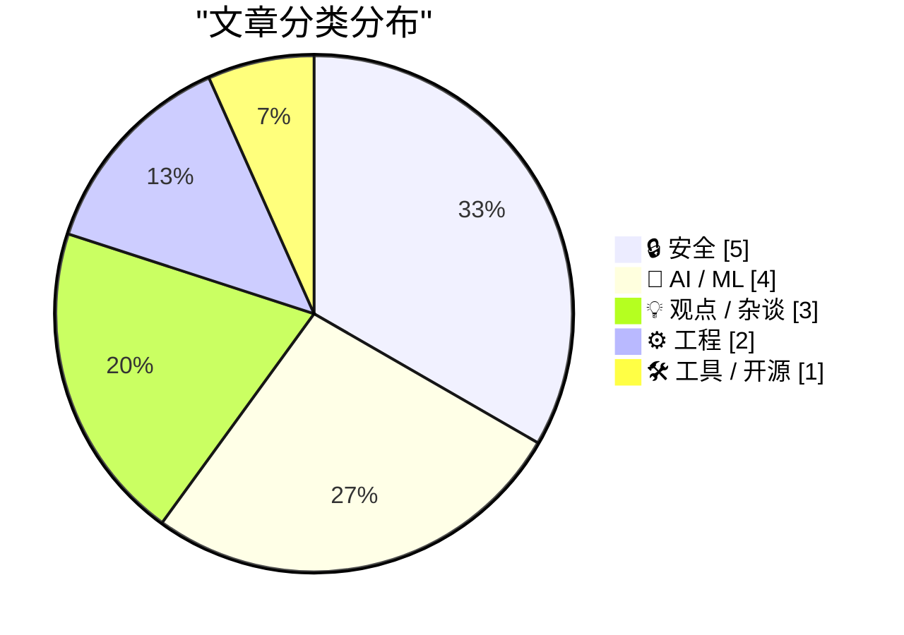
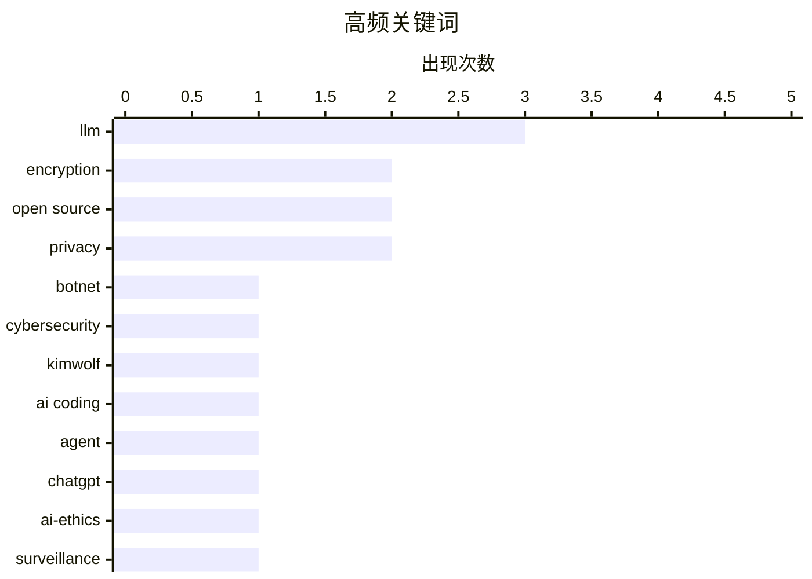

# 📰 AI 博客每日精选 — 2026-02-28

> 来自 Karpathy 推荐的 92 个顶级技术博客，AI 精选 Top 15

## 📝 今日看点

AI技术军事化正撕裂科技行业，OpenAI与五角大楼的战略合作引发开发者抵制潮，而Anthropic拒绝为国防需求修改Claude的立场形成鲜明对比，凸显企业在国家安全与伦理底线间的艰难抉择。与此同时，AI编程代理从概念验证走向大规模工程实践，开发者社区既在实测中探索能力边界，也在重构人机协作的技能管理方法论。安全领域则陷入攻防白热化与政策悖论，从国家级黑客报复到加密凭证管理风险，技术治理面临法律与技术的双重挑战。

---

## 🏆 今日必读

🥇 **谁是Kimwolf僵尸网络的控制者“Dort”？**

[Who is the Kimwolf Botmaster “Dort”?](https://krebsonsecurity.com/2026/02/who-is-the-kimwolf-botmaster-dort/) — krebsonsecurity.com · 8 小时前 · 🔒 安全

> 安全研究员披露漏洞被用于组建全球最大僵尸网络Kimwolf后，控制者“Dort”对其发动持续报复。Dort协调了针对研究员和KrebsOnSecurity作者的DDoS攻击、人肉搜索、邮件轰炸，甚至向研究员住所派遣SWAT特警队。攻击者通过一系列极端手段试图压制安全研究，包括利用社会工程学调动执法资源。文章深入追踪这位大规模网络犯罪幕后黑手的真实身份及其运作手法。

💡 **为什么值得读**: 揭露全球最大僵尸网络运营者的真实身份及其对安全研究员的极端报复手段，对网络安全防御和威胁情报具有重要参考价值。

🏷️ botnet, cybersecurity, Kimwolf

🥈 **一位AI编程代理怀疑者的深度实测报告（Simon Willison推荐）**

[An AI agent coding skeptic tries AI agent coding, in excessive detail](https://simonwillison.net/2026/Feb/27/ai-agent-coding-in-excessive-detail/#atom-everything) — simonwillison.net · 23 小时前 · 🤖 AI / ML

> Simon Willison推荐Max Woolf撰写的超长实测报告，记录从AI编程代理怀疑者到实践者的完整转变过程。文章通过一系列递进式项目验证能力边界，从简单的YouTube元数据爬虫逐步挑战更复杂的应用场景，详细记录提示词策略、代码质量评估与失败案例。这种不压缩细节的实证方法为当前AI代理编程的真实水平提供了可验证的参考基准。

💡 **为什么值得读**: 通过怀疑者的系统性实测揭示AI编程代理的实际能力边界，避免过度乐观或悲观的片面认知。

🏷️ AI coding, agent, LLM

🥉 **我注销了ChatGPT账户**

[That's it, I'm cancelling my ChatGPT](https://idiallo.com/byte-size/im-cancelling-my-chatgpt-openai-account?src=feed) — idiallo.com · 2 小时前 · 🤖 AI / ML

> 开发者Idiallo因OpenAI与美国国防部合作决定注销ChatGPT账户，抵制AI技术军事化。Sam Altman宣布将ChatGPT接入国防部机密网络，作者视其为大规模监控和AI武器化的入口，认为这完善了大规模监控所需的基础设施。此举与Anthropic CEO公开拒绝国防部合作形成鲜明对比，作者以销户行动抗议OpenAI成为政府监控与军事应用的技术推手。

💡 **为什么值得读**: 从开发者视角呈现AI伦理的极端立场选择，揭示OpenAI与国防部门合作引发的核心用户流失风险。

🏷️ ChatGPT, AI-ethics, surveillance

---

## 📊 数据概览

| 扫描源 | 抓取文章 | 时间范围 | 精选 |
|:---:|:---:|:---:|:---:|
| 81/92 | 2367 篇 → 38 篇 | 48h | **15 篇** |

### 分类分布



### 高频关键词



<details>
<summary>📈 纯文本关键词图（终端友好）</summary>

```
llm           │ ████████████████████ 3
encryption    │ █████████████░░░░░░░ 2
open source   │ █████████████░░░░░░░ 2
privacy       │ █████████████░░░░░░░ 2
botnet        │ ███████░░░░░░░░░░░░░ 1
cybersecurity │ ███████░░░░░░░░░░░░░ 1
kimwolf       │ ███████░░░░░░░░░░░░░ 1
ai coding     │ ███████░░░░░░░░░░░░░ 1
agent         │ ███████░░░░░░░░░░░░░ 1
chatgpt       │ ███████░░░░░░░░░░░░░ 1
```

</details>

### 🏷️ 话题标签

**llm**(3) · **encryption**(2) · **open source**(2) · privacy(2) · botnet(1) · cybersecurity(1) · kimwolf(1) · ai coding(1) · agent(1) · chatgpt(1) · ai-ethics(1) · surveillance(1) · ai agent(1) · coding(1) · automation(1) · passkeys(1) · authentication(1) · anthropic(1) · ai ethics(1) · military(1)

---

## 🔒 安全

### 1. 谁是Kimwolf僵尸网络的控制者“Dort”？

[Who is the Kimwolf Botmaster “Dort”?](https://krebsonsecurity.com/2026/02/who-is-the-kimwolf-botmaster-dort/) — **krebsonsecurity.com** · 8 小时前 · ⭐ 29/30

> 安全研究员披露漏洞被用于组建全球最大僵尸网络Kimwolf后，控制者“Dort”对其发动持续报复。Dort协调了针对研究员和KrebsOnSecurity作者的DDoS攻击、人肉搜索、邮件轰炸，甚至向研究员住所派遣SWAT特警队。攻击者通过一系列极端手段试图压制安全研究，包括利用社会工程学调动执法资源。文章深入追踪这位大规模网络犯罪幕后黑手的真实身份及其运作手法。

🏷️ botnet, cybersecurity, Kimwolf

---

### 2. 请停止使用Passkey加密用户数据

[Please, please, please stop using passkeys for encrypting user data](https://simonwillison.net/2026/Feb/27/passkeys/#atom-everything) — **simonwillison.net** · 21 小时前 · ⭐ 25/30

> 身份认证专家Tim Cappalli紧急呼吁行业停止用Passkey加密用户数据。用户频繁丢失Passkey且缺乏备份意识，若用于加密将导致数据永久不可恢复，这与仅用于身份认证的场景有本质区别。由于Passkey丢失率居高不下，将其用于数据加密会给用户带来不可逆的资产损失风险，而非传统的账户恢复问题。

🏷️ passkeys, encryption, authentication

---

### 3. iPhone与iPad获批处理北约机密信息

[iPhone and iPad Approved to Handle Classified NATO Information](https://nr.apple.com/Do0I6B8WX0) — **daringfireball.net** · 1 天前 · ⭐ 24/30

> iPhone与iPad成为首款通过北约信息保障认证的消费级移动设备，无需特殊软件即可处理NATO RESTRICTED级别（北约限制级）机密信息。这是首个达成此政府认证的消费设备，标志着消费电子产品进入高保密场景的关键里程碑。尽管如此，iPhone仅是历史上第二个获批处理机密信息的手机平台，继承了黑莓之后的政府移动办公标准。

🏷️ iOS, security, classified, compliance

---

### 4. 西弗吉尼亚州反苹果CSAM诉讼或将帮助儿童 predator 逍遥法外

[West Virginia’s Anti-Apple CSAM Lawsuit Would Help Child Predators Walk Free](https://www.techdirt.com/2026/02/25/west-virginias-anti-apple-csam-lawsuit-would-help-child-predators-walk-free/) — **daringfireball.net** · 1 天前 · ⭐ 23/30

> 西弗吉尼亚州要求苹果扫描iCloud CSAM的诉讼若胜诉，反而会导致罪犯逃脱法网。法院强制扫描构成“无证搜查”，根据第四修正案排除规则，所有由此获得的证据将被法庭排除。辩护律师可成功申请排除非法证据，导致针对儿童 predator 的刑事诉讼因证据无效而失败，产生保护儿童的措施反而让罪犯逍遥法外的悖论后果。

🏷️ CSAM, privacy, encryption, legal

---

### 5. npm 数据主体访问请求（GDPR）回应分析

[npm Data Subject Access Request](https://nesbitt.io/2026/02/28/npm-data-subject-access-request.html) — **nesbitt.io** · 10 小时前 · ⭐ 23/30

> 作者向 npm 提交 GDPR 数据主体访问请求后，详细分析了平台返回的完整数据档案。回应包含账户注册信息、所有发布的包元数据、详细的下载统计日志、IP 地址记录以及安全审计日志。数据显示 npm 保留了用户长期的操作轨迹和地理位置信息。分析揭示了主流包管理平台在数据收集广度与透明度之间的实际现状，以及开发者对平台数据保留策略的认知缺口。

🏷️ GDPR, npm, privacy

---

## 🤖 AI / ML

### 6. 一位AI编程代理怀疑者的深度实测报告（Simon Willison推荐）

[An AI agent coding skeptic tries AI agent coding, in excessive detail](https://simonwillison.net/2026/Feb/27/ai-agent-coding-in-excessive-detail/#atom-everything) — **simonwillison.net** · 23 小时前 · ⭐ 27/30

> Simon Willison推荐Max Woolf撰写的超长实测报告，记录从AI编程代理怀疑者到实践者的完整转变过程。文章通过一系列递进式项目验证能力边界，从简单的YouTube元数据爬虫逐步挑战更复杂的应用场景，详细记录提示词策略、代码质量评估与失败案例。这种不压缩细节的实证方法为当前AI代理编程的真实水平提供了可验证的参考基准。

🏷️ AI coding, agent, LLM

---

### 7. 我注销了ChatGPT账户

[That's it, I'm cancelling my ChatGPT](https://idiallo.com/byte-size/im-cancelling-my-chatgpt-openai-account?src=feed) — **idiallo.com** · 2 小时前 · ⭐ 26/30

> 开发者Idiallo因OpenAI与美国国防部合作决定注销ChatGPT账户，抵制AI技术军事化。Sam Altman宣布将ChatGPT接入国防部机密网络，作者视其为大规模监控和AI武器化的入口，认为这完善了大规模监控所需的基础设施。此举与Anthropic CEO公开拒绝国防部合作形成鲜明对比，作者以销户行动抗议OpenAI成为政府监控与军事应用的技术推手。

🏷️ ChatGPT, AI-ethics, surveillance

---

### 8. 一位AI编程代理怀疑者的深度实测报告（原文）

[An AI agent coding skeptic tries AI agent coding, in excessive detail](https://minimaxir.com/2026/02/ai-agent-coding/) — **minimaxir.com** · 1 天前 · ⭐ 26/30

> Max Woolf以超长篇幅详细记录AI编程代理的完整实测过程，通过“预计阅读时间”暗示内容深度与细节密度。文章摒弃社交媒体常见的模糊宣传，展示从简单脚本到复杂应用的开发日志，包含成功与失败的原始记录。这种不压缩细节的写作方式为AI代理编程的能力评估提供了第一手的、可验证的实证资料。

🏷️ AI agent, coding, automation

---

### 9. Python源代码中的LLM使用痕迹

[LLM Use in the Python Source Code](https://blog.miguelgrinberg.com/post/llm-use-in-the-python-source-code) — **miguelgrinberg.com** · 5 小时前 · ⭐ 25/30

> 开发者发现通过GitHub的屏蔽功能可识别使用Claude Code代理的开源项目。屏蔽Claude官方账号后，访问含其提交的仓库会显示提示横幅，从而意外发现Python官方CPython仓库已出现Claude Code的自动化提交。这一技巧揭示了主流开源项目开始大规模采用AI编程代理的趋势，证实Python核心开发已引入LLM辅助编码。

🏷️ LLM, Python, open source

---

## 💡 观点 / 杂谈

### 10. 给Dario的一块饼干？——Anthropic与死亡交易

[A Cookie for Dario? — Anthropic and selling death](https://anildash.com/2026/02/27/a-cookie-for-dario/) — **anildash.com** · 20 小时前 · ⭐ 25/30

> Anthropic CEO Dario Amodei拒绝美国国防部长Pete Hegseth修改Claude平台以支持军事行动的要求。Hegseth试图让Anthropic协助其“战争罪行委员会”，但公司明确抵制，坚持不将AI用于违反国际法的军事用途。这一立场使Anthropic成为首家公开拒绝美国国防部AI军事化合作请求的大模型公司，与OpenAI的做法形成对立。

🏷️ Anthropic, AI ethics, military

---

### 11. 囤积你知道如何做的事

[Hoard things you know how to do](https://simonwillison.net/guides/agentic-engineering-patterns/hoard-things-you-know-how-to-do/#atom-everything) — **simonwillison.net** · 1 天前 · ⭐ 23/30

> Simon Willison提出与AI编程代理高效协作的核心策略：建立个人技能知识库。开发者需保留自己懂得如何解决的技术方案片段，即使让AI代理执行也能准确验证输出质量。理解技术可行性边界是管理AI代理的前提，这种“囤积”技能的做法能避免被自信满满但错误的代码误导，确保在AI结对编程时保持对技术栈的深层掌控。

🏷️ AI agents, productivity, engineering

---

### 12. 我们需要流程，但流程也会碍事

[We Need Process, But Process Gets in the Way](https://idiallo.com/blog/when-process-get-in-the-way?src=feed) — **idiallo.com** · 1 天前 · ⭐ 21/30

> 文章剖析了大型组织（如 50,000 人规模企业）在流程管理上的根本悖论：虽然需要标准化流程来实现跨部门（技术、物流、运营）的可见性与控制，但试图用单一流程规范所有团队必然导致失效。强制统一会引发部门间冲突、项目延期和人才流失，最终流程沦为形式化妥协。作者认为成功的组织管理不应追求绝对标准化，而需在全局管控与团队上下文适配之间建立动态平衡机制。

🏷️ process, management, scalability

---

## ⚙️ 工程

### 13. 基于 HTTP Range 请求二分搜索的 Unicode 浏览器

[Unicode Explorer using binary search over fetch() HTTP range requests](https://simonwillison.net/2026/Feb/27/unicode-explorer/#atom-everything) — **simonwillison.net** · 1 天前 · ⭐ 22/30

> Simon Willison 开发了一个纯前端 Unicode 字符浏览器原型，利用 fetch() HTTP Range 请求对远程 Unicode 数据库执行二分搜索，无需下载完整数据集即可快速定位特定字符。该技术方案通过分块请求（HTTP 206 Partial Content）在移动端浏览器实现高效检索，展示了处理大型静态数据集时的带宽与性能优化技巧。整个工具由作者完全通过手机开发，并借助 LLM 辅助完成代码生成。

🏷️ HTTP range requests, binary search, web development

---

### 14. 在 IsDialogMessage 内部拦截消息：微调消息过滤器

[Intercepting messages inside Is­Dialog­Message, fine-tuning the message filter](https://devblogs.microsoft.com/oldnewthing/20260227-00/?p=112094) — **devblogs.microsoft.com/oldnewthing** · 1 天前 · ⭐ 22/30

> 文章深入探讨了 Windows Win32 API 中 IsDialogMessage 函数的消息处理机制，介绍如何通过精细调整消息过滤器实现对话框消息循环内的特定消息拦截。关键技术点在于确保钩子仅在目标消息（如特定键盘导航或自定义命令）出现时触发，避免干扰标准对话框的默认行为。这种精准控制对于需要在模态对话框中实现自定义交互逻辑（如快捷键重定向或消息预处理）的桌面应用开发至关重要。

🏷️ Win32, Windows API, message loop

---

## 🛠 工具 / 开源

### 15. Anthropic 向大型开源项目维护者免费提供 Claude Max

[Free Claude Max for (large project) open source maintainers](https://simonwillison.net/2026/Feb/27/claude-max-oss-six-months/#atom-everything) — **simonwillison.net** · 1 天前 · ⭐ 22/30

> Anthropic 推出针对高影响力开源项目的 Claude Max 免费使用计划，原价 $200/月的 20 倍额度套餐现向符合条件的维护者开放 6 个月免费权限。申请资格要求项目拥有 5,000+ GitHub Stars 或每月 100 万+ NPM 下载量，且申请者必须是核心维护者。该计划旨在降低大型开源项目使用高级 AI 辅助编程的成本门槛，但限制条件明确排除了中小型项目。

🏷️ Claude, open source, LLM

---

*生成于 2026-02-28 20:18 | 扫描 81 源 → 获取 2367 篇 → 精选 15 篇*
*基于 [Hacker News Popularity Contest 2025](https://refactoringenglish.com/tools/hn-popularity/) RSS 源列表，由 [Andrej Karpathy](https://x.com/karpathy) 推荐*
*由「懂点儿AI」制作，欢迎关注同名微信公众号获取更多 AI 实用技巧 💡*
