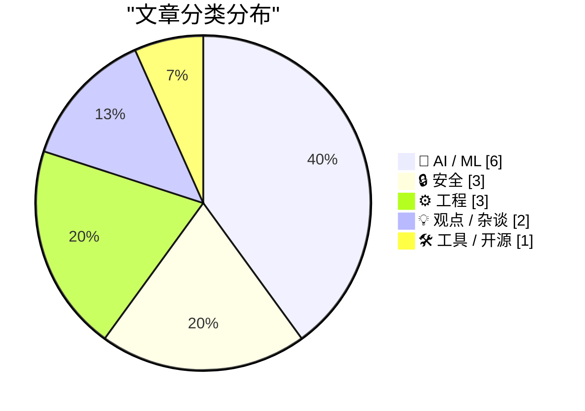
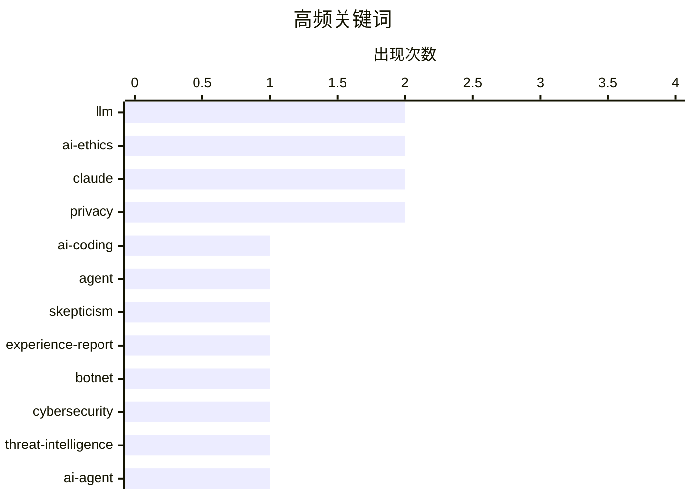

# 📰 AI 博客每日精选 — 2026-03-01

> 来自 Karpathy 推荐的 92 个顶级技术博客，AI 精选 Top 15

## 📝 今日看点

AI编程助手已从边缘工具渗透至核心基础设施，Python源码惊现LLM提交记录的同时，开发者开始警惕"认知债务"与设备端性能瓶颈的双重挑战。AI伦理争议急剧升温，OpenAI军事化合作引发用户抵制潮，数据主权与模型透明度成为无法回避的议题。安全领域警报频传，从巨型僵尸网络到Passkeys滥用风险，加之苹果对开放标准的侵蚀，技术封闭性与系统性安全威胁正形成双重夹击。

---

## 🏆 今日必读

🥇 **一位AI编程助手怀疑论者的详尽实践记录**

[An AI agent coding skeptic tries AI agent coding, in excessive detail](https://simonwillison.net/2026/Feb/27/ai-agent-coding-in-excessive-detail/#atom-everything) — simonwillison.net · 1 天前 · 🤖 AI / ML

> Max Woolf作为AI编程助手的长期怀疑论者，在2025年11月技术突破后进行了系统性尝试。他从简单的YouTube元数据抓取器起步，逐步挑战更复杂的项目，详细记录了每一步的成败与认知转变。文章展示了现代编码代理在实际需求处理中的能力边界，以及经验丰富的开发者如何调整工作流程与AI协作。最终项目规模远超初始预期，证明了代理编程在特定场景下的实用价值。

💡 **为什么值得读**: 来自资深怀疑论者的详细实践记录，客观展示了AI编程代理的真实能力边界和有效工作模式。

🏷️ AI-coding, agent, skepticism, experience-report

🥈 **Kimwolf僵尸网络控制者"Dort"身份调查**

[Who is the Kimwolf Botmaster “Dort”?](https://krebsonsecurity.com/2026/02/who-is-the-kimwolf-botmaster-dort/) — krebsonsecurity.com · 1 天前 · 🔒 安全

> 2026年1月曝光的Kimwolf是全球规模最大、破坏性最强的僵尸网络，由化名为"Dort"的黑客控制。在安全研究员披露其利用的漏洞后，Dort对研究员及本报道作者实施了包括DDoS攻击、人肉搜索、邮件轰炸在内的多维度报复，甚至恶意调动SWAT特警队突袭研究员住所。文章通过技术溯源和社交工程分析，深度调查这位 botmaster 的真实身份与运营网络。

💡 **为什么值得读**: 罕见地揭露了僵尸网络运营者的个人身份和报复手段，是了解现代网络犯罪生态的绝佳案例。

🏷️ botnet, cybersecurity, threat-intelligence

🥉 **交互式解释**

[Interactive explanations](https://simonwillison.net/guides/agentic-engineering-patterns/interactive-explanations/#atom-everything) — simonwillison.net · 21 小时前 · 🤖 AI / ML

> AI代理生成代码虽提升效率，却使开发者承担"认知债务"——即不理解代码实现细节却需维护的风险。对于简单的数据库查询转JSON输出，实现细节或许无需关注，但复杂业务逻辑缺乏理解将导致严重技术隐患。交互式解释模式要求代理不仅生成代码，还需提供可交互的文档和原理说明，帮助开发者建立心智模型而非盲目信任生成结果。

💡 **为什么值得读**: 提出了"认知债务"这一AI编程时代的核心概念，并提供可落地的交互式解释解决方案。

🏷️ AI-agent, cognitive-debt, engineering-patterns

---

## 📊 数据概览

| 扫描源 | 抓取文章 | 时间范围 | 精选 |
|:---:|:---:|:---:|:---:|
| 85/92 | 2436 篇 → 32 篇 | 48h | **15 篇** |

### 分类分布



### 高频关键词



<details>
<summary>📈 纯文本关键词图（终端友好）</summary>

```
llm               │ ████████████████████ 2
ai-ethics         │ ████████████████████ 2
claude            │ ████████████████████ 2
privacy           │ ████████████████████ 2
ai-coding         │ ██████████░░░░░░░░░░ 1
agent             │ ██████████░░░░░░░░░░ 1
skepticism        │ ██████████░░░░░░░░░░ 1
experience-report │ ██████████░░░░░░░░░░ 1
botnet            │ ██████████░░░░░░░░░░ 1
cybersecurity     │ ██████████░░░░░░░░░░ 1
```

</details>

### 🏷️ 话题标签

**llm**(2) · **ai-ethics**(2) · **claude**(2) · privacy(2) · ai-coding(1) · agent(1) · skepticism(1) · experience-report(1) · botnet(1) · cybersecurity(1) · threat-intelligence(1) · ai-agent(1) · cognitive-debt(1) · engineering-patterns(1) · passkeys(1) · encryption(1) · data-loss(1) · security(1) · edge-ai(1) · kv-cache(1)

---

## 🤖 AI / ML

### 1. 一位AI编程助手怀疑论者的详尽实践记录

[An AI agent coding skeptic tries AI agent coding, in excessive detail](https://simonwillison.net/2026/Feb/27/ai-agent-coding-in-excessive-detail/#atom-everything) — **simonwillison.net** · 1 天前 · ⭐ 28/30

> Max Woolf作为AI编程助手的长期怀疑论者，在2025年11月技术突破后进行了系统性尝试。他从简单的YouTube元数据抓取器起步，逐步挑战更复杂的项目，详细记录了每一步的成败与认知转变。文章展示了现代编码代理在实际需求处理中的能力边界，以及经验丰富的开发者如何调整工作流程与AI协作。最终项目规模远超初始预期，证明了代理编程在特定场景下的实用价值。

🏷️ AI-coding, agent, skepticism, experience-report

---

### 2. 交互式解释

[Interactive explanations](https://simonwillison.net/guides/agentic-engineering-patterns/interactive-explanations/#atom-everything) — **simonwillison.net** · 21 小时前 · ⭐ 26/30

> AI代理生成代码虽提升效率，却使开发者承担"认知债务"——即不理解代码实现细节却需维护的风险。对于简单的数据库查询转JSON输出，实现细节或许无需关注，但复杂业务逻辑缺乏理解将导致严重技术隐患。交互式解释模式要求代理不仅生成代码，还需提供可交互的文档和原理说明，帮助开发者建立心智模型而非盲目信任生成结果。

🏷️ AI-agent, cognitive-debt, engineering-patterns

---

### 3. 为什么设备端AI代理难以跟上需求

[Why on-device agentic AI can't keep up](https://martinalderson.com/posts/why-on-device-agentic-ai-cant-keep-up/?utm_source=rss) — **martinalderson.com** · 20 小时前 · ⭐ 26/30

> 设备端AI代理在隐私保护和延迟方面具备理论优势，但KV缓存的内存需求随上下文长度平方级增长，加上模型参数和推理计算量，很快耗尽移动设备有限的RAM预算和电池容量。实际测试表明，复杂代理任务所需的连续推理和工具调用在端侧芯片上速度过慢，难以满足实时交互需求。当前硬件物理限制使云端方案在可扩展性和性能上仍具不可替代的优势。

🏷️ edge-AI, KV-cache, on-device, inference

---

### 4. 就这样，我要取消我的ChatGPT账户

[That's it, I'm cancelling my ChatGPT](https://idiallo.com/byte-size/im-cancelling-my-chatgpt-openai-account?src=feed) — **idiallo.com** · 1 天前 · ⭐ 24/30

> 作者因OpenAI宣布与国防部合作在机密网络部署ChatGPT而决定注销账户，认为这标志着AI技术正式成为大规模监控和自主武器系统的使能器。Sam Altman公开支持所谓"战争部"（Department of War）的做法，与Anthropic CEO此前拒绝军事合作的立场形成鲜明对比。作者指出现有监控基础设施已完备，只需AI技术作为最后一块拼图即可实现全面社会控制。

🏷️ AI-ethics, military, surveillance, ChatGPT

---

### 5. 引用：claude.com/import-memory

[Quoting claude.com/import-memory](https://simonwillison.net/2026/Mar/1/claude-import-memory/#atom-everything) — **simonwillison.net** · 8 小时前 · ⭐ 23/30

> Claude推出的import-memory功能允许用户通过特定提示词完整导出个人数据，包括所有存储的记忆、对话中学到的上下文、用户偏好设置及自定义指令。该功能将数据格式化为带时间戳的代码块，便于迁移至其他AI服务平台。这代表了AI助手领域数据可移植性的重要进步，使用户能够真正拥有和控制自己的AI交互历史与个性化配置。

🏷️ Claude, memory-export, privacy, prompt-engineering

---

### 6. Python源代码中的LLM使用痕迹

[LLM Use in the Python Source Code](https://blog.miguelgrinberg.com/post/llm-use-in-the-python-source-code) — **miguelgrinberg.com** · 1 天前 · ⭐ 23/30

> 开发者发现CPython官方源码仓库出现Claude Code（Anthropic的AI编程代理）的提交记录，通过GitHub屏蔽"claude"用户的功能可识别使用该工具的项目。这一现象表明AI编码代理已渗透至编程语言最核心的基础设施开发，标志着开源软件工程范式的根本性转变。文章探讨了这种依赖对代码质量、安全审计和开源治理带来的深远影响。

🏷️ Python, LLM, Claude, GitHub

---

## 🔒 安全

### 7. Kimwolf僵尸网络控制者"Dort"身份调查

[Who is the Kimwolf Botmaster “Dort”?](https://krebsonsecurity.com/2026/02/who-is-the-kimwolf-botmaster-dort/) — **krebsonsecurity.com** · 1 天前 · ⭐ 27/30

> 2026年1月曝光的Kimwolf是全球规模最大、破坏性最强的僵尸网络，由化名为"Dort"的黑客控制。在安全研究员披露其利用的漏洞后，Dort对研究员及本报道作者实施了包括DDoS攻击、人肉搜索、邮件轰炸在内的多维度报复，甚至恶意调动SWAT特警队突袭研究员住所。文章通过技术溯源和社交工程分析，深度调查这位 botmaster 的真实身份与运营网络。

🏷️ botnet, cybersecurity, threat-intelligence

---

### 8. 请停止使用Passkeys加密用户数据

[Please, please, please stop using passkeys for encrypting user data](https://simonwillison.net/2026/Feb/27/passkeys/#atom-everything) — **simonwillison.net** · 1 天前 · ⭐ 26/30

> Passkeys作为身份验证手段虽便捷，但用于加密用户数据将导致灾难性后果。由于用户频繁丢失认证设备且往往不理解加密机制，一旦passkey丢失，用其加密的数据将永久不可恢复。Tim Cappalli紧急呼吁身份识别行业停止此类做法，建议严格区分身份验证与数据加密场景，避免用户因认知差距而遭受不可逆的数据损失。

🏷️ passkeys, encryption, data-loss, security

---

### 9. &ldquo;How old are you?&rdquo; Asked the OS

[&ldquo;How old are you?&rdquo; Asked the OS](https://idiallo.com/byte-size/how-old-are-you-asked-the-os?src=feed) — **idiallo.com** · 18 小时前 · ⭐ 21/30

> &ldquo;How old are you?&rdquo; Asked the OS

🏷️ privacy, regulation, age-verification

---

## ⚙️ 工程

### 10. The two kinds of error

[The two kinds of error](https://evanhahn.com/the-two-kinds-of-error/) — **evanhahn.com** · 20 小时前 · ⭐ 22/30

> The two kinds of error

🏷️ error-handling, software-design, reliability

---

### 11. Downstream Testing

[Downstream Testing](https://nesbitt.io/2026/03/01/downstream-testing.html) — **nesbitt.io** · 20 小时前 · ⭐ 21/30

> Downstream Testing

🏷️ testing, dependencies, libraries

---

### 12. Why does C have the best file API?

[Why does C have the best file API?](https://maurycyz.com/misc/c_files/) — **maurycyz.com** · 1 天前 · ⭐ 20/30

> Why does C have the best file API?

🏷️ C, file-API, systems-programming

---

## 💡 观点 / 杂谈

### 13. 苹果进军视频播客为何可能危及播客的最大优势

[Why Apple’s move to video could endanger podcasting's greatest power](https://anildash.com/2026/02/28/apple-video-podcast-power/) — **anildash.com** · 1 天前 · ⭐ 23/30

> 苹果在iOS播客应用中新增视频支持，但要求创作者将视频托管于特定合作平台，实质性地破坏了RSS开放标准。传统播客生态依赖开放协议避免算法操纵和隐私侵犯广告，而新系统通过封闭托管要求锁定内容分发渠道。在当前独立视频基础设施被私募收购、政治压力加剧的背景下，此举可能终结播客作为开放媒介的独特优势，将其变为受控的围墙花园。

🏷️ podcast, open-standard, Apple

---

### 14. A Cookie for Dario? — Anthropic and selling death

[A Cookie for Dario? — Anthropic and selling death](https://anildash.com/2026/02/27/a-cookie-for-dario/) — **anildash.com** · 1 天前 · ⭐ 22/30

> A Cookie for Dario? — Anthropic and selling death

🏷️ Anthropic, AI-ethics, defense

---

## 🛠 工具 / 开源

### 15. Redis编程模式

[Redis patterns for coding](http://antirez.com/news/161) — **antirez.com** · 10 小时前 · ⭐ 25/30

> Redis创始人antirez推出专门面向LLM和编程代理的文档站点redis.antirez.com，系统整理了Redis命令、数据类型、常用设计模式、配置优化技巧及算法实现。该资源不仅提供机器可读的详尽技术规范，也包含人类开发者友好的实践指导。通过结构化呈现Redis最佳实践，帮助AI工具准确理解和应用Redis特性，减少幻觉和误用。

🏷️ Redis, documentation, LLM, coding-patterns

---

*生成于 2026-03-01 20:18 | 扫描 85 源 → 获取 2436 篇 → 精选 15 篇*
*基于 [Hacker News Popularity Contest 2025](https://refactoringenglish.com/tools/hn-popularity/) RSS 源列表，由 [Andrej Karpathy](https://x.com/karpathy) 推荐*
*由「懂点儿AI」制作，欢迎关注同名微信公众号获取更多 AI 实用技巧 💡*
