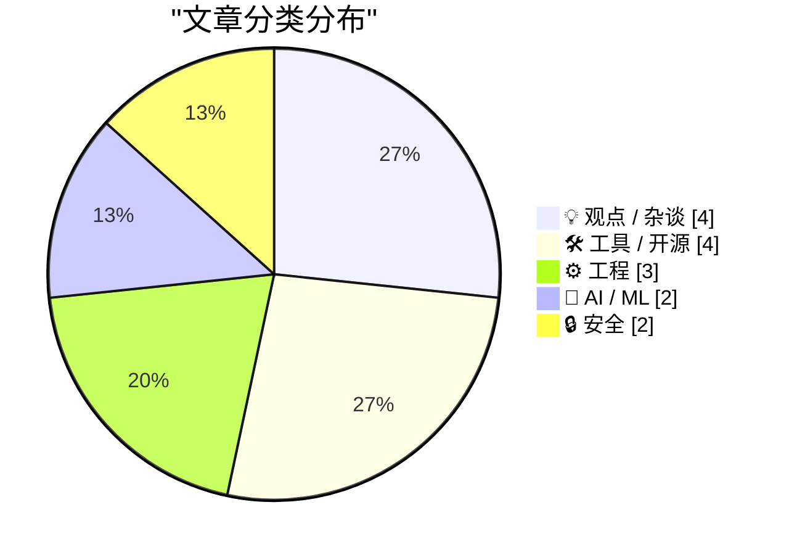
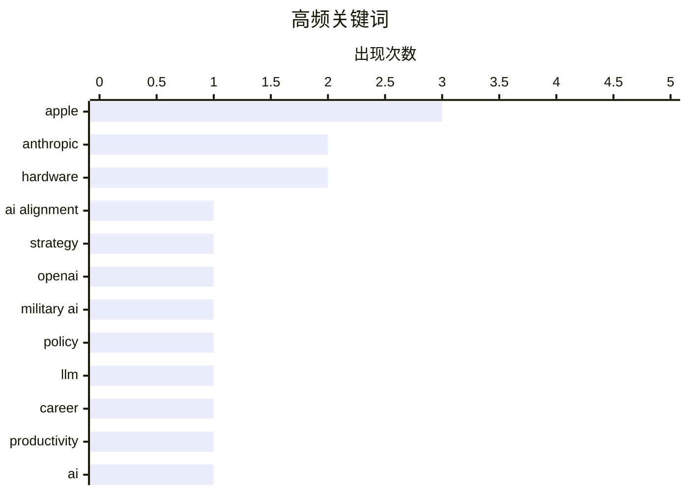

# 📰 AI 博客每日精选 — 2026-03-02

> 来自 Karpathy 推荐的 92 个顶级技术博客，AI 精选 Top 15

## 📝 今日看点

AI权力的边界争夺成为今日核心议题，Anthropic与美国政府的冲突暴露了私营科技公司在国家安全与伦理红线间的脆弱平衡。大模型技术正双向重塑数字生态：既催生了"独狼开发者"的新势力，也导致AI生成内容泛滥成灾，侵蚀网络信息质量。与此同时，从软件供应链的传递性风险到大规模数据泄露，数字世界的信任基础设施仍面临系统性安全考验。

---

## 🏆 今日必读

🥇 **Anthropic与AI对齐：权力、国际法与私营公司的边界**

[‘Anthropic and Alignment’](https://stratechery.com/2026/anthropic-and-alignment/) — daringfireball.net · 3 小时前 · 🤖 AI / ML

> Dario Amodei以核武器作类比，指出若私人公司开发核武器并试图向美军发号施令，美国将被迫摧毁该公司。国际法本质上是权力的函数，实力即正义。某些能力类别（如AGI）一旦由私人实体掌握并试图凌驾于国家之上，将触发国家层面的强制反制。Anthropic拒绝向军方开放无限制AI模型使用权，正是基于对这种权力冲突的预判。

💡 **为什么值得读**: 理解AI安全公司如何在商业利益、伦理红线与国家权力之间进行战略博弈的关键分析。

🏷️ Anthropic, AI alignment, strategy

🥈 **特朗普政府因护栏冲突冷落Anthropic，转而支持OpenAI**

[WSJ: ‘Trump Administration Shuns Anthropic, Embraces OpenAI in Clash Over Guardrails’](https://www.wsj.com/tech/ai/trump-will-end-government-use-of-anthropics-ai-models-ff3550d9) — daringfireball.net · 3 小时前 · 🤖 AI / ML

> 特朗普政府宣布终止政府使用Anthropic AI模型，此前五角大楼要求Anthropic同意军方在所有合法场景使用其模型，遭CEO Dario Amodei拒绝。Anthropic设定的红线包括国内大规模监控和自主武器开发，而OpenAI似乎愿意接受更宽松的使用条款。这一冲突凸显了AI公司在政府合同与伦理承诺之间的紧张关系，可能重塑联邦政府AI供应链格局。

💡 **为什么值得读**: 揭示美国政府AI采购政策重大转向及其对AI行业竞争格局的直接影响。

🏷️ Anthropic, OpenAI, military AI, policy

🥉 **专家初学者与独狼将主导LLM早期时代**

[Expert Beginners and Lone Wolves will dominate this early LLM era](https://www.jeffgeerling.com/blog/2026/expert-beginners-and-lone-wolves-dominate-llm-era/) — jeffgeerling.com · 23 小时前 · 💡 观点 / 杂谈

> 在大型语言模型（LLM）发展的早期阶段，具备跨领域基础知识的"专家初学者"和独立工作的"独狼"开发者将比大型团队更具优势。这类人群能快速利用LLM工具验证想法、构建原型，无需受制于传统软件开发中的复杂协作流程。作者以2009年将博客从静态生成器迁移到Drupal的经历类比，指出技术转型期个体敏捷性往往胜过组织惯性。

💡 **为什么值得读**: 为独立开发者和技术通才提供LLM时代职业发展的战略定位建议。

🏷️ LLM, career, productivity

---

## 📊 数据概览

| 扫描源 | 抓取文章 | 时间范围 | 精选 |
|:---:|:---:|:---:|:---:|
| 84/92 | 2406 篇 → 21 篇 | 24h | **15 篇** |

### 分类分布



### 高频关键词



<details>
<summary>📈 纯文本关键词图（终端友好）</summary>

```
apple        │ ████████████████████ 3
anthropic    │ █████████████░░░░░░░ 2
hardware     │ █████████████░░░░░░░ 2
ai alignment │ ███████░░░░░░░░░░░░░ 1
strategy     │ ███████░░░░░░░░░░░░░ 1
openai       │ ███████░░░░░░░░░░░░░ 1
military ai  │ ███████░░░░░░░░░░░░░ 1
policy       │ ███████░░░░░░░░░░░░░ 1
llm          │ ███████░░░░░░░░░░░░░ 1
career       │ ███████░░░░░░░░░░░░░ 1
```

</details>

### 🏷️ 话题标签

**apple**(3) · **anthropic**(2) · **hardware**(2) · ai alignment(1) · strategy(1) · openai(1) · military ai(1) · policy(1) · llm(1) · career(1) · productivity(1) · ai(1) · content(1) · ethics(1) · supply-chain(1) · security(1) · dependencies(1) · serpapi(1) · web scraping(1) · legal(1)

---

## 💡 观点 / 杂谈

### 1. 专家初学者与独狼将主导LLM早期时代

[Expert Beginners and Lone Wolves will dominate this early LLM era](https://www.jeffgeerling.com/blog/2026/expert-beginners-and-lone-wolves-dominate-llm-era/) — **jeffgeerling.com** · 23 小时前 · ⭐ 25/30

> 在大型语言模型（LLM）发展的早期阶段，具备跨领域基础知识的"专家初学者"和独立工作的"独狼"开发者将比大型团队更具优势。这类人群能快速利用LLM工具验证想法、构建原型，无需受制于传统软件开发中的复杂协作流程。作者以2009年将博客从静态生成器迁移到Drupal的经历类比，指出技术转型期个体敏捷性往往胜过组织惯性。

🏷️ LLM, career, productivity

---

### 2. 没人想读你的AI垃圾内容

[Pluralistic: No one wants to read your AI slop (02 Mar 2026)](https://pluralistic.net/2026/03/02/nonconsensual-slopping/) — **pluralistic.net** · 12 小时前 · ⭐ 25/30

> Cory Doctorow批评当前泛滥的AI生成低质量内容（AI slop），指出这种非自愿的内容填充正在侵蚀网络信息生态。作者主张若必须使用AI生成内容，应限制在私人领域而非公开发布，避免污染公共信息空间。文章涉及AI生成内容的伦理边界、平台责任以及信息过载时代的内容质量控制困境。

🏷️ AI, content, ethics

---

### 3. SerpApi提交动议驳回谷歌诉讼

[SerpApi Filed Motion to Dismiss Google’s Lawsuit](https://serpapi.com/blog/google-v-serpapi-motion-to-dismiss-why-were-in-the-right/) — **daringfireball.net** · 1 小时前 · ⭐ 23/30

> SerpApi正式向法院提交动议，要求驳回谷歌指控其非法抓取搜索结果的诉讼。SerpApi CEO Julien Khaleghy辩称谷歌试图主张对互联网数据的独占所有权，但法律明确表明无人能够拥有互联网。此案涉及搜索引擎结果页面（SERP）的数据所有权边界、网络爬虫合法性以及初创公司对抗科技巨头垄断的法律策略。

🏷️ SerpApi, web scraping, legal

---

### 4. 欢迎（回到）Macintosh

[Welcome (Back) to Macintosh](https://take.surf/2026/03/01/welcome-back-to-macintosh) — **daringfireball.net** · 1 小时前 · ⭐ 16/30

> 作者对Macintosh平台的未来提出深刻反思，担忧Mac可能像历史上那些因内斗、统治者自满和准备不足而瓦解的帝国一样走向衰落。文章呼吁Mac应当重新找回最初的天才火花，专注于服务用户的真实需求，而非盲目追逐年度设计趋势或过度"手机化"（phonification）。作者认为Mac需要重拾本质，维护那些对专业用户至关重要的核心功能，而不是被短期商业利益所左右。

🏷️ Macintosh, Apple, history

---

## 🛠 工具 / 开源

### 5. 基于WebAssembly和Gifsicle的GIF优化工具

[GIF optimization tool using WebAssembly and Gifsicle](https://simonwillison.net/guides/agentic-engineering-patterns/gif-optimization/#atom-everything) — **simonwillison.net** · 4 小时前 · ⭐ 22/30

> Simon Willison构建了一个基于WebAssembly的浏览器端GIF优化工具，集成Gifsicle库处理LICEcap录制的动画演示文件。该方案允许在浏览器本地完成GIF压缩，无需上传服务器，既保护隐私又减少带宽消耗。技术实现涉及将C语言编写的Gifsicle编译为WASM，并通过JavaScript API暴露优化参数（如颜色数、帧率调整）。

🏷️ WebAssembly, GIF, optimization

---

### 6. 修改请求头：Safari WebP格式问题的解决方案

[ChangeTheHeaders](https://underpassapp.com/news/2025/3/4.html) — **daringfireball.net** · 20 分钟前 · ⭐ 20/30

> Safari浏览器在处理图片拖拽下载时，HTTP响应头中的Content-Type决定了保存格式，导致用户有时获得WebP而非期望的PNG/JPEG。作者John Gruber与Jason Snell讨论发现，通过修改请求头（Change the Headers）可影响服务器返回的图片格式，这解释了为何同一图片在不同场景下保存格式不一致。该问题影响内容创作者的工作流，特别是需要兼容性格式（PNG/JPEG）的出版场景。

🏷️ Safari, WebP, macOS

---

### 7. 苹果推出搭载M4芯片的新款iPad Air

[Apple Introduces New iPad Air With M4](https://www.apple.com/newsroom/2026/03/apple-introduces-the-new-ipad-air-powered-by-m4/) — **daringfireball.net** · 3 小时前 · ⭐ 20/30

> 苹果发布新一代iPad Air，搭载M4芯片并在维持起售价不变的前提下实现性能大幅提升。新机CPU和GPU速度更快，统一内存容量较前代增加50%，内存带宽更高，神经引擎升级使其成为强大的AI设备。性能方面，搭载M4的iPad Air比M3版本快30%，比M1版本快达2.3倍。这次升级在保持价格竞争力的同时，显著增强了多任务处理、游戏和AI计算能力。

🏷️ iPad, M4, Apple, hardware

---

### 8. 苹果推出iPhone 17e

[Apple Introduces the iPhone 17e](https://www.apple.com/newsroom/2026/03/apple-introduces-iphone-17e/) — **daringfireball.net** · 6 小时前 · ⭐ 19/30

> 苹果发布iPhone 17系列的新成员iPhone 17e，定位高性价比市场并搭载最新A19芯片。该机采用苹果自研的C1X基带，速度是iPhone 16e所搭载C1基带的两倍，显著提升了蜂窝网络性能。影像系统配备4800万像素Fusion相机，支持新一代人像模式和4K杜比视界视频录制。这款机型在保持相对亲民价格的同时，提供了旗舰级的核心性能和最新的通信技术。

🏷️ iPhone, A19, Apple, mobile

---

## ⚙️ 工程

### 9. 我造了一台品脱大小的Macintosh

[I built a pint-sized Macintosh](https://www.jeffgeerling.com/blog/2026/pint-sized-macintosh-pico-micro-mac/) — **jeffgeerling.com** · 16 分钟前 · ⭐ 21/30

> Jeff Geerling为MARCHintosh活动组装了一台微型Macintosh，基于Raspberry Pi Pico运行Matt Evans开发的Pico Micro Mac模拟器，成功启动System 5.3。该项目利用Pico的RP2040微控制器模拟1984年Macintosh硬件，配合1.3英寸240x240 IPS显示屏和3D打印机箱，实现了掌机级别的复古Mac体验。整个项目开源，提供了完整的硬件清单和组装指南。

🏷️ Raspberry Pi, retrocomputing, hardware

---

### 10. 为Auth0添加"使用Mastodon登录"功能

[Adding "Log In With Mastodon" to Auth0](https://shkspr.mobi/blog/2026/03/adding-log-in-with-mastodon-to-auth0/) — **shkspr.mobi** · 8 小时前 · ⭐ 20/30

> 作者在使用Auth0为OpenBenches网站提供社交登录服务时，发现Auth0原生不支持Mastodon登录选项。虽然Auth0内置了Facebook、Twitter、Discord等主流平台的登录支持，但联邦宇宙（Fediverse）的Mastodon需要额外配置。文章介绍了如何通过自定义方式在Auth0中集成Mastodon认证，填补了这一空白。这为希望支持去中心化社交网络的开发者提供了可行的技术路径。

🏷️ Auth0, Mastodon, OAuth, authentication

---

### 11. 如果对话框中的非按钮控件使用了IDCANCEL ID会发生什么糟糕的事情？

[What sort of horrible things happen if my dialog has a non-button with the control ID of IDCANCEL?](https://devblogs.microsoft.com/oldnewthing/20260302-53/?p=112098) — **devblogs.microsoft.com/oldnewthing** · 35 分钟前 · ⭐ 19/30

> 在Windows对话框开发中，将非按钮控件（如静态文本或编辑框）的控制ID设置为IDCANCEL会引发意料之外的消息通知问题。系统会按照处理取消按钮的逻辑向该控件发送通知，导致程序收到不合理或无法正确处理的通知消息。这种ID误用可能破坏对话框的标准行为逻辑，引发难以调试的UI异常。开发者应避免将标准按钮ID（如IDOK、IDCANCEL）分配给非按钮控件，以确保消息路由的正确性。

🏷️ Win32, Windows, UI

---

## 🤖 AI / ML

### 12. Anthropic与AI对齐：权力、国际法与私营公司的边界

[‘Anthropic and Alignment’](https://stratechery.com/2026/anthropic-and-alignment/) — **daringfireball.net** · 3 小时前 · ⭐ 27/30

> Dario Amodei以核武器作类比，指出若私人公司开发核武器并试图向美军发号施令，美国将被迫摧毁该公司。国际法本质上是权力的函数，实力即正义。某些能力类别（如AGI）一旦由私人实体掌握并试图凌驾于国家之上，将触发国家层面的强制反制。Anthropic拒绝向军方开放无限制AI模型使用权，正是基于对这种权力冲突的预判。

🏷️ Anthropic, AI alignment, strategy

---

### 13. 特朗普政府因护栏冲突冷落Anthropic，转而支持OpenAI

[WSJ: ‘Trump Administration Shuns Anthropic, Embraces OpenAI in Clash Over Guardrails’](https://www.wsj.com/tech/ai/trump-will-end-government-use-of-anthropics-ai-models-ff3550d9) — **daringfireball.net** · 3 小时前 · ⭐ 27/30

> 特朗普政府宣布终止政府使用Anthropic AI模型，此前五角大楼要求Anthropic同意军方在所有合法场景使用其模型，遭CEO Dario Amodei拒绝。Anthropic设定的红线包括国内大规模监控和自主武器开发，而OpenAI似乎愿意接受更宽松的使用条款。这一冲突凸显了AI公司在政府合同与伦理承诺之间的紧张关系，可能重塑联邦政府AI供应链格局。

🏷️ Anthropic, OpenAI, military AI, policy

---

## 🔒 安全

### 14. 传递性信任

[Transitive Trust](https://nesbitt.io/2026/03/02/transitive-trust.html) — **nesbitt.io** · 11 小时前 · ⭐ 25/30

> 软件供应链中的信任关系具有传递性风险：你信任直接维护者，他们信任其依赖的维护者，但信任链末端第三方的可靠性往往未知。这种"信任但无法验证"的链条在开源生态中尤为脆弱，一个深层依赖的恶意更新即可突破整个安全防线。文章质疑当前依赖管理模型中隐含的无限责任假设，呼吁关注软件成分分析（SCA）和供应链安全。

🏷️ supply-chain, security, dependencies

---

### 15. 每周更新493：Odido数据泄露事件分析

[Weekly Update 493](https://www.troyhunt.com/weekly-update-493/) — **troyhunt.com** · 13 小时前 · ⭐ 22/30

> Troy Hunt本周重点分析Odido（原T-Mobile荷兰）数据泄露事件，攻击者分四次转储（dump）泄露数据，包含大量敏感个人信息。作者在第二次数据泄露后录制更新，随后遭遇第三和第四次完整数据转储。此次泄露规模巨大，建议相关用户立即检查Have I Been Pwned数据库确认自身数据是否受影响。

🏷️ data breach, Odido, incident response, leak monitoring

---

*生成于 2026-03-02 21:31 | 扫描 84 源 → 获取 2406 篇 → 精选 15 篇*
*基于 [Hacker News Popularity Contest 2025](https://refactoringenglish.com/tools/hn-popularity/) RSS 源列表，由 [Andrej Karpathy](https://x.com/karpathy) 推荐*
*由「懂点儿AI」制作，欢迎关注同名微信公众号获取更多 AI 实用技巧 💡*
