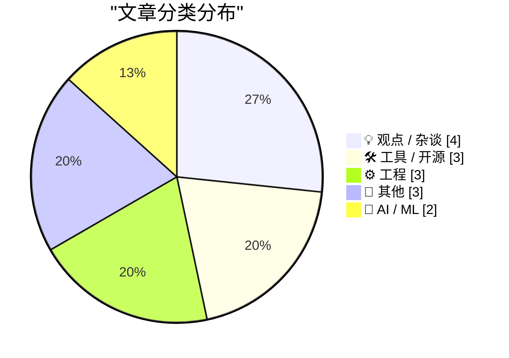
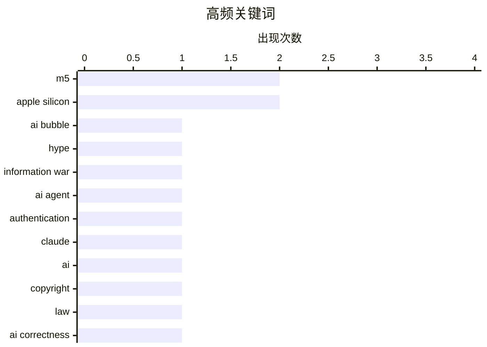

# 📰 AI 博客每日精选 — 2026-03-04

> 来自 Karpathy 推荐的 92 个顶级技术博客，AI 精选 Top 15

## 📝 今日看点

今日技术圈在AI狂热中显现理性回归迹象，从最高法院的版权保护到金融场景的可靠性质疑，行业开始为生成式AI划定法律与技术的边界。与此同时，苹果M5系列芯片以全新Fusion架构刷新专业算力基准，推动端侧AI性能进入新阶段。在工程文化层面，对复杂性崇拜的反思与设计本质的回归形成暗流，提醒开发者在工具链迭代中保持对简洁性的追求。

---

## 🏆 今日必读

🥇 **AI泡沫是一场信息战**

[The AI Bubble Is An Information War](https://www.wheresyoured.at/the-ai-bubble-is-an-information-war/) — wheresyoured.at · 4 小时前 · 💡 观点 / 杂谈

> 当前AI行业充斥着大量炒作和误导性信息，各方势力通过控制叙事来影响市场情绪和投资走向。这种信息战不仅模糊了真实的技术能力边界，还导致资源错配和泡沫膨胀。作者分析了AI产业中不同利益相关方如何通过媒体、公关和学术渠道塑造公众认知。识别这些信息的操控机制对于理解AI发展的真实状况至关重要。

💡 **为什么值得读**: 揭示AI行业炒作背后的信息操控机制，帮助读者在嘈杂的市场噪音中辨别技术真相。

🏷️ AI bubble, hype, information war

🥈 **npx workos：直接在代码库中编写认证的AI代理**

[[Sponsor] npx workos: An AI Agent That Writes Auth Directly Into Your Codebase](https://workos.com/docs/authkit/cli-installer?utm_source=tldrdev&amp;utm_medium=newsletter&amp;utm_campaign=q12026) — daringfireball.net · 21 小时前 · 🛠 工具 / 开源

> WorkOS推出由Claude驱动的AI代理工具，通过npx workos命令可直接读取现有项目代码、自动检测技术栈框架，并在现有代码库中写入完整的认证集成方案。不同于传统的模板生成器，该工具能深度理解代码上下文，生成定制化集成代码，并自动进行类型检查和构建，将错误反馈给自身进行迭代修复。

💡 **为什么值得读**: 展示了AI代理在开发者工具中的实际应用，实现了从理解现有代码到自动集成特定功能的端到端自动化。

🏷️ AI Agent, authentication, Claude

🥉 **最高法院保护艺术家免受AI侵害**

[Pluralistic: Supreme Court saves artists from AI (03 Mar 2026)](https://pluralistic.net/2026/03/03/its-a-trap-2/) — pluralistic.net · 3 小时前 · 🤖 AI / ML

> 美国最高法院近期做出裁决，在艺术版权争议中站在了人类艺术家一边，限制了AI生成内容对创作者权益的侵蚀。这一判决确认了人类创作在版权法中的核心地位，为面临生成式AI冲击的创意产业提供了重要的法律保护伞。然而文章也警示艺术家群体，司法胜利并不代表科技巨头会自动站在创作者一边，仍需保持警惕。

💡 **为什么值得读**: 为关注AI与版权交叉领域的开发者和创作者提供了最新的司法判例分析，揭示了法律框架如何适应生成式AI时代的挑战。

🏷️ AI, copyright, law

---

## 📊 数据概览

| 扫描源 | 抓取文章 | 时间范围 | 精选 |
|:---:|:---:|:---:|:---:|
| 82/92 | 2380 篇 → 21 篇 | 24h | **15 篇** |

### 分类分布



### 高频关键词



<details>
<summary>📈 纯文本关键词图（终端友好）</summary>

```
m5              │ ████████████████████ 2
apple silicon   │ ████████████████████ 2
ai bubble       │ ██████████░░░░░░░░░░ 1
hype            │ ██████████░░░░░░░░░░ 1
information war │ ██████████░░░░░░░░░░ 1
ai agent        │ ██████████░░░░░░░░░░ 1
authentication  │ ██████████░░░░░░░░░░ 1
claude          │ ██████████░░░░░░░░░░ 1
ai              │ ██████████░░░░░░░░░░ 1
copyright       │ ██████████░░░░░░░░░░ 1
```

</details>

### 🏷️ 话题标签

**m5**(2) · **apple silicon**(2) · **ai bubble**(1) · hype(1) · information war(1) · ai agent(1) · authentication(1) · claude(1) · ai(1) · copyright(1) · law(1) · ai correctness(1) · agentic ai(1) · reliability(1) · soc(1) · chip architecture(1) · package management(1) · naming(1) · dependencies(1) · url design(1)

---

## 💡 观点 / 杂谈

### 1. AI泡沫是一场信息战

[The AI Bubble Is An Information War](https://www.wheresyoured.at/the-ai-bubble-is-an-information-war/) — **wheresyoured.at** · 4 小时前 · ⭐ 27/30

> 当前AI行业充斥着大量炒作和误导性信息，各方势力通过控制叙事来影响市场情绪和投资走向。这种信息战不仅模糊了真实的技术能力边界，还导致资源错配和泡沫膨胀。作者分析了AI产业中不同利益相关方如何通过媒体、公关和学术渠道塑造公众认知。识别这些信息的操控机制对于理解AI发展的真实状况至关重要。

🏷️ AI bubble, hype, information war

---

### 2. 没有人因简洁而获得晋升

[Nobody Gets Promoted for Simplicity](https://terriblesoftware.org/2026/03/03/nobody-gets-promoted-for-simplicity/) — **terriblesoftware.org** · 9 小时前 · ⭐ 20/30

> 技术行业存在系统性偏好复杂性的文化缺陷，工程师在面试、设计评审和晋升评估中往往因展示复杂方案而获得奖励，而简洁优雅的解决方案反而被忽视。这种激励扭曲导致软件系统不必要的膨胀和维护困难。文章探讨了如何识别和纠正这种组织偏见，建立真正奖励简化能力和工程实用主义的技术文化。

🏷️ simplicity, complexity, career

---

### 3. 我们都能同意却不敢实施的科学改革

[The one science reform we can all agree on, but we're too cowardly to do](https://www.experimental-history.com/p/the-one-science-reform-we-can-all) — **experimental-history.com** · 3 小时前 · ⭐ 20/30

> 科学界急需一场 overdue 的“森林火灾”来清除积弊，尽管存在一种所有研究者理论上都能达成共识的系统性改革方案，但学术界因畏惧短期阵痛而集体回避。文章直指当前科研评价体系、发表机制或资金分配中维持现状的舒适区心态，批判阻碍变革的结构性胆怯。作者认为，只有勇于承受破坏性重建的代价，才能建立更健康的科学研究生态，否则科学进步将持续受制于保守的制度惯性。

🏷️ science reform, peer review, reproducibility, academia

---

### 4. 押注Substack会输：一个关于设计局限的反思

[Betting Against Substack](https://feed.tedium.co/link/15204/17288375/betting-against-substack) — **tedium.co** · 16 小时前 · ⭐ 19/30

> 作者曾因Substack在模板灵活性、视觉定制化或排版控制方面的设计局限性而放弃该平台。随着Substack近期再次成为行业焦点，作者通过具体功能缺失案例——如缺乏深度品牌个性化工具、受限的阅读体验优化选项——论证该平台在创作者经济竞争中的工具短板。文章指出Substack的设计保守性在创作者需要建立独特视觉身份时构成致命限制，这些未解决的功能缺口可能阻碍其长期平台竞争力。

🏷️ Substack, design, platforms

---

## 🛠 工具 / 开源

### 5. npx workos：直接在代码库中编写认证的AI代理

[[Sponsor] npx workos: An AI Agent That Writes Auth Directly Into Your Codebase](https://workos.com/docs/authkit/cli-installer?utm_source=tldrdev&amp;utm_medium=newsletter&amp;utm_campaign=q12026) — **daringfireball.net** · 21 小时前 · ⭐ 24/30

> WorkOS推出由Claude驱动的AI代理工具，通过npx workos命令可直接读取现有项目代码、自动检测技术栈框架，并在现有代码库中写入完整的认证集成方案。不同于传统的模板生成器，该工具能深度理解代码上下文，生成定制化集成代码，并自动进行类型检查和构建，将错误反馈给自身进行迭代修复。

🏷️ AI Agent, authentication, Claude

---

### 6. 免费图书

[Free Books](https://buttondown.com/hillelwayne/archive/free-books/) — **buttondown.com/hillelwayne** · 4 小时前 · ⭐ 22/30

> 作者Hillel Wayne因本周事务繁忙跳过常规通讯更新，作为补偿向读者提供10本《Logic for Programmers》的免费电子版。其中5本立即可用，另外5本将于欧洲中部时间次日上午10:30开放领取，以便欧洲时区读者获取。该书专注于程序员所需的逻辑学知识，是提升形式化思维能力的专业读物。

🏷️ logic, programming, education

---

### 7. HazeOver：专注当前窗口的Mac实用工具

[★ HazeOver — Mac Utility for Highlighting the Frontmost Window](https://daringfireball.net/2026/03/hazeover) — **daringfireball.net** · 21 小时前 · ⭐ 16/30

> HazeOver通过调暗所有背景窗口来高亮当前活动窗口，以极简功能解决macOS多任务场景下的视觉干扰问题。该应用利用优雅的暗色遮罩层自动降低非活动窗口亮度，配备可调节的暗度参数与精细的动画过渡效果。尽管仅执行单一任务，但其对视觉 clutter 的有效管控显著降低了认知负荷，提升了macOS日常可用性与深度工作专注力，成为窗口管理的轻量级效率解决方案。

🏷️ macOS, productivity, focus

---

## ⚙️ 工程

### 8. 苹果发布M5 Pro和M5 Max芯片并重新命名CPU核心

[Apple Debuts M5 Pro and M5 Max, and Renames Its M-Series CPU Cores](https://www.apple.com/newsroom/2026/03/apple-debuts-m5-pro-and-m5-max-to-supercharge-the-most-demanding-pro-workflows/) — **daringfireball.net** · 3 小时前 · ⭐ 23/30

> 苹果发布专为专业笔记本设计的M5 Pro和M5 Max芯片，采用全新的Fusion架构将两颗芯片集成至单一SoC，包含18核CPU架构。新架构整合了高性能CPU、可扩展GPU、媒体引擎、统一内存控制器、神经引擎及Thunderbolt 5功能。苹果同时宣布重新命名M系列CPU核心的命名体系，标志着芯片设计策略的重要转变。

🏷️ M5, SoC, chip architecture

---

### 9. 软件包管理归根结底是命名问题

[Package Management is Naming All the Way Down](https://nesbitt.io/2026/03/03/package-management-is-naming-all-the-way-down.html) — **nesbitt.io** · 11 小时前 · ⭐ 23/30

> 软件包管理领域充斥着计算机科学中的经典难题，且情况比"缓存失效和命名"这两个公认难题更为复杂。作者以幽默口吻指出，依赖解析、版本冲突、命名空间管理等软件包管理器的核心挑战，本质上都是命名问题的不同表现形式。这一观点揭示了软件工程基础性难题的深层结构，以及为何依赖管理至今仍是开发者日常工作的痛点。

🏷️ package management, naming, dependencies

---

### 10. 无名英雄：Flickr的URL设计

[Unsung Heroes: Flickr’s URLs Scheme](https://unsung.aresluna.org/unsung-heroes-flickrs-urls-scheme/) — **daringfireball.net** · 22 小时前 · ⭐ 22/30

> Flickr在2000年代末的URL设计堪称用户界面设计的典范，其简洁的层级结构如flickr.com/photos/username/favorites和flickr.com/photos/username/sets/ID，去除了冗余的www前缀，提供了可读性强且持久的资源定位方案。这种将URL作为用户界面而非仅仅是技术寻址手段的设计理念，影响了后续Web应用的设计范式，展示了RESTful原则在消费级产品中的优雅实践。

🏷️ URL design, REST API, web architecture

---

## 📝 其他

### 11. 苹果推出搭载M5 Pro和M5 Max芯片的MacBook Pro

[Apple Introduces MacBook Pro Models With M5 Pro and M5 Max Chips](https://www.apple.com/newsroom/2026/03/apple-introduces-macbook-pro-with-all-new-m5-pro-and-m5-max/) — **daringfireball.net** · 1 小时前 · ⭐ 21/30

> 苹果发布全新14英寸和16英寸MacBook Pro，搭载M5 Pro和M5 Max芯片，宣称拥有全球最快的CPU核心。新一代GPU在每个核心中集成神经加速器，统一内存带宽提升，AI性能较前代提升最高达4倍，特定场景下可达8倍。这款面向专业用户的笔记本在保持便携性的同时，大幅强化了本地AI计算能力和专业工作流处理性能。

🏷️ MacBook Pro, M5 Pro, Apple Silicon

---

### 12. 苹果发布搭载M5芯片的新款MacBook Air

[New MacBook Air With M5](https://www.apple.com/newsroom/2026/03/apple-introduces-the-new-macbook-air-with-m5/) — **daringfireball.net** · 24 分钟前 · ⭐ 19/30

> 苹果推出配备M5芯片的新款MacBook Air，起始存储容量翻倍至512GB并采用更快SSD技术，最高可配置至4TB。新机型搭载Apple N1无线芯片，支持Wi-Fi 7和蓝牙6，配备12MP Center Stage摄像头，续航时间最长可达18小时。机身维持轻薄铝制设计，配备Liquid Retina显示屏和沉浸式音响系统，在保持便携性的同时通过Thunderbolt连接能力提升整体性能表现。

🏷️ MacBook Air, M5, Apple Silicon

---

### 13. 苹果推出新款Studio Display及全新Studio Display XDR

[Apple Announces Updated Studio Display and All-New Studio Display XDR](https://www.apple.com/newsroom/2026/03/apple-unveils-new-studio-display-and-all-new-studio-display-xdr/) — **daringfireball.net** · 7 分钟前 · ⭐ 18/30

> 苹果发布新一代Studio Display系列，包含标准版与全新Studio Display XDR，专为匹配Mac产品线设计。新款配备12MP Center Stage摄像头，支持改进的图像质量与Desk View功能；内置三麦克风阵列和六扬声器音响系统，支持Spatial Audio空间音频。接口全面升级至Thunderbolt 5，提供更多下游连接能力，覆盖从日常用户到专业创作者的广泛需求，在音视频采集精度和连接扩展性方面实现显著提升。

🏷️ Studio Display, Apple, hardware

---

## 🤖 AI / ML

### 14. 最高法院保护艺术家免受AI侵害

[Pluralistic: Supreme Court saves artists from AI (03 Mar 2026)](https://pluralistic.net/2026/03/03/its-a-trap-2/) — **pluralistic.net** · 3 小时前 · ⭐ 24/30

> 美国最高法院近期做出裁决，在艺术版权争议中站在了人类艺术家一边，限制了AI生成内容对创作者权益的侵蚀。这一判决确认了人类创作在版权法中的核心地位，为面临生成式AI冲击的创意产业提供了重要的法律保护伞。然而文章也警示艺术家群体，司法胜利并不代表科技巨头会自动站在创作者一边，仍需保持警惕。

🏷️ AI, copyright, law

---

### 15. AI奥德赛（一）：正确性难题

[An AI Odyssey, Part 1: Correctness Conundrum](https://www.johndcook.com/blog/2026/03/02/an-ai-odyssey-part-1-correctness-conundrum/) — **johndcook.com** · 18 小时前 · ⭐ 24/30

> 尽管AI代理系统在专业金融管理任务中展现出显著的生产力提升能力，但其输出结果的正确性仍无法得到根本保证。在金融资产管理等关键业务场景中，即使AI能大幅提高效率，缺乏确定性验证的决策可能导致严重资产风险。作者强调，在将AI工具应用于核心资产管理和关键业务流程时，必须建立严格的人工验证和风险控制机制，而非盲目信任AI的输出。

🏷️ AI correctness, agentic AI, reliability

---

*生成于 2026-03-04 05:33 | 扫描 82 源 → 获取 2380 篇 → 精选 15 篇*
*基于 [Hacker News Popularity Contest 2025](https://refactoringenglish.com/tools/hn-popularity/) RSS 源列表，由 [Andrej Karpathy](https://x.com/karpathy) 推荐*
*由「懂点儿AI」制作，欢迎关注同名微信公众号获取更多 AI 实用技巧 💡*
