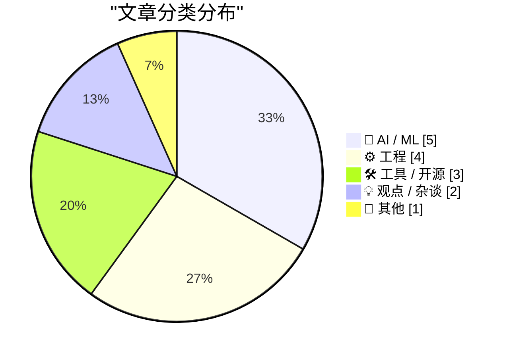
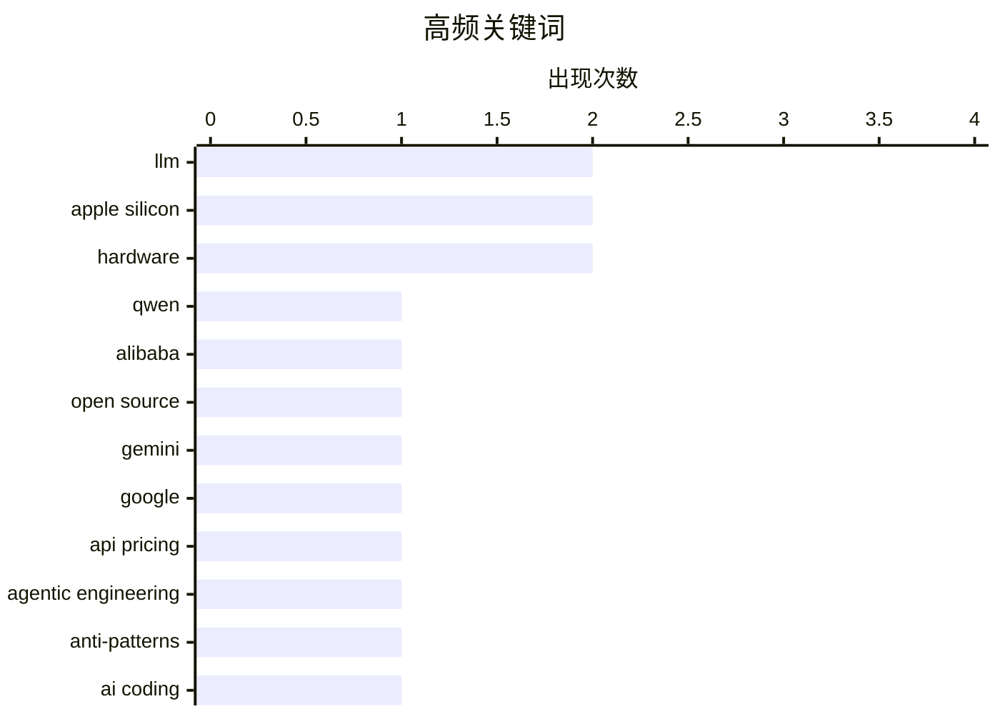

# 📰 AI 博客每日精选 — 2026-03-05

> 来自 Karpathy 推荐的 92 个顶级技术博客，AI 精选 Top 15

## 📝 今日看点

今日技术圈呈现AI能力跃迁与生态震荡的剧烈反差：Claude斩获图灵奖得主背书、Google推出极致性价比的Gemini Flash-Lite之际，Qwen团队核心离职却为开源模型未来蒙上阴影。工程实践进入深水区，智能体代码审查规范与提示词验证陷阱凸显AI原生开发流程的重构挑战。硬件层面，苹果借MacBook Neo重返大众市场，以架构革新打破能效核心偏见，标志个人计算设备竞争进入新阶段。

---

## 🏆 今日必读

🥇 **Qwen团队风云突变：核心成员离职引发开源模型未来担忧**

[Something is afoot in the land of Qwen](https://simonwillison.net/2026/Mar/4/qwen/#atom-everything) — simonwillison.net · 5 小时前 · 🤖 AI / ML

> 阿里巴巴Qwen团队近期发布了性能卓越的开源权重模型家族Qwen 3.5，但过去24小时内该团队遭遇包括Junyang Lin在内的核心成员高调离职震荡。这一人事变动令社区担忧Qwen 3.5是否会成为该团队的绝唱(swan song)，也给这一优秀的开源模型系列蒙上不确定性阴影。作者Simon Willison原计划撰写Qwen 3.5技术分析，现优先关注团队动荡对开源AI生态的潜在冲击。

💡 **为什么值得读**: 关注开源AI社区重大人事变动的必读快讯，涉及中国顶尖大模型团队的不确定性未来。

🏷️ Qwen, Alibaba, open source, LLM

🥈 **Gemini 3.1 Flash-Lite发布：低成本模型支持四级思考模式**

[Gemini 3.1 Flash-Lite](https://simonwillison.net/2026/Mar/3/gemini-31-flash-lite/#atom-everything) — simonwillison.net · 23 小时前 · 🤖 AI / ML

> Google发布Gemini 3.1 Flash-Lite，定价极具竞争力：输入0.25美元/百万token，输出1.5美元/百万token，仅为Gemini 3.1 Pro价格的八分之一。该模型支持四种不同的思考级别(thinking levels)，用户可根据任务复杂度灵活调整推理深度。这一产品延续了Google在低成本高效能模型领域的布局，为需要控制预算的AI应用提供了新选择。

💡 **为什么值得读**: 了解Google最新低价高性能模型及其差异化定价策略的技术概览，适合关注API成本优化的开发者。

🏷️ Gemini, Google, API pricing

🥉 **智能体工程反模式：切勿推送未经自审的代码**

[Anti-patterns: things to avoid](https://simonwillison.net/guides/agentic-engineering-patterns/anti-patterns/#atom-everything) — simonwillison.net · 3 小时前 · ⚙️ 工程

> 在智能体工程(agentic engineering)领域，向协作者推送未经审查的代码是最常见且令人沮丧的反模式之一。核心原则是：不要提交自己都没有审查过的代码PR，即使这些代码由AI生成。这一规范旨在维护代码质量和团队协作效率，避免将AI辅助编程的审查成本转嫁给其他开发者。建立“AI生成代码仍需人工把关”的工作流程至关重要。

💡 **为什么值得读**: AI辅助开发时代的团队协作必读指南，明确AI编程工具使用中的责任边界和最佳实践。

🏷️ agentic engineering, anti-patterns, AI coding, code review

---

## 📊 数据概览

| 扫描源 | 抓取文章 | 时间范围 | 精选 |
|:---:|:---:|:---:|:---:|
| 83/92 | 2408 篇 → 16 篇 | 24h | **15 篇** |

### 分类分布



### 高频关键词



<details>
<summary>📈 纯文本关键词图（终端友好）</summary>

```
llm                 │ ████████████████████ 2
apple silicon       │ ████████████████████ 2
hardware            │ ████████████████████ 2
qwen                │ ██████████░░░░░░░░░░ 1
alibaba             │ ██████████░░░░░░░░░░ 1
open source         │ ██████████░░░░░░░░░░ 1
gemini              │ ██████████░░░░░░░░░░ 1
google              │ ██████████░░░░░░░░░░ 1
api pricing         │ ██████████░░░░░░░░░░ 1
agentic engineering │ ██████████░░░░░░░░░░ 1
```

</details>

### 🏷️ 话题标签

**llm**(2) · **apple silicon**(2) · **hardware**(2) · qwen(1) · alibaba(1) · open source(1) · gemini(1) · google(1) · api pricing(1) · agentic engineering(1) · anti-patterns(1) · ai coding(1) · code review(1) · donald knuth(1) · claude opus(1) · ai reasoning(1) · openai api(1) · prompt engineering(1) · dependency management(1) · package managers(1)

---

## 🤖 AI / ML

### 1. Qwen团队风云突变：核心成员离职引发开源模型未来担忧

[Something is afoot in the land of Qwen](https://simonwillison.net/2026/Mar/4/qwen/#atom-everything) — **simonwillison.net** · 5 小时前 · ⭐ 26/30

> 阿里巴巴Qwen团队近期发布了性能卓越的开源权重模型家族Qwen 3.5，但过去24小时内该团队遭遇包括Junyang Lin在内的核心成员高调离职震荡。这一人事变动令社区担忧Qwen 3.5是否会成为该团队的绝唱(swan song)，也给这一优秀的开源模型系列蒙上不确定性阴影。作者Simon Willison原计划撰写Qwen 3.5技术分析，现优先关注团队动荡对开源AI生态的潜在冲击。

🏷️ Qwen, Alibaba, open source, LLM

---

### 2. Gemini 3.1 Flash-Lite发布：低成本模型支持四级思考模式

[Gemini 3.1 Flash-Lite](https://simonwillison.net/2026/Mar/3/gemini-31-flash-lite/#atom-everything) — **simonwillison.net** · 23 小时前 · ⭐ 26/30

> Google发布Gemini 3.1 Flash-Lite，定价极具竞争力：输入0.25美元/百万token，输出1.5美元/百万token，仅为Gemini 3.1 Pro价格的八分之一。该模型支持四种不同的思考级别(thinking levels)，用户可根据任务复杂度灵活调整推理深度。这一产品延续了Google在低成本高效能模型领域的布局，为需要控制预算的AI应用提供了新选择。

🏷️ Gemini, Google, API pricing

---

### 3. Donald Knuth：Claude Opus 4.6解决了我研究数周的开放性问题

[Quoting Donald Knuth](https://simonwillison.net/2026/Mar/3/donald-knuth/#atom-everything) — **simonwillison.net** · 21 小时前 · ⭐ 25/30

> 计算机科学泰斗Donald Knuth透露，他花费数周研究的一个开放性问题已被Anthropic三周前发布的混合推理模型Claude Opus 4.6解决。Knuth表示对此感到震惊，并承认需要重新评估对“生成式AI”能力的看法。这位以严谨著称的算法大师不仅庆祝其猜想得到优美解答，更认可了AI系统在复杂数学推理领域的突破性表现。

🏷️ Donald Knuth, Claude Opus, AI reasoning

---

### 4. AI奥德赛（二）：提示词配置陷阱与验证风险

[An AI Odyssey, Part 2: Prompting Peril](https://www.johndcook.com/blog/2026/03/04/an-ai-odyssey-part-2-prompting-peril/) — **johndcook.com** · 7 小时前 · ⭐ 23/30

> 作者与同事在使用OpenAI API时，提议通过调整参数增加模型推理量以提升响应准确性。然而同事立即向ChatGPT询问该方案可行性，而非查阅官方文档或进行实验验证。这一场景揭示了AI开发中的“递归信任”风险：开发者倾向于用AI验证AI配置，可能形成认知闭环。文章警示在关键工程决策中过度依赖AI建议而缺乏独立验证的危险性。

🏷️ OpenAI API, prompt engineering, LLM

---

### 5. 从逻辑回归到AI：量变如何引发质变

[From logistic regression to AI](https://www.johndcook.com/blog/2026/03/04/from-logistic-regression-to-ai/) — **johndcook.com** · 7 小时前 · ⭐ 20/30

> 虽然神经网络常被简化为“参数更多的逻辑回归”，但规模扩大引发的质变远超线性预期。LLM（大语言模型）本质上仍是神经网络，但参数量级跃升催生了涌现能力等无法从小规模模型预测的新现象。这种“多即不同”(more is different)的复杂系统特性，解释了为何简单将AI视为逻辑回归的扩展会低估其能力跃迁的本质。

🏷️ neural networks, logistic regression, AI fundamentals

---

## ⚙️ 工程

### 6. 智能体工程反模式：切勿推送未经自审的代码

[Anti-patterns: things to avoid](https://simonwillison.net/guides/agentic-engineering-patterns/anti-patterns/#atom-everything) — **simonwillison.net** · 3 小时前 · ⭐ 25/30

> 在智能体工程(agentic engineering)领域，向协作者推送未经审查的代码是最常见且令人沮丧的反模式之一。核心原则是：不要提交自己都没有审查过的代码PR，即使这些代码由AI生成。这一规范旨在维护代码质量和团队协作效率，避免将AI辅助编程的审查成本转嫁给其他开发者。建立“AI生成代码仍需人工把关”的工作流程至关重要。

🏷️ agentic engineering, anti-patterns, AI coding, code review

---

### 7. 包管理器亟需引入依赖冷却机制

[Package Managers Need to Cool Down](https://nesbitt.io/2026/03/04/package-managers-need-to-cool-down.html) — **nesbitt.io** · 11 小时前 · ⭐ 23/30

> 文章调研了主流包管理器和更新工具对“依赖冷却”(dependency cooldown)功能的支持现状，即延迟自动更新或引入缓冲期的能力。当前大多数工具缺乏有效的冷却机制，导致开发者频繁面临破坏性更新或供应链攻击风险。引入强制等待期可让社区在自动采纳最新版本前有足够时间发现潜在问题，是提升软件供应链安全性的关键缺失环节。

🏷️ dependency management, package managers, supply chain

---

### 8. 苹果CPU核心重命名背后：能效核心不再“低人一等”

[‘In Other Words, Batman Has Become Superman and Robin Has Become Batman’](https://sixcolors.com/post/2026/03/apple-gives-in-to-temptation-and-renames-its-cpu-cores/) — **daringfireball.net** · 7 小时前 · ⭐ 20/30

> 据Jason Snell分析，苹果高管长期不满外界将其“能效核心”(efficiency cores)视为性能弱化的印象，实际上这些核心在M系列芯片中速度相当快。随着架构演进，苹果efficiency cores与performance cores的性能差距持续缩小，导致“蝙蝠侠变成了超人，罗宾变成了蝙蝠侠”的相对实力变化。这解释了为何苹果选择重新命名其CPU核心架构，以消除市场对能效核心的偏见。

🏷️ Apple Silicon, CPU architecture, performance

---

### 9. QueryPerformanceCounter 文档“永不失败”承诺的反例

[Aha, I found a counterexample to the documentation that says that Query­Performance­Counter never fails](https://devblogs.microsoft.com/oldnewthing/20260304-00/?p=112110) — **devblogs.microsoft.com/oldnewthing** · 6 小时前 · ⭐ 19/30

> Windows API 文档声称 QueryPerformanceCounter 函数绝不会失败，但 Raymond Chen 发现了一个违反该保证的实际情况。当代码破坏操作系统规则（如内存损坏或违规操作）时，即使是最可靠的系统调用也可能返回错误。这一发现提醒开发者：API 的“永不失败”承诺仅在遵守契约的前提下成立，调试时应考虑极端边界情况。

🏷️ Windows API, debugging, QueryPerformanceCounter

---

## 🛠 工具 / 开源

### 10. MacBook Neo观察：Apple Silicon时代首款面向大众的新Mac

[★ Thoughts and Observations on the MacBook Neo](https://daringfireball.net/2026/03/599_not_a_piece_of_junk_macbook_neo) — **daringfireball.net** · 52 分钟前 · ⭐ 20/30

> MacBook Neo是Apple Silicon时代首款针对消费者市场设计的全新Mac产品线，标志着苹果重新关注主流PC市场扩张。该产品旨在提升Mac在整个PC市场中的份额，即使只是“宇宙中的微小凹痕”，对苹果而言也是重大市场突破。作为自M系列芯片推出以来首款非专业级的新形态Mac，Neo代表了苹果对消费者级硬件设计的重新思考。

🏷️ MacBook, Apple Silicon, hardware

---

### 11. 新款 Studio Display 兼容性限制解析

[Compatibility Notes on the New Studio Displays](https://www.macrumors.com/2026/03/03/apple-studio-display-no-intel-mac-support/) — **daringfireball.net** · 5 小时前 · ⭐ 19/30

> 苹果新款 Studio Display 和 Studio Display XDR 完全不支持基于 Intel 芯片的 Mac 设备。在显示性能方面存在严格的芯片门槛：搭载 M1、基础版 M2 或 M3 的 Mac 只能驱动 Studio Display XDR 在 60Hz 刷新率下运行；而要实现 120Hz 高刷新率，必须使用 M2 Pro/Max/Ultra、M3 Pro/Max/Ultra，或任意 M4/M5 系列芯片。这一兼容性策略标志着苹果正加速淘汰 Intel 平台，同时通过硬件分层策略区分显示输出性能。

🏷️ Mac, compatibility, display

---

### 12. Studio Display 与 Studio Display XDR 规格对比

[Studio Display vs. Studio Display XDR](https://www.apple.com/displays/) — **daringfireball.net** · 3 小时前 · ⭐ 17/30

> 苹果官网更新了“显示器”主页面，提供了标准版 Studio Display 与高端 Studio Display XDR 的逐规格详细对比。该页面清晰罗列了两款显示器在亮度、对比度、色彩准确度、接口配置等关键参数上的差异，方便用户根据专业需求选择合适机型。

🏷️ Studio Display, Apple, hardware

---

## 💡 观点 / 杂谈

### 13. 中断驱动开发：耳机作为“请勿打扰”信号的生存策略

[Interruption-Driven Development](https://idiallo.com/blog/interruption-driven-development?src=feed) — **idiallo.com** · 9 小时前 · ⭐ 20/30

> 作者阐述“中断驱动开发”现象：工作时戴耳机并非为了听音乐，而是作为向同事发出的“正在专注”视觉信号，以减少不必要的打扰。真正损害生产力的是非预期的中断本身，而非交流内容——即使短暂打断也会破坏深度工作状态。这种防御性策略反映了现代开放式办公环境中知识工作者面临的注意力保护困境，以及被动式边界设定的无奈。

🏷️ productivity, focus, developer experience

---

### 14. 或许这里有个模式？发明家与影响力

[Maybe there’s a pattern here?](https://dynomight.net/pattern/) — **dynomight.net** · 21 小时前 · ⭐ 19/30

> 文章探讨了历史上著名发明家的成功模式及其对社会的实际影响力，试图从创新案例中发现可重复的规律或相关性，分析技术突破背后是否存在可预测的路径。

🏷️ innovation, inventors, technology impact

---

## 📝 其他

### 15. 门洛帕克的家酿计算机俱乐部

[Homebrew Computer Club in Menlo Park](https://dfarq.homeip.net/homebrew-computer-club-in-menlo-park/?utm_source=rss&#038;utm_medium=rss&#038;utm_campaign=homebrew-computer-club-in-menlo-park) — **dfarq.homeip.net** · 9 小时前 · ⭐ 13/30

> 家酿计算机俱乐部是加州门洛帕克的一个传奇早期计算机爱好者组织，被《硅谷之火》和 1999 年电影《硅谷传奇》记载为个人电脑产业的关键推手。该俱乐部汇聚了早期黑客和创业者，为苹果等公司的诞生提供了技术交流和人才网络基础，深刻塑造了现代计算机产业格局。

🏷️ computer history, Homebrew Club, Silicon Valley

---

*生成于 2026-03-05 05:32 | 扫描 83 源 → 获取 2408 篇 → 精选 15 篇*
*基于 [Hacker News Popularity Contest 2025](https://refactoringenglish.com/tools/hn-popularity/) RSS 源列表，由 [Andrej Karpathy](https://x.com/karpathy) 推荐*
*由「懂点儿AI」制作，欢迎关注同名微信公众号获取更多 AI 实用技巧 💡*
