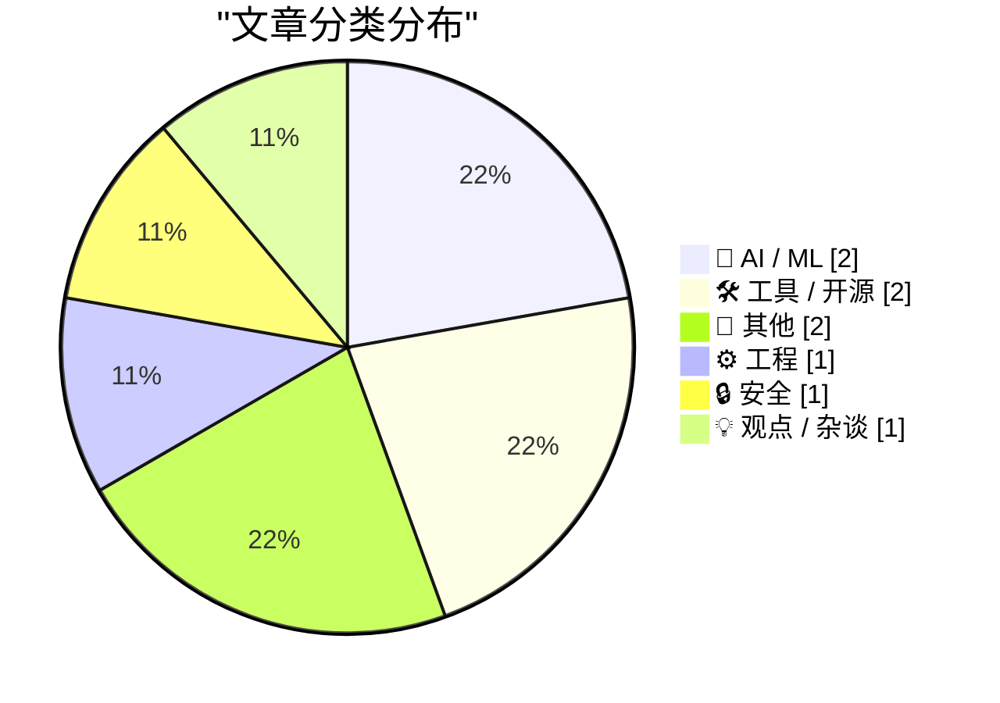
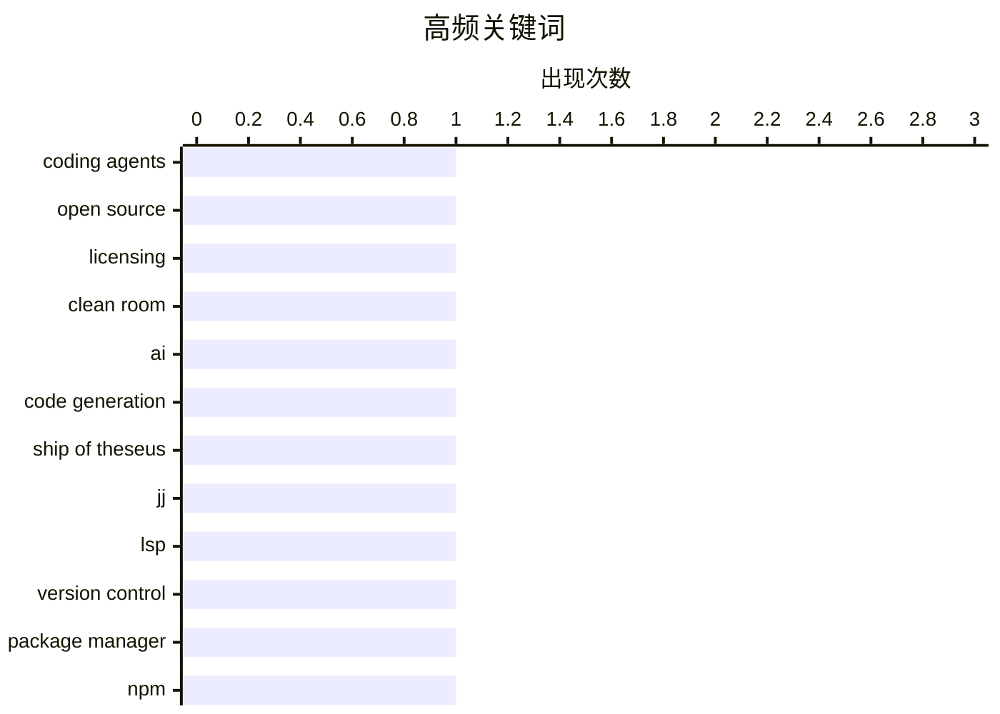

# 📰 AI 博客每日精选 — 2026-03-06

> 来自 Karpathy 推荐的 92 个顶级技术博客，AI 精选 Top 9

## 📝 今日看点

今日技术圈的核心议题围绕AI对软件工程的深层重构展开：编码智能体展现出的"清洁室"重写能力正在模糊代码许可边界，并引发关于代码身份认同的"忒修斯之船"式哲学追问。与此同时，开发者工具链在基础设施层持续进化，从分布式版本控制到包管理配置，工程实践正朝着更精细、标准化的方向演进。而在技术伦理与历史维度，从早期病毒威胁到平台剥削策略的批判，行业在快速迭代中重新审视质量坚守与用户权益的永恒命题。

---

## 🏆 今日必读

🥇 **编码智能体能否通过"清洁室"实现对开源代码的重新许可？**

[Can coding agents relicense open source through a “clean room” implementation of code?](https://simonwillison.net/2026/Mar/5/chardet/#atom-everything) — simonwillison.net · 4 小时前 · 🤖 AI / ML

> 编码智能体（coding agents）正展现出通过"清洁室"（clean room）方法完全重新实现代码的惊人能力，这种方式类似于1982年Compaq团队反向工程IBM BIOS后交由独立团队重建的经典策略。这种AI驱动的重写模式允许通过观察行为或测试套件重建功能等价的代码，而无需接触原始源码，从而在技术上可能规避传统开源许可证的约束。与过去需要大量人力协调不同，现代编码智能体可以自动执行这一曾经复杂的流程，使得"清洁室"实现的成本急剧下降。这引发了一个关键的法律与伦理问题：当机器能够廉价且快速地重新实现任何开源项目时，GPL、MIT等许可证的copyleft机制是否还能有效保护开源生态？

💡 **为什么值得读**: 深入探讨了AI代码生成对传统开源许可法律框架的根本性挑战，对于关注开源合规与AI伦理的开发者具有重要参考价值。

🏷️ coding agents, open source, licensing, clean room

🥈 **AI与忒修斯之船**

[AI And The Ship of Theseus](https://lucumr.pocoo.org/2026/3/5/theseus/) — lucumr.pocoo.org · 21 小时前 · 🤖 AI / ML

> 随着AI大幅降低代码生成成本，完全重写和跨语言移植正变得越来越普遍，引发了关于代码身份认同的"忒修斯之船"式疑问。作者分享了使用AI将个人库移植到新语言时，AI选择了与原版不同的内部设计但保持外部功能一致的经历，类似于近期chardet维护者通过AI从头重新实现该库的案例。这种通过测试套件逆向工程并生成全新实现的方式，使得新代码在功能等价的同时失去了与原始代码的历史联系。当重构可以如此彻底地完成时，我们面临一个根本性问题：重新实现的代码是否仍是原来的项目，还是成为了法律和技术意义上的全新实体，其许可证归属又该如何界定？

💡 **为什么值得读**: 以哲学视角审视AI驱动的代码重构对软件身份认同和版权认定的深远影响，适合思考技术伦理的开发者阅读。

🏷️ AI, code generation, Ship of Theseus

🥉 **JJ LSP 后续进展**

[JJ LSP Follow Up](https://matklad.github.io/2026/03/05/jj-lsp-followup.html) — matklad.github.io · 21 小时前 · 🛠 工具 / 开源

> 作者推进了Majjit LSP项目，试图利用语言服务器协议（LSP）为Jujutsu（JJ）分布式版本控制系统打造一次开发、到处运行的类Magit用户体验。该方案将JJ的核心操作逻辑和状态管理封装为标准的LSP服务，使得任何支持LSP的编辑器（VS Code、Vim、Emacs等）都能获得统一的高级版本控制界面，而无需为每个编辑器单独维护插件。这种方法克服了JJ目前缺乏成熟图形界面的痛点，同时避免了传统Git工具链中编辑器集成碎片化的问题。通过借用IDE领域成熟的协议标准，该项目为新一代版本控制工具提供了一条低成本、高兼容性的UI生态建设路径。

💡 **为什么值得读**: 为分布式版本控制系统JJ提供了一条基于LSP标准化的UI实现路径，对关注开发者工具链和编辑器生态的读者具有参考价值。

🏷️ jj, LSP, version control

---

## 📊 数据概览

| 扫描源 | 抓取文章 | 时间范围 | 精选 |
|:---:|:---:|:---:|:---:|
| 83/92 | 2397 篇 → 9 篇 | 24h | **9 篇** |

### 分类分布



### 高频关键词



<details>
<summary>📈 纯文本关键词图（终端友好）</summary>

```
coding agents   │ ████████████████████ 1
open source     │ ████████████████████ 1
licensing       │ ████████████████████ 1
clean room      │ ████████████████████ 1
ai              │ ████████████████████ 1
code generation │ ████████████████████ 1
ship of theseus │ ████████████████████ 1
jj              │ ████████████████████ 1
lsp             │ ████████████████████ 1
version control │ ████████████████████ 1
```

</details>

### 🏷️ 话题标签

**coding agents**(1) · **open source**(1) · **licensing**(1) · clean room(1) · ai(1) · code generation(1) · ship of theseus(1) · jj(1) · lsp(1) · version control(1) · package manager(1) · npm(1) · configuration(1) · windows(1) · win32(1) · message loop(1) · politics(1) · authoritarianism(1) · malware(1) · virus history(1)

---

## 🤖 AI / ML

### 1. 编码智能体能否通过"清洁室"实现对开源代码的重新许可？

[Can coding agents relicense open source through a “clean room” implementation of code?](https://simonwillison.net/2026/Mar/5/chardet/#atom-everything) — **simonwillison.net** · 4 小时前 · ⭐ 26/30

> 编码智能体（coding agents）正展现出通过"清洁室"（clean room）方法完全重新实现代码的惊人能力，这种方式类似于1982年Compaq团队反向工程IBM BIOS后交由独立团队重建的经典策略。这种AI驱动的重写模式允许通过观察行为或测试套件重建功能等价的代码，而无需接触原始源码，从而在技术上可能规避传统开源许可证的约束。与过去需要大量人力协调不同，现代编码智能体可以自动执行这一曾经复杂的流程，使得"清洁室"实现的成本急剧下降。这引发了一个关键的法律与伦理问题：当机器能够廉价且快速地重新实现任何开源项目时，GPL、MIT等许可证的copyleft机制是否还能有效保护开源生态？

🏷️ coding agents, open source, licensing, clean room

---

### 2. AI与忒修斯之船

[AI And The Ship of Theseus](https://lucumr.pocoo.org/2026/3/5/theseus/) — **lucumr.pocoo.org** · 21 小时前 · ⭐ 24/30

> 随着AI大幅降低代码生成成本，完全重写和跨语言移植正变得越来越普遍，引发了关于代码身份认同的"忒修斯之船"式疑问。作者分享了使用AI将个人库移植到新语言时，AI选择了与原版不同的内部设计但保持外部功能一致的经历，类似于近期chardet维护者通过AI从头重新实现该库的案例。这种通过测试套件逆向工程并生成全新实现的方式，使得新代码在功能等价的同时失去了与原始代码的历史联系。当重构可以如此彻底地完成时，我们面临一个根本性问题：重新实现的代码是否仍是原来的项目，还是成为了法律和技术意义上的全新实体，其许可证归属又该如何界定？

🏷️ AI, code generation, Ship of Theseus

---

## 🛠 工具 / 开源

### 3. JJ LSP 后续进展

[JJ LSP Follow Up](https://matklad.github.io/2026/03/05/jj-lsp-followup.html) — **matklad.github.io** · 21 小时前 · ⭐ 20/30

> 作者推进了Majjit LSP项目，试图利用语言服务器协议（LSP）为Jujutsu（JJ）分布式版本控制系统打造一次开发、到处运行的类Magit用户体验。该方案将JJ的核心操作逻辑和状态管理封装为标准的LSP服务，使得任何支持LSP的编辑器（VS Code、Vim、Emacs等）都能获得统一的高级版本控制界面，而无需为每个编辑器单独维护插件。这种方法克服了JJ目前缺乏成熟图形界面的痛点，同时避免了传统Git工具链中编辑器集成碎片化的问题。通过借用IDE领域成熟的协议标准，该项目为新一代版本控制工具提供了一条低成本、高兼容性的UI生态建设路径。

🏷️ jj, LSP, version control

---

### 4. 包管理器的魔法配置文件

[Package Manager Magic Files](https://nesbitt.io/2026/03/05/package-manager-magic-files.html) — **nesbitt.io** · 11 小时前 · ⭐ 19/30

> 文章系统梳理了主流包管理器中那些决定依赖解析、构建行为和发布流程的关键"魔法"配置文件，涵盖Node.js的.npmrc与.pnpmfile.cjs、Python的MANIFEST.in以及.NET的Directory.Packages.props等。这些文件往往拥有超越常规配置的优先权和副作用，例如.npmrc控制私有源和认证，.pnpmfile.cjs允许在依赖安装时进行编程式修改，而Directory.Packages.props可实现跨项目的统一版本管理。掌握这些文件的定位、加载顺序和交互规则，是处理复杂多仓库依赖、定制构建流水线以及排查"在我机器上能跑"类问题的关键技能。

🏷️ package manager, npm, configuration

---

## 📝 其他

### 5. 多元视角：用喷灯煮青蛙（2026年3月5日）

[Pluralistic: Blowtorching the frog (05 Mar 2026) executive-dysfunction](https://pluralistic.net/2026/03/05/executive-dysfunction/) — **pluralistic.net** · 2 小时前 · ⭐ 13/30

> Cory Doctorow在Pluralistic周刊中探讨了数字平台如何通过"喷灯煮青蛙"（blowtorching the frog）策略——即比传统"温水煮青蛙"更激进的渐进式剥削——来侵蚀用户权益和数字主权。本期内容涵盖了从Bill Cosby案到TSA政策、从平台垄断到生物黑客的广泛议题，核心论点是科技公司通过"enshittification"（垃圾化）策略逐步锁定用户并降低服务质量，而监管反应始终滞后。作者警告，这种由算法驱动的商业模型正系统性地摧毁开放互联网的基础设施，将公共领域转化为围墙花园（walled gardens）。

🏷️ politics, authoritarianism

---

### 6. 书评：R.F.匡《地狱归来》★★★★⯪

[Book Review: Katabasis by R. F. Kuang ★★★★⯪](https://shkspr.mobi/blog/2026/03/book-review-katabasis-by-r-f-kuang/) — **shkspr.mobi** · 8 小时前 · ⭐ 10/30

> 这篇书评讨论了R.F.匡（R.F. Kuang）的最新小说《Katabasis》（希腊语意为"降至冥界"），一部将学术体制讽刺与奇幻元素融合的黑色喜剧。故事设定中，主人公的博士生导师去世后，唯一的毕业方式是亲自下地狱将导师带回人间，这一荒诞设定被评论员认为完美映射了当代研究生教育的权力不对等和心理压力。与前作《巴别塔》（Babel）的严肃历史奇幻不同，本书首次展现了Kuang作品中罕见的"大声笑出来"的幽默感。作者认为这部小说成功将个人学术创伤转化为具有普世意义的寓言，既是对高等教育异化机制的尖锐批评，也是一部充满想象力的地狱漫游指南。

🏷️ book review, fiction

---

## ⚙️ 工程

### 7. 消息循环前就被分派的发送消息之谜

[The mystery of the posted message that was dispatched before reaching the main message loop](https://devblogs.microsoft.com/oldnewthing/20260305-00/?p=112114) — **devblogs.microsoft.com/oldnewthing** · 6 小时前 · ⭐ 18/30

> 文章深入剖析了Windows GUI编程中一个令人困惑的陷阱：通过PostMessage发送的消息竟在到达主消息循环前就被提前分派（dispatch），导致消息处理顺序异常。这种违反直觉的行为通常源于代码在消息泵（message pump）正式启动前主动调用了DispatchMessage，或存在嵌套的消息循环导致消息被"偷取"。过早分派会破坏应用程序的状态假设，引发重入（reentrancy）问题、窗口过程回调异常或资源竞争。理解Windows消息队列的底层分派机制，对于维护遗留Win32应用、编写自定义消息泵或调试难以复现的UI竞态条件至关重要。

🏷️ Windows, Win32, message loop

---

## 🔒 安全

### 8. 纪念米开朗基罗病毒

[Remembering the Michelangelo virus](https://dfarq.homeip.net/remembering-michelangelo/?utm_source=rss&#038;utm_medium=rss&#038;utm_campaign=remembering-michelangelo) — **dfarq.homeip.net** · 9 小时前 · ⭐ 13/30

> 文章回顾了1992年3月6日发作的米开朗基罗病毒（Michelangelo），这一DOS时代的引导扇区病毒会覆盖硬盘前100个扇区，虽不如格式化彻底但足以造成灾难性数据丢失。作为早期计算机病毒的代表，它通过软盘传播并在当年感染了全球数百万台PC，引发了公众对计算机安全的首次大规模恐慌，直接推动了反病毒软件产业的爆发式增长。这一历史案例不仅展示了早期恶意软件利用系统引导过程的简单破坏力，也标志着个人计算机从孤立设备走向联网生态时安全范式的根本转变。

🏷️ malware, virus history, Michelangelo

---

## 💡 观点 / 杂谈

### 9. 史蒂夫·乔布斯2007年谈苹果对PC市场份额的追求："我们就是不能发垃圾产品"

[Steve Jobs in 2007, on Apple’s Pursuit of PC Market Share: ‘We Just Can’t Ship Junk’](https://www.youtube.com/watch?v=U37Ds3RvyoM) — **daringfireball.net** · 1 小时前 · ⭐ 12/30

> 2007年8月在苹果Infinite Loop总部举行的发布会上，史蒂夫·乔布斯面对媒体关于苹果是否以超越Windows PC市场份额为目标的提问，明确表示苹果宁愿保持较小份额也"绝不能发垃圾产品"（just can't ship junk）。坐在蒂姆·库克和菲尔·席勒之间的乔布斯强调，苹果的核心策略是通过iMac、iLife和iWork等高质量产品吸引特定用户群，而非通过低价低质产品争夺大众市场。这一立场定义了苹果长期坚持的高端产品哲学，解释了为何即使在iPhone发布同年（2007年），苹果仍选择牺牲规模以维护用户体验和品牌溢价。

🏷️ Steve Jobs, Apple, product quality

---

*生成于 2026-03-06 05:33 | 扫描 83 源 → 获取 2397 篇 → 精选 9 篇*
*基于 [Hacker News Popularity Contest 2025](https://refactoringenglish.com/tools/hn-popularity/) RSS 源列表，由 [Andrej Karpathy](https://x.com/karpathy) 推荐*
*由「懂点儿AI」制作，欢迎关注同名微信公众号获取更多 AI 实用技巧 💡*
