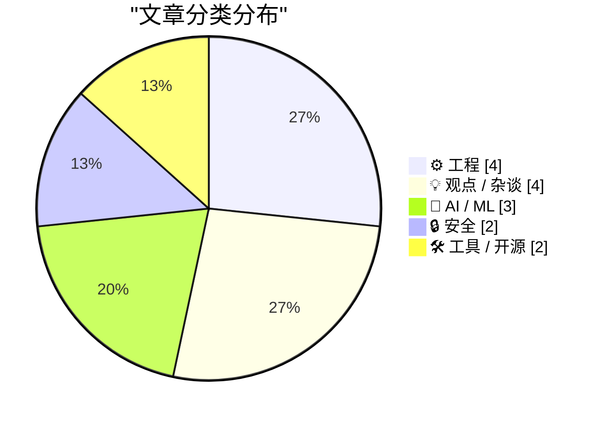
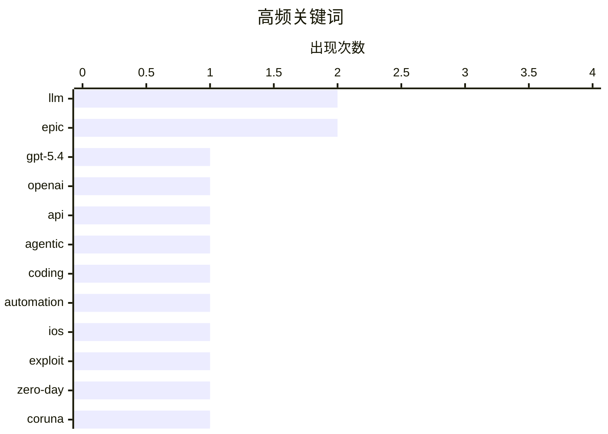

# 📰 AI 博客每日精选 — 2026-03-07

> 来自 Karpathy 推荐的 92 个顶级技术博客，AI 精选 Top 15

## 📝 今日看点

技术圈今日聚焦平台权力重构与工程自主权的双重变奏：Epic与谷歌的反垄断和解因禁言条款至2032年引发热议，暴露科技巨头对开发者话语权的隐性控制；与此同时，去中心化实践从Fediverse社交协议到自建邮件服务器全面回潮，技术人正逃离中心化平台寻求基础设施自主；而Git工作流优化与UI可发现性危机等讨论，则持续印证复杂工程决策中"视情况而定"的专业共识。

---

## 🏆 今日必读

🥇 **关于联邦宇宙，我大错特错了**

[Introducing GPT‑5.4](https://simonwillison.net/2026/Mar/5/introducing-gpt54/#atom-everything) — simonwillison.net · 21 小时前 · 🤖 AI / ML

> 作者从坚定的"线下优先"社交者转变为Fediverse（联邦宇宙）的支持者，承认自己此前对去中心化社交网络的偏见有误。不同于Twitter式的名人互动文化，Fediverse提供了基于真实人际关系的分布式社交体验，让不擅长公开表演性发言的普通用户也能建立有意义的连接。这种转变挑战了传统社交媒体以平台为中心的集权模式，证明了去中心化协议（如ActivityPub）对非技术用户同样具有实用价值。

💡 **为什么值得读**: 如果你也曾质疑去中心化社交网络（如Mastodon）的实际价值，这篇个人视角的转变记录提供了不同于技术乌托邦叙事的真实使用体验。

🏷️ GPT-5.4, OpenAI, API, LLM

🥈 **Treedix TRX5-0816 线缆测试仪固件更新指南**

[Agentic manual testing](https://simonwillison.net/guides/agentic-engineering-patterns/agentic-manual-testing/#atom-everything) — simonwillison.net · 15 小时前 · 🤖 AI / ML

> Treedix USB线缆测试仪存在线缆识别错误和显示bug，制造商未通过官网发布更新，而是通过Google Drive私下分发固件文件。更新流程涉及特定版本的二进制固件和Windows刷写工具，修复了之前版本中存在的PD（Power Delivery）协议检测失败问题。这反映了部分中国硬件厂商偏好通过私有云盘而非官方渠道分发软件更新的行业实践，为持有该设备的用户提供了关键的维护途径。

💡 **为什么值得读**: 如果你拥有这款USB线缆测试仪并遇到识别问题，这篇文章提供了官方未公开渠道发布的固件更新下载链接和详细刷写教程。

🏷️ agentic, LLM, coding, automation

🥉 **Git 应当支持本地文件自忽略机制（.gitlocal）**

[Google’s Threat Intelligence Group on Coruna a Powerful iOS Exploit Kit of Mysterious Origin](https://cloud.google.com/blog/topics/threat-intelligence/coruna-powerful-ios-exploit-kit) — daringfireball.net · 54 分钟前 · 🔒 安全

> 开发者提议引入.gitlocal文件机制，允许特定配置文件仅在本地仓库忽略自身，而不污染全局.gitignore或提交到远程仓库。当前Git工作流中，团队共享的.gitignore往往无法满足个人本地开发环境的差异化配置需求，导致 IDE 设置、本地调试配置等文件频繁出现在未跟踪文件列表或误提交。该方案通过文件级自声明忽略状态，解决了本地配置与版本控制冲突的长期痛点，填补了.git/info/exclude和全局.gitignore之间的功能空白。

💡 **为什么值得读**: 如果你厌倦了为本地开发配置（如IDE设置、环境变量文件）反复修改.gitignore或担心误提交敏感信息，这个.gitlocal提案提供了一种优雅的解决方案。

🏷️ iOS, exploit, zero-day, Coruna

---

## 📊 数据概览

| 扫描源 | 抓取文章 | 时间范围 | 精选 |
|:---:|:---:|:---:|:---:|
| 84/92 | 2408 篇 → 24 篇 | 24h | **15 篇** |

### 分类分布



### 高频关键词



<details>
<summary>📈 纯文本关键词图（终端友好）</summary>

```
llm        │ ████████████████████ 2
epic       │ ████████████████████ 2
gpt-5.4    │ ██████████░░░░░░░░░░ 1
openai     │ ██████████░░░░░░░░░░ 1
api        │ ██████████░░░░░░░░░░ 1
agentic    │ ██████████░░░░░░░░░░ 1
coding     │ ██████████░░░░░░░░░░ 1
automation │ ██████████░░░░░░░░░░ 1
ios        │ ██████████░░░░░░░░░░ 1
exploit    │ ██████████░░░░░░░░░░ 1
```

</details>

### 🏷️ 话题标签

**llm**(2) · **epic**(2) · **gpt-5.4**(1) · openai(1) · api(1) · agentic(1) · coding(1) · automation(1) · ios(1) · exploit(1) · zero-day(1) · coruna(1) · ai(1) · military(1) · ethics(1) · anthropic(1) · prompt injection(1) · supply chain(1) · vulnerability(1) · email(1)

---

## ⚙️ 工程

### 1. 如何自建邮件服务器

[How to Host your Own Email Server](https://blog.miguelgrinberg.com/post/how-to-host-your-own-email-server) — **miguelgrinberg.com** · 5 小时前 · ⭐ 24/30

> 自建邮件服务器常被业界视为过于复杂而建议选择 Mailgun 或 SendGrid 等付费服务，但实际上完全可行且能避免额外依赖。文章详细阐述了搭建自主邮件服务器的完整流程，包括 DNS 配置、SPF/DKIM/DMARC 记录设置、反垃圾邮件措施等关键技术环节。通过自建方案，开发者可在不依赖第三方 SaaS 的情况下实现用户验证、密码重置等关键邮件功能，同时降低长期运营成本。

🏷️ email, self-hosting, infrastructure

---

### 2. 视情况而定：为什么专家从不给简单答案

[It Depends](https://idiallo.com/blog/it-depends-experts-never-give-straight-answers?src=feed) — **idiallo.com** · 9 小时前 · ⭐ 21/30

> 技术专家面对"是否应该升级 MySQL/Ubuntu/PHP"等问题时，总是回答"视情况而定"（It depends），这常让寻求明确答案的开发者感到沮丧。这种回答并非敷衍，而是反映了软件工程决策的复杂性——需要权衡业务需求、系统现状、团队能力、风险承受度等多重因素。真正的专业判断不在于给出非黑即白的答案，而在于理解每个技术决策背后的上下文依赖和权衡取舍。

🏷️ decision-making, software-engineering, best-practices

---

### 3. 当 ReadDirectoryChangesW 报告文件删除时，如何获取被删除文件的更多信息？

[When Read­Directory­ChangesW reports that a deletion occurred, how can I learn more about the deleted thing?](https://devblogs.microsoft.com/oldnewthing/20260306-00/?p=112116) — **devblogs.microsoft.com/oldnewthing** · 6 小时前 · ⭐ 21/30

> Windows API ReadDirectoryChangesW 在报告文件删除事件时，无法提供关于被删除对象的额外信息，因为此时文件系统对象已不存在。开发者需要在删除事件发生前主动缓存和维护相关元数据，才能在删除后获知文件属性。这一设计反映了文件系统通知 API 的基本限制：通知是异步的，当系统传达删除事件时，相关资源已释放，无法回溯查询。

🏷️ Windows-API, file-system, systems-programming

---

### 4. A PTP Wall Clock is impractical and a little too precise

[A PTP Wall Clock is impractical and a little too precise](https://www.jeffgeerling.com/blog/2026/ptp-wall-clock-impractical-too-precise/) — **jeffgeerling.com** · 6 小时前 · ⭐ 17/30

> <p>After seeing Oliver Ettlin's 39C3 presentation <a href="https://media.ccc.de/v/39c3-excuse-me-what-precise-time-is-it">Excuse me, what precise time is It?</a>, I wanted to replicate the PTP (<a hre

🏷️ PTP, time synchronization, networking

---

## 💡 观点 / 杂谈

### 5. The Verge 专访 Tim Sweeney：Epic 诉谷歌案胜诉后的思考

[The Verge Interviews Tim Sweeney After Victory in ‘Epic v. Google’](https://www.theverge.com/23996474/epic-tim-sweeney-interview-win-google-antitrust-lawsuit-district-court) — **daringfireball.net** · 3 小时前 · ⭐ 22/30

> Epic Games CEO Tim Sweeney 将苹果的反垄断策略比作"冰"，谷歌比作"火"。苹果通过内部统一的商店政策、支付系统和强制条款实施控制，而谷歌则通过向游戏开发商和 OEM 厂商支付巨额费用来巩固 Android 生态的垄断地位。这种差异反映了两大移动平台在维持应用商店霸权时采取的根本不同策略：一个是封闭的垂直整合，另一个是横向的金钱收买。

🏷️ antitrust, Epic, Google, app store

---

### 6. Tim Sweeney 签署协议，放弃批评谷歌 Play 商店权利至 2032 年

[Tim Sweeney Signed Away His Right to Criticize Google’s Play Store Until 2032](https://www.theverge.com/news/889595/tim-sweeney-signed-away-his-right-to-criticize-google-until-2032) — **daringfireball.net** · 3 小时前 · ⭐ 22/30

> Epic Games CEO Tim Sweeney 在与谷歌的和解协议中签署了具有法律约束力的禁言条款，直至 2032 年前不得批评谷歌应用商店的分发政策、收费模式及对待游戏开发者的态度。协议不仅禁止 Epic 就相关事项提起诉讼或发表贬低性言论，还禁止 Sweeney 倡导任何进一步的谷歌应用商店政策改革。这一条款实际上"堵住了"这位最激烈批评者的嘴，消除了谷歌在应用商店反垄断领域的主要反对声音。

🏷️ settlement, Epic, legal, censorship

---

### 7. Boy I was wrong about the Fediverse

[Boy I was wrong about the Fediverse](https://matduggan.com/boy-i-was-wrong-about-the-fediverse/) — **matduggan.com** · 9 小时前 · ⭐ 21/30

> I have never been an "online community first" person. The internet is how I stay in touch with people I met in real life. I&apos;m not a "tweet comments at celebrities" guy. I was never funny enough t

🏷️ Fediverse, decentralized-social, community

---

### 8. ‘The Window Chrome of Our Discontent’

[‘The Window Chrome of Our Discontent’](https://pxlnv.com/blog/window-chrome-of-our-discontent/) — **daringfireball.net** · 1 小时前 · ⭐ 15/30

> Nick Heer, writing at Pixel Envy, uses Pages (from 2009 through today) to illustrate Apple’s march toward putting “greater focus on your content” by making window chrome, and toolbar icons, more and m

🏷️ UI design, macOS, Apple

---

## 🤖 AI / ML

### 9. 关于联邦宇宙，我大错特错了

[Introducing GPT‑5.4](https://simonwillison.net/2026/Mar/5/introducing-gpt54/#atom-everything) — **simonwillison.net** · 21 小时前 · ⭐ 27/30

> 作者从坚定的"线下优先"社交者转变为Fediverse（联邦宇宙）的支持者，承认自己此前对去中心化社交网络的偏见有误。不同于Twitter式的名人互动文化，Fediverse提供了基于真实人际关系的分布式社交体验，让不擅长公开表演性发言的普通用户也能建立有意义的连接。这种转变挑战了传统社交媒体以平台为中心的集权模式，证明了去中心化协议（如ActivityPub）对非技术用户同样具有实用价值。

🏷️ GPT-5.4, OpenAI, API, LLM

---

### 10. Treedix TRX5-0816 线缆测试仪固件更新指南

[Agentic manual testing](https://simonwillison.net/guides/agentic-engineering-patterns/agentic-manual-testing/#atom-everything) — **simonwillison.net** · 15 小时前 · ⭐ 26/30

> Treedix USB线缆测试仪存在线缆识别错误和显示bug，制造商未通过官网发布更新，而是通过Google Drive私下分发固件文件。更新流程涉及特定版本的二进制固件和Windows刷写工具，修复了之前版本中存在的PD（Power Delivery）协议检测失败问题。这反映了部分中国硬件厂商偏好通过私有云盘而非官方渠道分发软件更新的行业实践，为持有该设备的用户提供了关键的维护途径。

🏷️ agentic, LLM, coding, automation

---

### 11. PTP 挂钟：既不实用又过于精确

[Anthropic and the Pentagon](https://simonwillison.net/2026/Mar/6/anthropic-and-the-pentagon/#atom-everything) — **simonwillison.net** · 4 小时前 · ⭐ 25/30

> 作者尝试复现39C3大会上Oliver Ettlin展示的PTP（Precision Time Protocol，精确时间协议）硬件时钟，发现微秒级甚至纳秒级的时间同步对于家庭环境完全属于过度设计。PTP协议需要专用硬件支持（如支持硬件时间戳的网卡）、复杂的网络拓扑配置（边界时钟、透明时钟），且对温度变化和电磁干扰极度敏感，相比NTP在实际家庭使用中几乎无法感知差异。这种极端精确度更适合金融交易高频套利或科学研究数据中心，而非普通家庭墙面时钟。

🏷️ AI, military, ethics, Anthropic

---

## 🔒 安全

### 12. Git 应当支持本地文件自忽略机制（.gitlocal）

[Google’s Threat Intelligence Group on Coruna a Powerful iOS Exploit Kit of Mysterious Origin](https://cloud.google.com/blog/topics/threat-intelligence/coruna-powerful-ios-exploit-kit) — **daringfireball.net** · 54 分钟前 · ⭐ 26/30

> 开发者提议引入.gitlocal文件机制，允许特定配置文件仅在本地仓库忽略自身，而不污染全局.gitignore或提交到远程仓库。当前Git工作流中，团队共享的.gitignore往往无法满足个人本地开发环境的差异化配置需求，导致 IDE 设置、本地调试配置等文件频繁出现在未跟踪文件列表或误提交。该方案通过文件级自声明忽略状态，解决了本地配置与版本控制冲突的长期痛点，填补了.git/info/exclude和全局.gitignore之间的功能空白。

🏷️ iOS, exploit, zero-day, Coruna

---

### 13. 窗口装饰的不满：苹果界面设计的可发现性危机

[Clinejection — Compromising Cline's Production Releases just by Prompting an Issue Triager](https://simonwillison.net/2026/Mar/6/clinejection/#atom-everything) — **simonwillison.net** · 18 小时前 · ⭐ 25/30

> 通过对比Pages 2009版与最新版本的界面演变，作者指出苹果"专注于内容"的设计理念导致窗口chrome（标题栏、工具栏、按钮）持续淡化甚至隐形。从具象的拟物化图标到极简的线性图标，再到完全隐形的浮动控件，这种设计趋势并未减少用户干扰，反而增加了认知负担，降低了界面的可发现性（discoverability）。当用户无法直观识别可交互元素时，所谓的"极简"实际上损害了生产力工具的可用性，使得功能发现依赖于猜测而非视觉线索。

🏷️ prompt injection, supply chain, vulnerability

---

## 🛠 工具 / 开源

### 14. Firmware Update for the Treedix TRX5-0816 Cable Tester

[Firmware Update for the Treedix TRX5-0816 Cable Tester](https://shkspr.mobi/blog/2026/03/firmware-update-for-the-treedix-trx5-0816-cable-tester/) — **shkspr.mobi** · 8 小时前 · ⭐ 18/30

> Last year I reviewed the Treedix USB Cable Tester - a handy device for testing the capabilities of all your USB cables. I noted that it had a few minor bugs and contacted the manufacturer to see if th

🏷️ hardware, USB, firmware, testing

---

### 15. .gitlocal

[.gitlocal](https://nesbitt.io/2026/03/06/gitlocal.html) — **nesbitt.io** · 11 小时前 · ⭐ 18/30

> Git Should Let Files Ignore Themselves

🏷️ Git, version-control, workflow

---

*生成于 2026-03-07 05:27 | 扫描 84 源 → 获取 2408 篇 → 精选 15 篇*
*基于 [Hacker News Popularity Contest 2025](https://refactoringenglish.com/tools/hn-popularity/) RSS 源列表，由 [Andrej Karpathy](https://x.com/karpathy) 推荐*
*由「懂点儿AI」制作，欢迎关注同名微信公众号获取更多 AI 实用技巧 💡*
