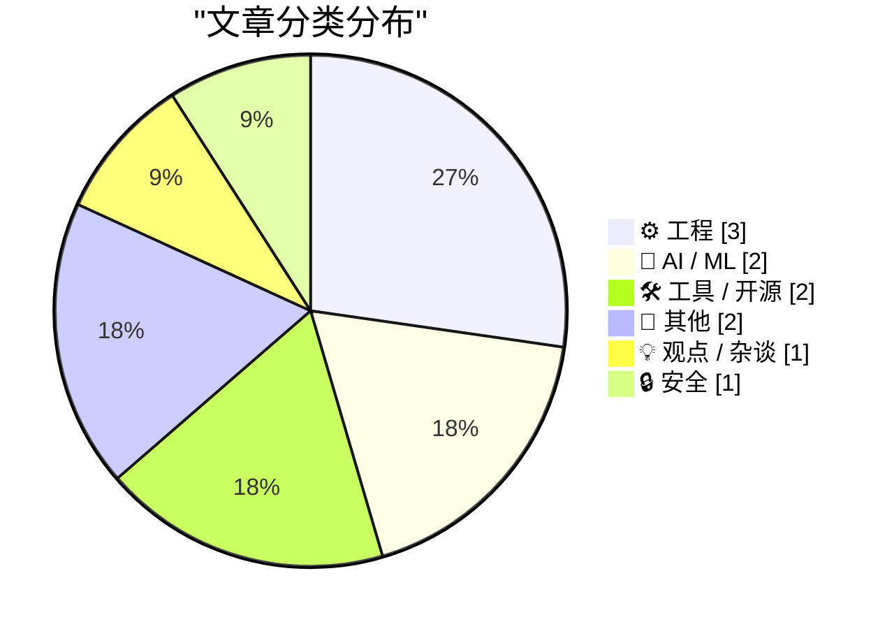
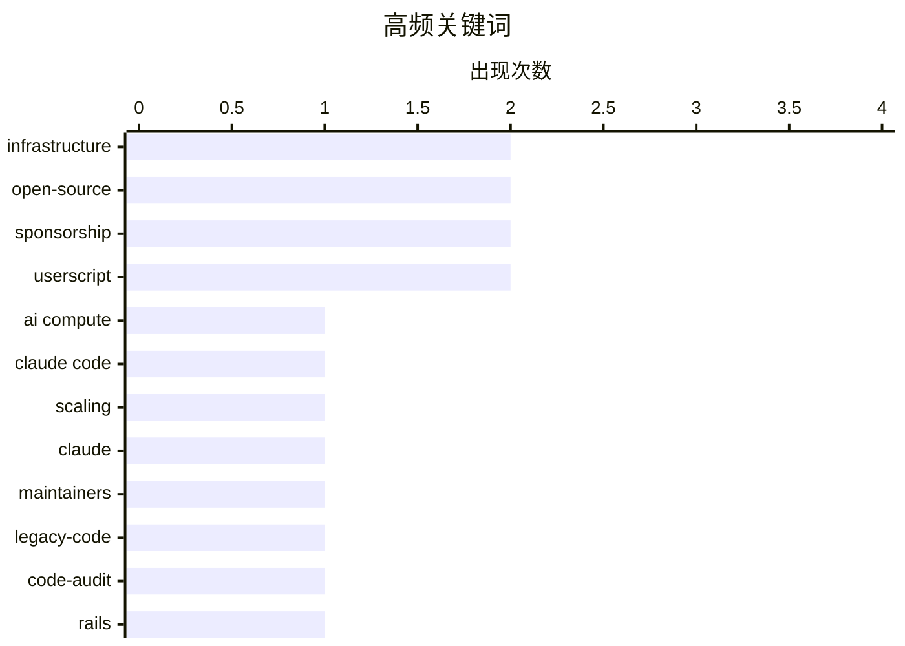

# 📰 AI 博客每日精选 — 2026-03-08

> 来自 Karpathy 推荐的 92 个顶级技术博客，AI 精选 Top 11

## 📝 今日看点

AI算力危机阴影逼近之际，OpenAI与Anthropic正围绕开源开发者展开激烈生态争夺，算力可持续性与用户规模增长的矛盾日益尖锐。与此同时，开发者社区掀起回归极简的逆流，借助RSS、阅读器模式及自动化工具剥离网页冗余，反抗现代互联网的臃肿与侵扰。工程实践方面，从遗留代码审计方法论到数据中心能源独立探索，技术治理与基础设施韧性仍是行业关注的核心议题。

---

## 🏆 今日必读

🥇 **AI算力危机已经来临了吗？**

[Is the AI Compute Crunch Here?](https://martinalderson.com/posts/is-the-ai-compute-crunch-here/?utm_source=rss&amp;utm_medium=rss&amp;utm_campaign=feed) — martinalderson.com · 21 小时前 · 🤖 AI / ML

> Claude Code目前拥有200万至300万用户，仅占知识工作者总数的1%。从计算资源消耗的数学模型来看，当AI编程工具的用户规模继续扩大时，所需的算力将呈现惊人增长。作者认为当前AI算力需求与供给之间的矛盾即将进入临界状态，未来的资源消耗将变得"可怕"。

💡 **为什么值得读**: 通过具体的用户渗透率数据和计算资源推演，警示AI算力瓶颈可能比预期更快到来。

🏷️ AI compute, Claude Code, infrastructure, scaling

🥈 **面向开源项目的 Codex**

[Codex for Open Source](https://simonwillison.net/2026/Mar/7/codex-for-open-source/#atom-everything) — simonwillison.net · 3 小时前 · 🤖 AI / ML

> 继Anthropic于2月27日为流行开源项目维护者（要求5000+ GitHub Stars或100万+ NPM下载量）提供六个月免费Claude Max（价值$200/月）之后，OpenAI推出竞争性方案：为符合条件的开源维护者提供六个月免费ChatGPT Pro（同样价值$200/月），包含Codex编码代理功能。这标志着AI巨头开始通过免费赠送高价订阅来争夺开源社区的核心影响力。

💡 **为什么值得读**: 揭示了OpenAI与Anthropic在开发者生态争夺上的直接竞争策略，对开源维护者具有实际经济价值。

🏷️ Claude, open-source, maintainers, sponsorship

🥉 **引用 Ally Piechowski 的代码审计问题清单**

[Quoting Ally Piechowski](https://simonwillison.net/2026/Mar/6/ally-piechowski/#atom-everything) — simonwillison.net · 23 小时前 · ⚙️ 工程

> 针对遗留Rails代码库的技术审计，Ally Piechowski提供了一套分层提问策略。面向开发者的问题包括：最不敢触碰的代码区域、上次周五部署时间、过去90天未测试捕获的生产故障；面向CTO/工程经理的问题包括：被阻塞超过一年的功能、实时错误可见性覆盖情况。这套问题清单旨在快速暴露代码库的技术债务和运维风险。

💡 **为什么值得读**: 提供了一套可直接落地的遗留系统审计检查表，帮助技术管理者在尽职调查或接手项目时快速识别风险点。

🏷️ legacy-code, code-audit, Rails, maintenance

---

## 📊 数据概览

| 扫描源 | 抓取文章 | 时间范围 | 精选 |
|:---:|:---:|:---:|:---:|
| 83/92 | 2393 篇 → 11 篇 | 24h | **11 篇** |

### 分类分布



### 高频关键词



<details>
<summary>📈 纯文本关键词图（终端友好）</summary>

```
infrastructure │ ████████████████████ 2
open-source    │ ████████████████████ 2
sponsorship    │ ████████████████████ 2
userscript     │ ████████████████████ 2
ai compute     │ ██████████░░░░░░░░░░ 1
claude code    │ ██████████░░░░░░░░░░ 1
scaling        │ ██████████░░░░░░░░░░ 1
claude         │ ██████████░░░░░░░░░░ 1
maintainers    │ ██████████░░░░░░░░░░ 1
legacy-code    │ ██████████░░░░░░░░░░ 1
```

</details>

### 🏷️ 话题标签

**infrastructure**(2) · **open-source**(2) · **sponsorship**(2) · userscript(2) · ai compute(1) · claude code(1) · scaling(1) · claude(1) · maintainers(1) · legacy-code(1) · code-audit(1) · rails(1) · maintenance(1) · rss(1) · reader-mode(1) · open-web(1) · hacker-news(1) · themes(1) · ui(1) · cybersecurity(1)

---

## ⚙️ 工程

### 1. 引用 Ally Piechowski 的代码审计问题清单

[Quoting Ally Piechowski](https://simonwillison.net/2026/Mar/6/ally-piechowski/#atom-everything) — **simonwillison.net** · 23 小时前 · ⭐ 20/30

> 针对遗留Rails代码库的技术审计，Ally Piechowski提供了一套分层提问策略。面向开发者的问题包括：最不敢触碰的代码区域、上次周五部署时间、过去90天未测试捕获的生产故障；面向CTO/工程经理的问题包括：被阻塞超过一年的功能、实时错误可见性覆盖情况。这套问题清单旨在快速暴露代码库的技术债务和运维风险。

🏷️ legacy-code, code-audit, Rails, maintenance

---

### 2. 宣布成立新的工作组

[Announcing New Working Groups](https://nesbitt.io/2026/03/07/announcing-new-working-groups.html) — **nesbitt.io** · 11 小时前 · ⭐ 16/30

> 开源基础联盟（Open Source Foundations Consortium）正式宣布成立七个新的工作组。公告未详细列出各工作组的具体技术方向或治理目标，仅作成立宣告。

🏷️ open-source, governance, foundations

---

### 3. 阅读清单 2026年3月7日

[Reading List 03/07/2026](https://www.construction-physics.com/p/reading-list-03072026) — **construction-physics.com** · 8 小时前 · ⭐ 16/30

> 本期阅读清单汇集了五个技术趋势话题：数据中心脱离电网独立运行的趋势、太阳能光伏效率新记录、美国战略石油储备的维修需求、福特在电动车领域的战略失误，以及前OpenAI首席技术官Murati的新创企业动态。内容涵盖能源基础设施、汽车制造业和AI产业人事变动。

🏷️ data-centers, energy, infrastructure

---

## 🤖 AI / ML

### 4. AI算力危机已经来临了吗？

[Is the AI Compute Crunch Here?](https://martinalderson.com/posts/is-the-ai-compute-crunch-here/?utm_source=rss&amp;utm_medium=rss&amp;utm_campaign=feed) — **martinalderson.com** · 21 小时前 · ⭐ 26/30

> Claude Code目前拥有200万至300万用户，仅占知识工作者总数的1%。从计算资源消耗的数学模型来看，当AI编程工具的用户规模继续扩大时，所需的算力将呈现惊人增长。作者认为当前AI算力需求与供给之间的矛盾即将进入临界状态，未来的资源消耗将变得"可怕"。

🏷️ AI compute, Claude Code, infrastructure, scaling

---

### 5. 面向开源项目的 Codex

[Codex for Open Source](https://simonwillison.net/2026/Mar/7/codex-for-open-source/#atom-everything) — **simonwillison.net** · 3 小时前 · ⭐ 23/30

> 继Anthropic于2月27日为流行开源项目维护者（要求5000+ GitHub Stars或100万+ NPM下载量）提供六个月免费Claude Max（价值$200/月）之后，OpenAI推出竞争性方案：为符合条件的开源维护者提供六个月免费ChatGPT Pro（同样价值$200/月），包含Codex编码代理功能。这标志着AI巨头开始通过免费赠送高价订阅来争夺开源社区的核心影响力。

🏷️ Claude, open-source, maintainers, sponsorship

---

## 🛠 工具 / 开源

### 6. HN Skins 0.3.0 发布

[HN Skins 0.3.0](https://susam.net/code/news/hnskins/0.3.0.html) — **susam.net** · 21 小时前 · ⭐ 19/30

> HN Skins用户脚本发布0.3.0次要版本更新，该脚本为Hacker News提供多种自定义视觉主题。本次修复包括：评论输入框现在使用与当前主题一致的字体和字号；已访问链接颜色被适当淡化，以便与未访问链接区分。这些改进提升了主题一致性和浏览体验。

🏷️ Hacker-News, userscript, themes, UI

---

### 7. 移除烦人的网页横幅

[Remove annoying banners](https://maurycyz.com/projects/fixsite/) — **maurycyz.com** · 21 小时前 · ⭐ 14/30

> 这是一个简洁的JavaScript代码片段，通过遍历页面所有DOM节点并检查其计算样式（getComputedStyle），自动识别并移除固定定位（fixed positioning）的"烂条"（dick bars）和其他侵入式网页元素。代码采用轻量级实现，可直接在浏览器控制台运行或制作用户脚本。

🏷️ userscript, ad-blocking, javascript

---

## 📝 其他

### 8. Daring Fireball 每周赞助位开放

[Daring Fireball Weekly Sponsorship Openings](https://daringfireball.net/feeds/sponsors/) — **daringfireball.net** · 23 小时前 · ⭐ 11/30

> Daring Fireball博客开放每周赞助位预订，该赞助模式自2007年以来一直是网站主要收入来源。采用每周单一赞助商机制，确保赞助商内容与读者兴趣相关，避免受众反感。历史数据显示这种赞助形式对品牌方效果显著，且能维持读者体验。

🏷️ sponsorship, advertising

---

### 9. Using Clankers to Help Me Process Surgery

[Using Clankers to Help Me Process Surgery](https://xeiaso.net/blog/2026/surgery-recovery-clankers/) — **xeiaso.net** · 21 小时前 · ⭐ 11/30

> At 4 AM in recovery, the machines that never sleep turned out to be exactly the right company.

🏷️ personal, healthcare

---

## 💡 观点 / 杂谈

### 10. 有了 RSS，网页体验尚可忍受

[Pluralistic: The web is bearable with RSS (07 Mar 2026)](https://pluralistic.net/2026/03/07/reader-mode/) — **pluralistic.net** · 3 小时前 · ⭐ 19/30

> Cory Doctorow在Pluralistic博客中主张通过RSS订阅和浏览器"阅读器模式"（Reader Mode）来改善现代网页体验。文章认为这两种技术能够剥离冗余的网页元素，回归内容本质，使臃肿的现代网络变得可阅读。文中同时推荐了近期值得关注的链接和话题。

🏷️ RSS, reader-mode, open-web

---

## 🔒 安全

### 11. 书评：《电子罪犯》（Robert Farr，1975）★★★⯪☆

[Book Review: The Electronic Criminals by Robert Farr (1975) ★★★⯪☆](https://shkspr.mobi/blog/2026/03/book-review-the-electronic-criminals-by-robert-farr-1975/) — **shkspr.mobi** · 8 小时前 · ⭐ 18/30

> 这本出版于50年前的计算机安全著作记录了早期计算时代的犯罪形态，包括电传系统诈骗、物理磁带勒索、大型机密码窃取和黑客入侵。虽然书籍开篇引人入胜，但由于当时计算机犯罪案例确实稀少，后半部分逐渐乏力。该书评分3.5星（满分5星），为理解网络安全发展历程提供了历史视角。

🏷️ cybersecurity, history, retro-computing

---

*生成于 2026-03-08 05:18 | 扫描 83 源 → 获取 2393 篇 → 精选 11 篇*
*基于 [Hacker News Popularity Contest 2025](https://refactoringenglish.com/tools/hn-popularity/) RSS 源列表，由 [Andrej Karpathy](https://x.com/karpathy) 推荐*
*由「懂点儿AI」制作，欢迎关注同名微信公众号获取更多 AI 实用技巧 💡*
